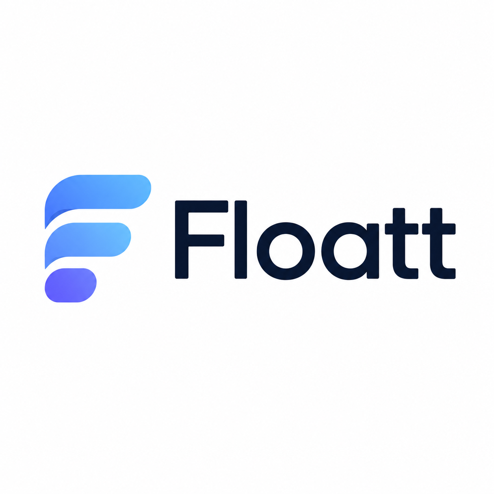

<p align="center">
  
</p>

<p align="center">
  <strong>One local-first workspace for everything you get done.</strong>
</p>

<p align="center">
  <em>Your tasks, notes, and projects — fast, offline, and yours. No backend, no cloud, no lock-in.</em>
</p>

<p align="center">
  
  
  
  
  
</p>

---

**Floatt** is a local-first productivity workspace. It starts with a fast, focused **task manager** and grows into a suite of tools — notes, boards, and more — that share one offline-first foundation. Everything lives on your device (IndexedDB via Dexie); there is no backend, so the app works fully offline and your data never leaves your machine.

It ships as both a **web app** and a **Tauri desktop app** from a single shared React codebase.

## Modules

Floatt is built as a workspace of focused modules sharing one shell, design system, and platform layer. New tools ship as new modules — without reworking the foundation.

| Module | What it is | Status |
| --- | --- | --- |
| **Tasks** | Groups → lists → tasks → steps, smart lists (My Day, Important, Planned), reminders, recurring tasks, drag-and-drop, per-list themes | ✅ Available |
| **Notes** | Quick capture and rich note-taking | 🔜 Planned |
| **Boards** | Kanban-style project management | 🔜 Planned |
| **Calendar** | Time-blocking and planning | 💡 Idea |

> Want a module that isn't here yet? Open an issue — the architecture is designed to grow.

## Highlights

- **Local-first & offline** — all data on-device in IndexedDB; no account, no sync server required.
- **Cross-platform** — one React codebase runs as a web app and a native desktop app (macOS, Windows, Linux) via Tauri.
- **Fast & private** — no network round-trips for your data; the app stays responsive offline.
- **Themeable** — per-list themes with coordinated light/dark variants.
- **Extensible by design** — each tool is an isolated module, so the workspace scales feature by feature.

## Tech stack

- **React 19** + **TypeScript**
- **Next.js 15** (App Router) for the web app — static export
- **Vite** + **Tauri** for the desktop app
- **Dexie** (IndexedDB) for local-first persistence
- **Zustand** for ephemeral UI state
- **Tailwind CSS v4** + **radix-ui** primitives (shadcn-style)
- **@dnd-kit** (drag & drop), **fuse.js** (search), **date-fns** (dates)
- **pnpm** + **Turborepo** monorepo

## Monorepo layout

```
apps/
  web/        @floatt/web      — web shell (Next.js)
  desktop/    @floatt/desktop  — desktop shell (Vite + Tauri)
packages/
  app/        @floatt/app      — the workspace: shared UI, state, and the Tasks module
  config/     @floatt/config   — shared tsconfig bases
```

Each new module ships as a **sibling package** (`packages/notes`, `packages/boards`, …) consumed by the same thin app shells. The apps are platform adapters only: each renders the workspace inside a `<PlatformProvider>` with a platform-specific implementation (Web Notification API vs. Tauri plugins). Shared code never imports platform APIs directly — it goes through `usePlatform()`.

## Getting started

```bash
pnpm install        # install dependencies

pnpm dev            # run all dev servers via Turborepo
pnpm dev:web        # web app only (Next.js)
pnpm dev:desktop    # desktop app (Tauri — requires a Rust toolchain)
```

> Desktop development requires a [Rust toolchain](https://www.rust-lang.org/tools/install) for `apps/desktop/src-tauri`. `tauri dev` auto-starts the Vite dev server on `http://localhost:1420`.

## Scripts

```bash
pnpm build          # build everything (next build for web, vite build for desktop)
pnpm test           # run all tests (vitest)
pnpm check-types    # tsc --noEmit across packages

# single package / single test
pnpm --filter @floatt/app test
pnpm --filter @floatt/app exec vitest run src/utils/repeat.test.ts
pnpm --filter @floatt/app exec vitest          # watch mode
```

## Architecture

State flows in one direction inside each module (`packages/app/src` today):

1. **`services/`** — all writes/mutations and business logic; owns the Dexie `db`.
2. **`queries/`** — pure read functions returning Promises off `db`.
3. **`hooks/`** — reactive bindings via Dexie's `useLiveQuery`, plus runtime effects.
4. **`components/` / `screens/`** — consume hooks; never touch `db` directly.

The Tasks data model is **Group → Subgroup (a "list") → Task → Subtask (a "step")**, with types in `types/` validated by Zod schemas. Smart lists (`my-day`, `important`, `planned`, `tasks`) are *virtual* — computed by filtering tasks rather than stored in a table.

See [`CLAUDE.md`](./CLAUDE.md) for the full architecture guide.

## Roadmap

- [x] Tasks module — lists, steps, smart lists, reminders, recurrence, drag-and-drop, themes
- [ ] Notes module
- [ ] Boards (Kanban) module
- [ ] Cross-module search
- [ ] Optional end-to-end-encrypted sync

## License

[MIT](./LICENSE) © Muhammad Bappi
