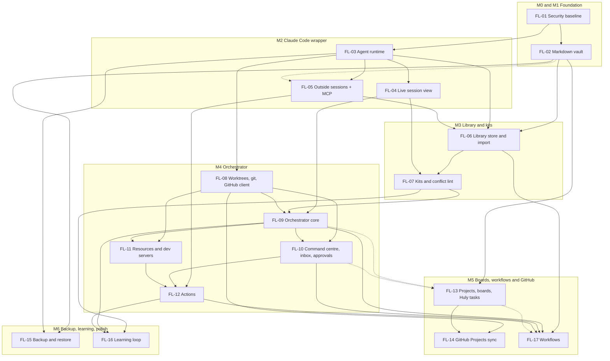

# Floatt command centre: epics

The execution breakdown for [`claude-code-command-centre-plan.md`](./claude-code-command-centre-plan.md). There are 17 epics in 7 milestones (M0 to M6).

How to use this file:
- Each epic, from its **Milestone** line down to **Risks**, is ready to paste as a GitHub issue body.
- Each sub-task is sized for one agent in one worktree, ending in one PR.
- Sizes assume one developer working with agents: S is under a week, M is 1-2 weeks, L is 2-3 weeks, XL is 3-4 weeks.

## Milestones

| Milestone | Epics | What you have at the end | Rough weeks |
|---|---|---|---|
| M0 Claude inside Floatt (v0) | FL-01, then parts of FL-03, FL-04 and FL-05 (listed below) | Claude runs inside Floatt: the user's `claude` CLI driven over stdio, an in-app session panel with streaming, approvals, stop and resume, and agents that read and write Floatt tasks over MCP. No vault and no sidecar | 2-3 |
| M1 Foundation | FL-02 | The same app, with data as markdown in `~/Floatt/` | 3-4 |
| M2 Claude Code wrapper you can use daily | FL-03, FL-04, FL-05, and FL-10.3 | Run, watch and steer Claude sessions from Floatt, with one approval surface and the question ledger, and see (read-only) the sessions started elsewhere, Orca's included | 5-7 |
| M3 Library and kits | FL-06, FL-07 | One library, a kit per project, conflict lint and context cost, and reusable things agents write and the user approves | 4-5 |
| M4 Orchestrator | FL-08 to FL-12 | The open-source workspace as an app: queue issues, worktrees, verified reports, one inbox, approvals, dev servers and device-switch buttons | 10-13 |
| M5 Boards, workflows, Huly features, GitHub Projects | FL-13, FL-14, FL-17 | Boards with Huly fields and the open-source workspace imported, status pushed to GitHub Projects; workflows you or an agent build, with every run visible | 5-7 |
| M6 Backup, learning loop, polish | FL-15, FL-16 | Encrypted folder backup with tested restore, and proposals from repeated asks | 1-2 |

The serial total is about 30-41 weeks (36-52 before the review decisions of 2026-10-09). Parallel tracks shorten it, because milestones mark an order of finishing, not a strict queue:
- M0 comes first, by the user's call: Claude running inside Floatt is worth more early than markdown data. It takes about 2-3 weeks (FL-01.1-01.3, FL-01.6 and the FL-03.1 spike are already done), where the first draft needed 9-13 (M1 then M2) before the first session ran in the app. Driving the CLI from Rust instead of the Agent SDK in a sidecar removes the packaging spike and the extra process.
- FL-02 starts once M0's agent runtime is in, and the rest of FL-03 and FL-04 carries on beside it.
- FL-06 (library store) needs only the vault, the agent runtime and the MCP server, so it starts during M2.
- FL-08 (worktrees and the GitHub client) starts as soon as FL-03 lands.
- FL-13's board and Huly fields need only FL-02, so they can ship right after M1; only the agent overlay waits for M4.
- FL-15 (backup) can move up to right after FL-02 if migration safety matters more than features.

Two changes from the first draft of the order, both from the research:
- The library store starts early, because the library is the lead pillar and it only needs the vault and the agent runtime.
- The GitHub client moves into M4, because the approval sheet needs it to open PRs. Projects v2 sync stays in M5.

Later additions, from the user:
- **M0, Claude inside Floatt (v0).** Claude runs in the app, with no "Open in terminal" button. The Rust core drives the user's `claude` CLI over stdio, the way the VS Code extension does, with no Agent SDK and no sidecar. M0 is FL-01 plus these sub-tasks, before the vault:
  - FL-03.1 the CLI spike, FL-03.2 the Rust process supervisor, FL-03.3 the loopback server for `/mcp`, FL-03.5 `Platform.agent` over IPC, FL-03.7 `claude` discovery, and a minimal SQLite table of sessions from FL-03.4
  - FL-04.1 the CLI driver, FL-04.2 the event normaliser, FL-04.3 approvals, FL-04.4 and FL-04.5 the session panel with tool cards, and FL-04.7 resume after an app restart
  - FL-05.1 the MCP server with `tasks_*`, given to each session with `--mcp-config`. Until FL-02 moves tasks to the vault, the runtime forwards these calls to the open window, whose Dexie services do the reads and writes. They return "Floatt window closed" when there is no window
  - Done when: from Floatt, the user picks a repo, starts a session, sees streaming text and tool cards, answers a permission prompt, stops it, quits Floatt, reopens it and resumes the same session. In that session Claude lists and creates Floatt tasks through MCP, and they show in the task list
- Library proposals (`library_propose` and its review pane) move from FL-16 into FL-06, because the AI writing reusable things (skills, actions, workflows and more) for later reuse is a main goal, not polish.
- The question ledger (FL-05, FL-10) replaces chat follow-ups on half-answered questions.
- FL-17 adds workflows the user or an agent builds, run by the orchestrator and visible in the command centre.
- Smaller changes from the same review of chat friction: drafts with versions (FL-10), holds (FL-09), push preflight (FL-08), checkpoints after usage limits (FL-09), a user lock on worktrees and found dev servers (FL-11), real exit codes (FL-09), environment facts (FL-05) and an evidence folder per task (FL-09).
- Floatt never modifies anything of Claude's: no login flows, no writes to `~/.claude`, no installing `claude`. Outside sessions are read-only, kits write only `.claude/settings.local.json` inside worktrees Floatt created, and sessions load the user's own setup.
- The plan review decisions (2026-10-09), applied across the epics:
  - personal-only for now; a public release (API key, signing, auto-update) is in Later
  - one device in v1, with the vault in a visible `~/Floatt/`
  - the inbox model (FL-10.3) moves into M2, the FL-04 → FL-05 edge is dropped, and FL-13's board no longer waits for the orchestrator
  - FL-09 is cut to what one person with four agents needs, and policy uses Claude Code's own deny rules first
  - the library, kits, resources, GitHub sync, backup, actions and learning loop are trimmed to their v1 core, with the rest in Later
  - a fake `claude` for tests (FL-03.9) and the workspace import (FL-13.9) fill two gaps
- From the Conductor and Orca comparison: Orca shows read-only in Floatt (FL-05.10, "Open in Orca"), worktrees use the shared `.worktreeinclude` and `orca.yaml` files (FL-08.2), and the borrowed features land in FL-04, FL-08, FL-09, FL-10 and FL-11.

## Dependency graph

There are two critical paths. The longer runs FL-01 → FL-03 → FL-04 → FL-07 → FL-09 → FL-10 → FL-12 → FL-17. The other runs FL-01 → FL-02 → FL-06 → FL-07. Dotted edges are partial: FL-05's task tools move onto the vault once FL-02 lands, FL-17's board-column trigger waits for FL-13, and only FL-13's agent overlay (FL-13.4, FL-13.8) waits for FL-09 and FL-10.

---

## M0 and M1 Foundation

### FL-01 Security baseline and groundwork

**Milestone:** M0 (FL-01.1-01.3 and FL-01.6 done) · **Size:** M, about 1 week · **Depends on:** none

**Problem**

The desktop app runs with `csp: null`. Two components read the Dexie `db` directly, sibling packages can't import `@floatt/app` without a cycle, and there is no CI. The command centre will render markdown written by agents and gain process access, so an XSS there would become code execution.

**Goal**

Make the codebase safe and modular enough for the command-centre work, with no visible change for users.

**In scope**
- A strict CSP in `tauri.conf.json`
- Remove the leftover `greet` command
- Move the two direct `db` reads behind queries and hooks
- Subpath exports `./ui`, `./stores` and `./hooks` on `@floatt/app`
- An `App` `modules` prop, so desktop-only packages add sidebar entries and screens by injection
- CI on pull requests: install, `check-types`, `test`
- CLAUDE.md updated: the Platform section, module injection, the rule that markdown renders without raw HTML, and the "no backend" premise

**Out of scope**
- Any new user feature
- Picking a linter

**Done when**
- The desktop app runs in dev and in a release build with the strict CSP, and Tauri IPC still works
- No file under `components/` or `hooks/` imports `db`
- A test module passed through `modules` renders a sidebar entry and a screen, and `@floatt/app` never imports it
- CI runs on every PR and is green on `main`
- `greet` is gone from Rust and from the capabilities file

**Sub-tasks**
- [x] FL-01.1 Set a strict CSP and fix what it breaks in dev and release builds (PR #8)
- [x] FL-01.2 Remove the `greet` command and its capability entry (PR #8)
- [x] FL-01.3 Route `search-results.component.tsx` and `use-keyboard-shortcuts.ts` through queries and hooks (PR #8)
- [ ] FL-01.4 Add `./ui`, `./stores` and `./hooks` subpath exports
- [ ] FL-01.5 Add the `App` `modules` prop, with a test module
- [x] FL-01.6 Add a GitHub Actions workflow for install, `check-types` and `test` (PR #7)
- [ ] FL-01.7 Update CLAUDE.md (Platform section, module injection, safe markdown rule, and the "no backend, all data in IndexedDB" line, which the plan replaces)

**Risks**
- The CSP may break dev tooling or IPC. Test both dev and release builds.

### FL-02 Markdown vault at `~/Floatt`

**Milestone:** M1 · **Size:** XL, 3-4 weeks (one device, so no multi-device bookkeeping) · **Depends on:** FL-01

**Problem**

All tasks live in IndexedDB inside the webview. Agents, git, the agent runtime and backup can't read them, and nothing can reach them while the window is closed.

**Goal**

Tasks and projects live as markdown files with YAML frontmatter in `~/Floatt/`. Dexie becomes an index that can be rebuilt, and existing data migrates safely. This is the first shippable step: the same app, with markdown data.

**In scope**
- A `@floatt/vault` package (schemas, serialise, reconcile, in-memory `VaultFs`, migration) that works in the webview and in Node
- Rust vault commands: a path jail, atomic writes with an expected hash, a watcher
- A `floatt-index` Dexie database, reconciled on start and on every change
- Task, subtask, group and subgroup services writing through the vault
- A midpoint reorder, so a move writes one file
- A one-time migration from Dexie v1, with a JSON dump kept in `~/Floatt/.migrations/`
- A web `VaultFs` over IndexedDB
- A vault location setting (default `~/Floatt/`), with `device.json` in the Tauri app-data dir
- A problems list for invalid files and sync-tool conflict copies

**Out of scope**
- New Huly fields and the board (FL-13)
- The library (FL-06)
- Git auto-commit of the vault

**Done when**
- A fresh install creates `~/Floatt/` with `config.json` and the default `projects/tasks/` project
- Every task edit writes exactly one file, and so does a drag reorder
- An edit made in another editor shows in the UI within about a second
- Existing v1 data migrates with nothing lost, and the dump file is kept. The v1 IndexedDB stays untouched for one release
- Deleting the index and restarting rebuilds it from the files
- Path jail tests reject `..`, absolute paths and symlink escapes
- The vault can be moved in Settings, and `device.json` never lives inside it
- The web build works on its IndexedDB `VaultFs`
- The time for a cold index of 10k task files is measured and written down

**Sub-tasks**
- [ ] FL-02.1 `@floatt/vault`: Zod schemas with passthrough for project, task, milestone, note and decision; YAML serialise with a fixed key order
- [ ] FL-02.2 `planReconcile` util and an in-memory `VaultFs`, with vitest
- [ ] FL-02.3 Rust: scan, read, write with expected hash (temp file then rename), remove to `.trash/`, move, and the path jail, with tests
- [ ] FL-02.4 Rust: debounced watcher over a Channel, vault root picked only through a native dialog, `device.json` in app-data
- [ ] FL-02.5 The `floatt-index` database, reconcile on start and on watch events, the problems table
- [ ] FL-02.6 Move the task, subtask, group and subgroup services to field-patch writes
- [ ] FL-02.7 Midpoint reorder in `reorder.service.ts`
- [ ] FL-02.8 Migration from Dexie v1 with a dump, plus the first-launch flow
- [ ] FL-02.9 Web `VaultFs` over a Dexie `files` table
- [ ] FL-02.10 Settings: show, reveal and move the vault location

**Risks**
- Data loss during migration. Keep the v1 data for one release, and test the migration against an in-memory vault
- Slow cold rebuilds on large vaults
- iCloud placeholders and conflict copies if the user moves the vault into a synced folder
- CRLF line endings on Windows and NFC file names on macOS

---

## M2 Claude Code wrapper you can use daily

### FL-03 Agent runtime and runtime store

**Milestone:** M2 (most of it in M0) · **Size:** M, about 2 weeks · **Depends on:** FL-01

**Problem**

Runs have to keep going when the window closes, and Floatt has nothing that can own Claude sessions, keep runtime state, or serve hooks and MCP. Floatt drives the user's installed `claude` CLI over stdio, so this doesn't need a separate process: the Rust core can own it.

**Goal**

The agent runtime ("agentd") is a module in the Rust core. It finds and spawns `claude`, keeps a SQLite runtime store in app-data, serves one loopback endpoint for `claude`'s hooks and MCP calls, and talks to the UI only through Tauri IPC.

**In scope**
- A CLI spike, run first: one `claude -p --input-format stream-json --output-format stream-json --include-partial-messages --verbose --permission-prompts host` session driven from Rust, covering:
  - a permission prompt answered from the host
  - an interrupt
  - `--resume` after killing the process
  - `--mcp-config` with `--strict-mcp-config`, and `--setting-sources`
  - record the control messages seen, what loads into the session, and the tested `claude` version
- A process supervisor in Rust: each `claude` child in its own process group, killed on quit. The tray keeps the app and its children running with the window closed
- A loopback server on 127.0.0.1 with a per-boot token, for `/hook` and `/mcp` only. The token goes to `claude` through `--mcp-config` headers and the hook config, never to the webview
- SQLite (`rusqlite`) schema v1 and a migration runner: events, jobs, runs, sessions, decisions, actions, leases, resources, GitHub cache
- A `Platform.agent` capability over Tauri IPC (`invoke` for commands, a `Channel` per session stream), desktop only
- Keychain access straight from Rust
- Finding the user's `claude` the way their terminal does: run their interactive login shell once (`$SHELL -ilc 'command -v claude; claude --version'`), resolve the real binary on that `PATH` (never an alias or shell function, so an alias's flags such as `--dangerously-skip-permissions` don't carry over), reuse that `PATH` for every spawn, and show the path and version in Settings. Fall back to the known install locations, then a file picker. Record the capabilities from `system/init`. Never install, update or log in to `claude`; when it's missing or signed out, show a clear setup state
- A small Rust reader for the vault fields the runtime acts on (status, branch, kit, holds). The full parser stays in `@floatt/vault` for the UI

**Out of scope**
- The session UI (FL-04)
- Orchestration (FL-09)
- Signing and notarisation, which only matter for a public build

**Done when**
- The spike result is written down: the control messages, what loads with the chosen flags, and the tested `claude` version
- Closing the window keeps sessions running, and quitting Floatt stops every `claude` child
- Requests to the loopback server without the token are refused, and the webview has no network access beyond IPC
- With `claude` aliased to `claude --dangerously-skip-permissions` in the user's shell, Floatt still runs the real binary, and permission prompts still reach the app
- The SQLite file lives in app-data, never under `~/Floatt/`
- The web build shows no agent UI
- Launched from the Dock (no shell `PATH`), Floatt finds the same `claude` that `command -v claude` prints in the user's terminal, and Settings shows its path and version. When `claude` is missing, the UI says so and links to Anthropic's install docs
- After a full session, `~/.claude/settings.json` and `~/.claude.json` are byte-for-byte unchanged
- A `claude` newer than the tested version shows a warning, and the session still starts

**Sub-tasks**
- [x] FL-03.1 Spike: drive `claude -p` stream-json from Rust with host permission prompts, interrupt, `--resume`, `--strict-mcp-config` and `--setting-sources`. Write down the protocol messages, what loads, and the version. Done 2026-10-09 (agent5): go. Drive `claude` directly, with Floatt's tools on an HTTP loopback MCP endpoint. The spike's PR is dev-only and is the base for M0
- [ ] FL-03.2 Rust process supervisor: process groups, kill on quit, kept alive from the tray
- [ ] FL-03.3 Loopback server with token auth for `/hook` and `/mcp`
- [ ] FL-03.4 SQLite store, migration runner and schema v1
- [ ] FL-03.5 `Platform.agent` type and desktop adapter over IPC (commands, a stream per session), undefined on web
- [ ] FL-03.6 Keychain access from Rust
- [ ] FL-03.7 `claude` discovery through the user's interactive shell, path and version in Settings, version pinning, capability check, and the setup screen
- [ ] FL-03.8 Rust reader for the vault fields the runtime needs (needs FL-02.1)
- [ ] FL-03.9 A fake `claude` for tests: a small binary that replays recorded stream-json and control messages, so FL-04 and FL-09 tests run in CI without spending tokens

**Risks**
- The host permission protocol is what the Agent SDK implements, but it isn't documented as a standalone API. Pin the tested `claude` version, feature-detect on `system/init`, re-test on every update, and keep the Agent SDK (a small Bun script) as the fallback
- `claude` updates itself under Floatt. The version warning and a re-test checklist catch protocol changes early
- Known gap: an API key exported in a shell rc file doesn't reach a Finder-launched Floatt, because only `PATH` is taken from the shell. Left for now. The fix, starting `claude` through the user's interactive shell, adds about 0.7 s per session; do it when someone needs it
- Tool approvals stay in the app. Floatt never copies a shell alias's `--dangerously-skip-permissions`; a per-project "trusted" mode may come later as a deliberate setting
- If the M4 orchestrator is much easier to write in TypeScript, it may move into a Bun process the Rust core supervises. Decide at M4

### FL-04 Live session view

**Milestone:** M2 (FL-04.1-04.5 and FL-04.7 in M0) · **Size:** L, 2-3 weeks · **Depends on:** FL-03

**Problem**

Today, checking on an agent means asking master and waiting for relayed prose. Floatt needs to run Claude sessions itself and show what each one is doing, live, with approvals in the UI.

**Goal**

Start, watch, steer and stop Claude sessions in any repo from Floatt. It should be calmer than a terminal and just as capable.

**In scope**
- A CLI driver in the runtime: spawn `claude -p` with explicit stream-json flags, send user messages on stdin, interrupt and change the permission mode and model through control requests, resume with `--resume`, close
- An event normaliser from the stream-json output to compact UI events
- Permission control requests (`--permission-prompts host`) and `AskUserQuestion` shown as approval cards. Once FL-05 adds the question ledger, each `AskUserQuestion` question (1-4 per call) becomes a ledger item instead
- A session list and the task focus view: a timeline (steps, tools, subagents), chat with queued messages, and Diff, Checks and Log tabs
- CodeMirror 6 with `@codemirror/merge` for diffs and text
- Cost, context and rate-limit meters
- Recovery after the app restarts. "Undo turn" uses FL-09's per-turn checkpoint refs, not the SDK's file rewind
- Line comments on the diff, sent back to the session as one message
- "Open in VS Code", and "Open in Orca" when Orca is installed. Claude itself runs only in the app, so there's no "Open in terminal" button
- The Agent SDK as a fallback driver (a small Bun script), only if the host protocol breaks

**Out of scope**
- Kits from the library. Sessions use an empty kit until FL-07
- Budgets, reports and worktrees (FL-08, FL-09)
- Sessions Floatt didn't start (FL-05)

**Done when**
- You can pick a repo folder, type a prompt, and see streaming text, tool cards, subagents and steps
- A permission prompt appears in Floatt, and allow or deny reaches Claude
- A message typed mid-turn shows as "queued" and is delivered
- Stop ends the turn within a few seconds
- After the app is killed, the session shows as interrupted, and Resume continues the same session id
- Cost and context percent show for each session
- "Open in VS Code" opens the folder in a new window
- Three line comments on the diff reach the session as one message

**Sub-tasks**
- [ ] FL-04.1 CLI driver and session table in the runtime, with events over an IPC `Channel`
- [ ] FL-04.2 Event normaliser (tools, subagents, todos from both `TodoWrite` and `Task*`, cost, rate limits), with text coalesced to about 30 fps
- [ ] FL-04.3 Approvals: permission control request → decision record → UI card, cancelled on interrupt
- [ ] FL-04.4 Session list and the focus view shell
- [ ] FL-04.5 Tool cards and the subagent tree, with a virtualised log
- [ ] FL-04.6 Diff tab: per-call edits plus `git diff`, rendered with CodeMirror merge, with line comments sent back as one message
- [ ] FL-04.7 Recovery on app start and resume (Undo turn comes with FL-09.12)
- [ ] FL-04.8 "Open in VS Code" and "Open in Orca" buttons
- [ ] FL-04.9 Agent SDK fallback driver that shares the normaliser (only if needed)

**Risks**
- The CLI's stream and control messages can change, and the host permission protocol isn't documented as a standalone API. Feature-detect on `system/init`, pin the tested version, and re-test on updates
- Which todo tool current Claude Code uses is **[unverified]**, so render both
- Parallel sessions use up Pro or Max limits quickly

### FL-05 Outside sessions and the Floatt MCP server

**Milestone:** M2 (FL-05.1 in M0, against the open window) · **Size:** M, about 2 weeks · **Depends on:** FL-03, and FL-02 for vault-backed task tools

**Problem**

Many sessions start outside Floatt, in a terminal or in VS Code. Floatt can't see them, and agents have no way to read tasks or ask Floatt for anything.

**Goal**

Every Claude session on the machine shows up in Floatt, read-only. Sessions whose user added Floatt's snippet to their own settings can also talk to it. Floatt never edits Claude's files.

**In scope**
- The Floatt MCP server over HTTP: `tasks_*`, `notes_*` and `project_state`, with good server instructions and small results
- The question ledger store and its MCP tools, so a question never has to be re-asked in chat:
  - `questions_ask` takes one or more questions, each with context, options, a recommended option and why, and links to its project, task and session. It returns at once with question ids; the agent keeps working or ends its turn
  - each question is its own row in agentd's SQLite: `open` → `answered` → `delivered`, or `deferred`. A partial answer updates only the questions it answers
  - `questions_answers(since)` returns answered, undelivered questions as structured data. For Floatt's own sessions the runtime also delivers them as a stdin user message; for other sessions the `UserPromptSubmit` and `SessionStart` hooks add them as `additionalContext`
  - server instructions and the kits tell agents to ask through `questions_ask`, because no hook sees `AskUserQuestion` in sessions Floatt didn't start
- Environment facts in `project_state` and `SessionStart` context:
  - a probe per project: the package manager and its version from `packageManager`/`devEngines`, which binary is first on `PATH` and any older copy later on `PATH`, `gh` token scopes, and the required Rust or Xcode
  - facts an agent learns ("Metro reads the `react-native` field"), proposed through `facts_add` and stored after approval in `project.md` under `facts:`
- A snippet in Settings (user-scope `http` hooks and the MCP server entry) that the user can add to their own `~/.claude/settings.json`. Floatt never writes it
- Hook ingest from that snippet, shown as "external" rows in the session list
- Answering `PermissionRequest` from Floatt, for sessions with the snippet
- Polling `claude agents --json --all` for background sessions
- Orca, read-only: when Orca is installed, its worktrees and agent states (`orca worktree list --json`, `orca worktree ps --json`) show as outside rows with "Open in Orca". Floatt never changes Orca's state
- Usage and rate limits for outside sessions, read from the state Claude Code keeps on disk
- `SessionStart` context injection (the current task and recent action runs)

**Out of scope**
- Action tools (FL-12)
- `library_propose` and `library_search` (FL-06)
- GitHub tools (FL-08)

**Done when**
- A `claude` started in a terminal appears in Floatt within one `claude agents --json` poll, with its folder and state, and nothing of Claude's was edited
- With the user's snippet added and Floatt quit, that terminal session runs normally, because the hooks fail open with short timeouts
- With the snippet added, a permission prompt in an outside session can be answered in Floatt
- An agent can call `tasks_list` and `tasks_create`, and the new task file appears in the vault
- A terminal session with Floatt's MCP server (added by the user) asks three questions through `questions_ask` and keeps working. The user answers two in Floatt. On its next prompt the session gets exactly those two answers as structured data, and the third stays open. Nobody restates anything
- A run in this repo starts with "bun 1.4.2 at `~/.bun/bin/bun`; an older bun 1.3.13 is later on `PATH`" in its context, without the agent finding it out again
- `~/.claude/settings.json` and `~/.claude.json` are never written by Floatt (their hashes are unchanged after every test)
- With Orca running, its worktrees and agents appear as outside rows, and "Open in Orca" focuses the right one

**Sub-tasks**
- [ ] FL-05.1 MCP server on the loopback server, with `tasks_*` and `notes_*`
- [ ] FL-05.2 `project_state` tool and the server instructions
- [ ] FL-05.3 Hook ingest endpoint and the external session model
- [ ] FL-05.4 The hooks and MCP snippet in Settings, with copy and a check that shows whether it's in place (read-only)
- [ ] FL-05.5 Answer `PermissionRequest` from the inbox
- [ ] FL-05.6 `claude agents --json` poller
- [ ] FL-05.7 Usage and rate limits for outside sessions, read from Claude Code's state on disk
- [ ] FL-05.8 Question ledger store, `questions_ask` and `questions_answers`, delivery through stdin messages and hook `additionalContext`
- [ ] FL-05.9 Environment probe, `facts_add`, and facts in `project_state` and `SessionStart`
- [ ] FL-05.10 Orca's worktrees and agents as read-only outside rows

**Risks**
- Floatt never writes `~/.claude`, so outside sessions send live events and get Floatt's tools only if the user adds the snippet
- Hook payloads can change between Claude Code releases
- Never parse transcript JSONL, because its format is internal

---

## M3 Library and kits

### FL-06 Library store and import

**Milestone:** M3 (can start during M2) · **Size:** L, 2-3 weeks · **Depends on:** FL-02, FL-03, FL-05

**Problem**

The user's skills are spread out and drifting. One skill is copied into five repos with different content, the expo plugin is installed four times at different versions, and about 190 skills and commands load into every session. There is no canonical copy and no single place to see them all. Agents also can't find what already exists, so they rebuild the same procedure in every session, and what they write is lost when the session ends.

**Goal**

One library at `~/Floatt/library/`, filled by import and by agents, browsable in Floatt. The library is also a Claude Code plugin marketplace. Anything an agent writes for reuse arrives as a proposal the user reviews, edits and approves, and agents search the library before they write something new.

**In scope**
- The library repo layout, `marketplace.json`, the pack layout and the `floatt.json` schema. Rule fragments ship as skills; there is no `instructions/` folder, because plugins don't load one
- Import from `~/.claude` (skills, agents, commands), from installed plugins, from linked repos' `.claude/` folders, and from git packs pinned to a sha. Import only reads; Floatt never writes `~/.claude`
- Dedupe by content hash, with a drift view ("1 item, 3 variants, choose canonical")
- `claude plugin validate` after every change
- A library index for search (name, description, tags)
- A library browser: one table across kinds, with facets, search, usage counts, and an item detail view with its files and a CodeMirror editor
- Pack updates with a per-pack diff, with hooks, MCP servers and `bin/` flagged high-risk
- Agent-written artefacts, one proposal flow for every kind the library holds:
  - v1 kinds: skill (rule fragments included), kit, action template, workflow (FL-17), hold and fact
  - later kinds: agent, command, output style, check manifest, device recipe and board template, and last of all hooks and MCP server configs, which run code with no model in the loop
  - `library_propose` (MCP, `requiresUserInteraction`) writes to a `proposals/<id>` branch of the library repo, never to `main`
  - a review pane: the diff against the current item, the parsed frontmatter, high-risk flags (actions with free argv, anything executable), `claude plugin validate` results, and an editor so the user can change the proposal before approving. Approve merges and bumps the pack version
  - provenance on every item: who wrote it (user, or the run and session that proposed it) and when it was last used
- Reuse by agents: `library_search` (name, description, tags, kind) and `library_get` MCP tools, and server instructions that tell agents to search before proposing. A proposal that duplicates an existing item by content hash is refused with a link to the existing one

**Out of scope**
- Kits and enabling packs per project (FL-07)
- Proposals the learning loop finds in repeated requests (FL-16)
- Curation tiers, smoke evals and community registry links (Later)

**Done when**
- A fresh library is a valid marketplace, and `claude plugin marketplace add ~/Floatt/library` works when the user runs it in plain Claude Code
- Import finds the user's `~/.claude` items and installed plugins, and copies them in without touching the originals
- Five copies of one skill show as one item with variants, and choosing a canonical copy works
- Every library change passes `claude plugin validate`
- An update shows a diff first, and a changed hook is marked high-risk
- Search finds an item by words in its description
- An agent proposes a skill. It shows as a diff with its validation result, the user edits one line and approves, and the next session loads it
- Nothing reaches the library's `main` without approval, and a proposal that copies an existing item is refused with a link to it
- An agent that calls `library_search` for "changeset" gets the existing `changeset` skill and uses it instead of writing one

**Sub-tasks**
- [ ] FL-06.1 Library layout, `marketplace.json`, and the `floatt.json` Zod schema in `packages/library`
- [ ] FL-06.2 Import `~/.claude` skills, agents and commands into a personal pack
- [ ] FL-06.3 Import installed plugins, one pack per plugin
- [ ] FL-06.4 Scan linked repos, dedupe by hash, show drift
- [ ] FL-06.5 Import git packs pinned to a sha; update with a diff and high-risk flags
- [ ] FL-06.6 Run `claude plugin validate` after every change and surface the errors
- [ ] FL-06.7 Library index and search
- [ ] FL-06.8 Library browser screen, and item detail with the editor
- FL-06.9 (the Community tier) moved to Later
- [ ] FL-06.10 `library_propose` for the v1 kinds, and the proposals branch flow (moved from FL-16.1)
- [ ] FL-06.11 Proposal review pane: diff, validation, high-risk flags, edit before approve (moved from FL-16.2)
- [ ] FL-06.12 `library_search` and `library_get` MCP tools, provenance and last-used, duplicate refusal

**Risks**
- Imported packs can carry hostile instructions or MCP commands. Nothing from them runs until the user approves it
- Reading `~/.claude` is fine. Floatt never writes there
- A large library will need the embeddings tier from the local AI plan for good search

### FL-07 Kits, conflict lint and per-project packs

**Milestone:** M3 · **Size:** M, about 2 weeks · **Depends on:** FL-04, FL-06

**Problem**

Even with one library, every session still gets every pack. Triggers overlap ("plan this" matches three skills), hooks inject rules into subagents unseen, and nothing tells the user what a pack costs in context.

**Goal**

Each project picks a kit, and Floatt checks it for conflicts and cost. Floatt's own runs load the kit with `--plugin-dir`, and worktrees Floatt created carry it in `.claude/settings.local.json`, so terminal and VS Code sessions there get it too. Nothing else of Claude's is written.

**In scope**
- The kit schema and `kits/default.json`, plus `kit:` in `project.md`
- A resolver (extends, requires, excludes, conflicts) as a pure, tested function, plus a kit lock: the library commit and each pack's version, recorded on every run
- Kit delivery:
  - Floatt runs: one `--plugin-dir` per pack, straight from the library. No build step
  - worktrees Floatt created: `enabledPlugins` for the kit's packs in that worktree's `.claude/settings.local.json`, which Claude Code keeps out of git. Never in the user's own checkouts, never in committed files, never in `~/.claude`
- Kit to CLI flags (`--plugin-dir`, `--model`, `--effort`, `--permission-mode`, `--max-budget-usd`, and `settings` with the kit's permission deny rules). A clean-room kit adds `--strict-mcp-config`, `--setting-sources project,local` and `CLAUDE_CODE_DISABLE_AUTO_MEMORY=1`
- The conflict lint:
  - shadowing
  - trigger overlap by keywords
  - hooks on the same event, and hooks that inject into subagents
  - MCP collisions
  - contradicting permission rules
- Context cost per pack, measured at session init
- A per-project toggle grid (On, Version, Cost, Conflicts)
- The Core starter kits: `oss-contributor`, `expo-app`, `writing`, `design`

**Out of scope**
- A default workflow per task type (FL-17)
- Workflows bound to board columns (FL-17)
- An LLM check for contradicting instructions, and embeddings for trigger overlap (Later)

**Done when**
- A normal Floatt run loads the user's own setup plus the project's kit. A clean-room run loads exactly its kit: its commands match the kit and include nothing from the user's `~/.claude` settings
- `git status` in the repo is clean after a run starts
- The lint flags `plan`, `ccr-plan` and `gsd:plan-phase` as overlapping, and offers to keep one and disable the others
- A hook that injects into subagents is flagged
- The toggle grid shows each pack's context cost
- Toggling a pack writes only `.claude/settings.local.json`, and only inside a worktree Floatt created. The user's own checkouts and `~/.claude` are unchanged
- The `oss-contributor` kit runs an issue end to end in a test repo

**Sub-tasks**
- [ ] FL-07.1 Kit schema, the default kit, and `kit:` in `project.md`
- [ ] FL-07.2 `resolveKit` pure function and the kit lock, with vitest
- [ ] FL-07.3 Kit delivery: `--plugin-dir` for Floatt runs, `.claude/settings.local.json` in worktrees Floatt created (the content-addressed build step is dropped)
- [ ] FL-07.4 Kit to CLI flags in the session driver, recording the lock on the run
- [ ] FL-07.5 Conflict lint: static checks (shadowing, hooks, MCP, permissions)
- [ ] FL-07.6 Conflict lint: trigger overlap by keywords
- [ ] FL-07.7 Context cost measurement per pack
- [ ] FL-07.8 Per-project toggle grid
- [ ] FL-07.9 The Core starter kits

**Risks**
- Keyword overlap misses paraphrased triggers. Embeddings come later
- `enabledPlugins` names packs in the `floatt` marketplace. Whether Claude Code asks the user to trust that marketplace the first time, and how, is **[unverified]**. Check it before FL-07.3
- `--bare` may become the default for `-p`, so always pass explicit options

---

## M4 Orchestrator, multi-project, worktrees, resources, actions

### FL-08 Worktrees, git and the GitHub client

**Milestone:** M4 (can start during M2) · **Size:** L, about 3 weeks · **Depends on:** FL-03

**Problem**

Today, worktree creation, base clone syncing, cleanup and every GitHub call happen by hand or through agents. That led to a worktree inside a base clone, and to a hook that called the API about 30 times per command and hit the user's rate limit.

**Goal**

agentd owns every worktree and git operation and the only GitHub client, with a shared budget and git-first checks.

**In scope**
- Worktree create, a port of `new-worktree.sh`:
  - absolute paths and a branch name check
  - fork sync under a per-repo mutex, then a fast-forward with hooks off
  - the base guard
  - the install as a job, skipped when the lockfile hash matches
  - files to copy from `.worktreeinclude`, and the setup script from `orca.yaml` (`scripts.setup`), so Floatt, Orca, Conductor and Claude Code Desktop can share one repo's conventions. `project.md` adds only what those files can't say
  - the draft folder
- Worktree cleanup: leases released, actions expired, no force flags, and remote branch deletes through approval. Before removing a worktree with uncommitted changes, agentd saves them as a commit on `refs/floatt/archive/<branch>` that the user can restore later, instead of only refusing. The `orca.yaml` archive script runs first
- Git status helpers using porcelain v2, with a per-repo write mutex
- The GitHub client:
  - the token from `gh auth token`
  - REST and GraphQL token buckets
  - an ETag cache in SQLite
  - backoff
  - a budget readout
- Git-first PR and merge detection (`ls-remote` pull refs, `merge-base --is-ancestor`)
- Cached `github_*` MCP read tools and `propose_write` for agents
- Push and PR creation from agentd, used by the approval sheet in FL-10
- CI checks on the task card, and "Send to agent": one click hands the failing check names and their logs to the task's session
- A push preflight. Branches are created with `--no-track`, and the first push sets the upstream to `origin/<branch>`. Before any push, agentd checks that the upstream isn't the default branch, the remote is the project's fork or own repo, and the branch name matches the task. The exact `remote:branch` target goes into the approval sheet header
- Holds on base-clone sync: a repo with an active hold (FL-09) is skipped by "Sync workspace", and the reason is shown
- Overlap detection between active branches, and a rebase job with `rerere`
- Stacked PRs in own repos: a dependent branch's PR targets its parent, and merging goes through the stack in order

**Out of scope**
- Device and dev server resources (FL-11)
- Projects v2 sync (FL-14)

**Done when**
- A worktree requested with a relative path still lands in the absolute worktree root, never inside a base clone (test)
- A dirty base clone freezes worktree creation for that repo and raises a decision. It is never reset
- A second worktree with the same lockfile skips the install
- A repo with `.worktreeinclude` and an `orca.yaml` setup script gets the same files and setup in a Floatt worktree as in an Orca one
- Cleaning up a worktree with uncommitted changes keeps them on an archive ref, and "Restore" brings them back into a new worktree
- With 4 agents running, GitHub use stays inside the set budget, and the UI shows what's left
- A squash-merged PR is detected as merged without an API call
- Two branches touching the same file raise a merge-order decision
- A branch that tracks `origin/main` can't be pushed through Floatt. The sheet names the wrong target and offers to set the upstream to `origin/<branch>`
- A failing CI check reaches the task's session in one click, with its log

**Sub-tasks**
- [ ] FL-08.1 Git helpers (porcelain v2, per-repo mutex) and the base guard
- [ ] FL-08.2 Worktree create job: path checks, sync, install job, `.worktreeinclude` and `orca.yaml` setup, draft folder
- [ ] FL-08.3 Worktree cleanup job, with the archive ref and Restore
- [ ] FL-08.4 GitHub client: token, buckets, ETag cache, backoff, budget readout
- [ ] FL-08.5 Git-first PR, merge and branch state
- [ ] FL-08.6 `github_*` MCP reads and `propose_write`
- [ ] FL-08.7 Push and PR create, run only when an approval record exists
- [ ] FL-08.8 Overlap detection and merge-order decisions
- [ ] FL-08.9 Rebase job after a parent merges, stacked PRs in own repos with stack-aware merge, and the force push going through approval
- [ ] FL-08.10 Push preflight (`--no-track`, upstream, remote and branch checks) and holds on sync
- [ ] FL-08.11 CI checks on the card and "Send to agent" with the failing logs

**Risks**
- Repo quirks (like pnpm 12 without corepack) need per-repo profiles
- The `gh` token may lack the `project` scope that FL-14 needs
- ETag behaviour on the newer Projects REST endpoints is **[unverified]**

### FL-09 Orchestrator core

**Milestone:** M4 · **Size:** L, about 3 weeks · **Depends on:** FL-04, FL-07, FL-08

**Problem**

Today the master agent holds the roster in its context, can't get messages from its agents, trusts their claims and has no budgets. Status arrives late and stale, and one run went 20 minutes over scope.

**Goal**

A deterministic orchestrator in agentd that queues, budgets, verifies and recovers runs across all projects, sized for one person running up to four agents.

**In scope**
- A job queue in SQLite for agent runs and installs: a global cap (default 4) and a per-project cap, FIFO, interactive jobs first, and a reason for every wait
- The run state machine with overlay states. State lives in plain rows; an append-only event table feeds the timeline (no replayed projections)
- Per-project policy: caps, the kit and budget defaults
- The scope contract and budgets: `--max-budget-usd`, a wall-clock timer and a turn count, with behaviour at 50, 80 and 100 percent
- Step labels from `tool_use`. A run counts as stalled after 10 minutes with no stream message while no tool call is open
- The structured report schema, a verifier that runs the repo's check manifest, and claim chips
  - every Bash result keeps its real exit code from the tool result. A claim that rests on a piped command without `pipefail` (`| tail`, `| head`) stays grey
  - evidence goes into the task's folder (`tasks/<slug>/evidence/`): agentd's own screenshots and check logs, and files an agent attaches with the `evidence_attach` MCP tool. Files up to 5 MB live there; larger ones stay in app-data with a link
- The commit pipeline: format, validate the message, `git commit --only`, check the tree. When a hook fails or rewrites files, "Send to agent" hands its output, the message and the paths to the run's session
- Policy:
  - the kit's permission deny rules, which Claude Code enforces: `git add`, `reset`, `restore --staged`, `commit`, `stash`; `gh api`, `gh search`, `gh pr|issue view|list`; dev server and device commands; `sh -c` and `bash -c`
  - the host permission handler for everything that prompts
  - one `PreToolUse` check for what deny rules can't express: the path guard (writes only inside the run's worktree and draft folder) and the git index rule
  - repos that need an allowlist (react-native-firebase) get it as deny rules in `default` mode, not `dontAsk`, which would deny Floatt's own MCP proposals
- Durability: intent and result events, with reconcile by checking the world
- Checkpoints:
  - after every turn agentd records the worktree as `refs/floatt/turns/<runId>/<n>` (`git stash create` plus `git update-ref`, so neither the index nor the files change)
  - "Undo turn" restores the files from the previous ref with `git restore --source=<ref> --worktree`, after a confirm, without touching the index
  - when a run stops on a usage limit, a crash or a stall, the last ref is its checkpoint. The run shows `paused: usage limit until 14:05` from the rate-limit event's reset time, with a one-click Resume. Resuming automatically at the reset is an opt-in per project
- Holds: typed constraints that today live only in prose ("don't sync react-native-svg while #3066 is open"):
  - kinds: `no-sync` (a base clone), `no-cleanup` (a worktree), `no-push` (a branch), `no-run` (a project)
  - each ends on a PR state, a date or a manual release, and has a reason
  - stored in `project.md` under `holds:`, enforced by the scheduler and by FL-08's jobs, and shown on the project and in Resources
  - agents propose one with the `holds_add` MCP tool. It becomes active after the user approves it
- `dependsOn` gating, and bulk pause, resume and cancel

**Out of scope**
- The command centre and inbox UI (FL-10)
- Dev servers and devices (FL-11)
- Routing by task type: a default workflow per task type does it (FL-17)
- CPU and RAM pools, priority with aging, advisor triage, and child-CPU stall detection (Later, if four agents ever aren't enough)
- The optional master chat persona (decide at the end of M4)

**Done when**
- With 6 tasks queued and a cap of 4, exactly 4 run, and the other 2 show why they wait
- A run at 80% of its budget gets the wrap-up message, and at 100% it stops and raises a decision
- A run that edits outside its worktree, or runs `git add`, `gh api` or `expo start`, is denied with a message pointing to the right tool
- A report that claims a check passed shows grey until agentd's own run of that check passes
- Killing the app mid-push and restarting it reconciles from `git ls-remote`, without pushing twice
- A pre-commit hook that rewrites files stops the commit and shows the diff, and "Send to agent" passes it to the run
- "Undo turn" puts the worktree back to the previous turn, and the user's staged files are untouched
- A run that hits the five-hour limit shows when it can continue, keeps its checkpoint, and Resume continues the same session after the reset without losing edits
- With a hold "don't sync react-native-svg while #3066 is open", sync skips that repo with the reason, and the hold clears itself when #3066 merges or closes
- A report claiming "tests pass" from `bun run test | tail -5` shows grey until agentd's own run passes
- A screenshot an agent attached is still in the task folder after its session ends, and shows in the Evidence tab

**Sub-tasks**
- [ ] FL-09.1 Job queue with global and per-project caps, FIFO and `pickNext`, with tests
- [ ] FL-09.2 Run state machine, state rows and the event table
- [ ] FL-09.3 Per-project policy and the scheduler loop, with a reason for every wait
- FL-09.4 (routing by task type) moved to FL-17 as a default workflow per task type
- [ ] FL-09.5 Scope contract, budgets and nudges
- [ ] FL-09.6 Step labels and stall detection
- [ ] FL-09.7 Report schema, check manifest runner, claim verification
- [ ] FL-09.8 Commit pipeline with `--only`, the tree check and "Send to agent" for hook output
- [ ] FL-09.9 Policy: kit deny rules, the `PreToolUse` path guard and git index check, and allowlist repos as deny rules
- [ ] FL-09.10 Intent and result events, and crash reconcile
- [ ] FL-09.11 Holds: schema in `project.md`, enforcement in the scheduler and jobs, `holds_add`, release on PR state or date
- [ ] FL-09.12 Turn checkpoints, Undo turn, usage-limit pause, Resume, and opt-in auto-resume
- [ ] FL-09.13 Exit-code capture and the pipe check; `evidence_attach` and the task evidence folder

**Risks**
- Odd shell forms can slip past deny rules. The kit denies `sh -c` and `bash -c`, and the path guard backs it up
- The budget defaults will be wrong at first. Adjust them from the run history
- Scope creep. Keep the master persona out until the inbox has proved itself

### FL-10 Command centre, inbox and approvals

**Milestone:** M4 (FL-10.3 lands in M2) · **Size:** L, about 3 weeks · **Depends on:** FL-08, FL-09

**Problem**

The user reads long chat messages to learn what nine agents are doing, answers numbered decision lists by hand, and approves commit and PR text in chat. Master re-lists the same open decisions on every reply until all are answered, and a partial answer ("1, 2, 3") has to be matched up by hand. One issue comment took four chat rounds (shorter, add the URL, markdown, "so I can paste it").

**Goal**

One home screen for every run across projects, one inbox for every decision, and one sheet that sends approved text with one key.

**In scope**
- Sidebar entries (Inbox, Command centre, Resources, Library), a sync footer and a 24px status bar
- The command centre: one line per run, grouped Needs you, Working, In review and Done today, with peek (Space) and reply
- The inbox:
  - approval, decision (single and grouped), permission and cleanup cards
  - the recommended option first
  - the keys `Y`, `1`-`9`, `E`, `H`, `X`, `Shift+Y`
  - dedupe, supersede and resolve
- The question ledger UI over FL-05's store, across all projects:
  - **Needs you:** open questions, grouped by run, each with its recommendation and why
  - **Answered, waiting for the agent:** answers not yet delivered. When the run has ended, the item reads "ready to act" with a Resume button that hands the answers to the same session
  - **Waiting on AI:** delivered answers the agent is working on
  - **Deferred:** snoozed with a date or "after #96 merges"
  - answering some questions in a group leaves the rest open in place, and nothing is ever re-posted
- The approval sheet: a safety header, editable commit, push and PR text, edits diffed against the draft, Send all with progress, and "Ask agent to revise". Send stays disabled while the run has open questions or grey claims, and says which
- Drafts as versioned entities: commit messages, PR bodies, issue comments and review replies. Every edit, and every "Ask agent to revise: <instruction>", makes a new version with a diff. The header names the target (repo, issue or PR, branch). "Copy as markdown" covers text the user posts by hand. Drafts live in the task folder (`tasks/<slug>/PR.md` and siblings), so the vault keeps the final text
- The `⌘K` palette base:
  - navigation
  - the prefixes `a:`, `s:`, `p:` and `#96`
  - paste a GitHub issue URL to start an agent from a preflight card
- "Next thing that needs you" on one key, and mark-unread on any card or run
- Notification tiers, batching (at most one per 2 minutes) and the away recap
- Status colour tokens for both themes, reduced motion, and screen-reader text

**Out of scope**
- Actions in the palette (FL-12)
- The board view (FL-13)

**Done when**
- Nine test runs across three projects render as nine lines grouped by state, and nothing auto-scrolls
- Fifteen decisions from one run show as one card with "Accept 12 recommended"
- An approval that posts to GitHub can't be batch-accepted until its sheet has been opened once
- Send all commits, pushes and opens the PR with exactly the text shown, and the card gets a PR chip
- A wrong remote turns the safety header red and disables Send
- A newer draft replaces the old approval card instead of adding a second one
- Pasting an issue URL into `⌘K` starts a run after one Enter
- An agent asks four questions. The user answers 1, 2 and 3 with `Y`, `2` and an edit. The agent gets those three, question 4 stays in Needs you, and no message lists the four again
- With an open question or a grey claim on the run, Send is disabled and names it
- One key jumps to the next item that needs the user, and a card marked unread comes back in that order
- An issue comment goes from first draft to posted in one sheet: two inline edits and one "make it shorter" revision show as versions with diffs, and "Copy as markdown" copies the approved text

**Sub-tasks**
- [ ] FL-10.1 Sidebar entries, sync footer and status bar
- [ ] FL-10.2 Command centre list with state groups, peek and reply
- [ ] FL-10.3 Inbox data model: dedupe keys, supersede, resolve, snooze, on top of the FL-05 question ledger. Built in M2 with FL-05.8, so FL-04 and FL-05 share one approval surface
- [ ] FL-10.4 Inbox UI and keys, grouped decisions, accept recommended
- [ ] FL-10.5 Approval sheet with the safety header, edits and Send all
- [ ] FL-10.6 `⌘K` palette base with navigation and prefixes
- [ ] FL-10.7 Start an agent on an issue: the preflight card (the workspace's skip rules: an open PR from cached reads and the `Issue accepted` label; branch, port, kit, budget)
- [ ] FL-10.8 Notification tiers, batching and the away recap
- [ ] FL-10.9 Status tokens, contrast checks and accessibility text
- [ ] FL-10.10 Question ledger views (Needs you, Answered, Waiting on AI, Deferred) and Resume with answers
- [ ] FL-10.11 Versioned drafts with targets, revise-by-instruction and Copy as markdown
- [ ] FL-10.12 Next-needs-you key, mark unread, and Send blocked by open questions or grey claims

**Risks**
- Too much on screen. Write the "calm by default" rules as tests
- Preflight open-PR checks spend API budget. Use the cache, and show a link when it's stale

### FL-11 Resource broker and dev servers

**Milestone:** M4 · **Size:** M, about 1.5 weeks · **Depends on:** FL-08, FL-09

**Problem**

Agents started and killed Metro servers, the emulator and DevTools. Servers died, or came back after their worktree was gone. Two dev servers wanted the same port, an agent changed files while the user was testing in that worktree, and another claimed a device switch worked when it didn't.

**Goal**

agentd owns every dev server Floatt starts and knows about the ones it didn't. Agents lease servers instead of starting them, and pointing a device at a worktree is a verified, confirm-level action. The device lab (a device pool, an agents emulator, per-app write leases) comes later.

**In scope**
- The resource model, with each process supervised in its own process group and logs kept per resource
- Leases tied to a run and a worktree, released when either ends, cascading on worktree removal
- Port pools, sticky per task and test-bound before use, with exclusive ports supported. Each worktree also gets `FLOATT_PORT`, the first of 10 ports reserved for it, in its processes' environment
- Health checks (Metro, Vite) and restarts with backoff
- The agent tools `resource.acquire` and `release`. Policy denies direct server and device commands
- `device.point` as a confirm-level action, from a per-project recipe, verified by the inspector check and a screenshot:
  - Expo dev client
  - physical Android device
  - bare React Native with `debug_http_host`
  - iOS simulator
- `device.screenshot` as evidence for reports
- The resources panel: worktrees, servers, devices, and base clones with "Sync workspace" and "Clean up"
- A user lock on a worktree ("I'm testing here"), toggled by hand and suggested when Floatt sees the user start a dev server there. While it's on, agents' writes to that worktree are denied by the path guard, and their runs wait
- Dev servers Floatt didn't start: listening ports are matched to their process and its working directory (`lsof`), shown against their worktree, and never handed to another task

**Out of scope**
- User-facing action buttons beyond the built-ins (FL-12)
- The device lab: a device pool with tags, a dedicated agents emulator, write leases with allowed app ids, and a foreground-app check before every tap (Later)
- Container runtimes

**Done when**
- Removing a worktree stops its servers and frees its ports, and nothing restarts them
- Task #96 gets the same port every time it starts, and its processes see `FLOATT_PORT`
- Pointing a bare React Native app at port 8085 works on the emulator after one confirm, verified by the inspector check and a screenshot
- A crashed Metro restarts up to 3 times, then raises a decision
- While the user's lock is on #96's worktree, an agent's edit there is denied with "the user is testing in this worktree"
- A `tauri dev` the user started by hand shows in Resources as `:1420 · floatt/docs-claude-code-workspace-plan`, and a task that needs :1420 queues with that reason instead of failing on "port in use"

**Sub-tasks**
- [ ] FL-11.1 Resource model and supervised spawn with logs
- [ ] FL-11.2 Leases tied to runs and worktrees, cascading on worktree removal
- [ ] FL-11.3 Port pools, sticky allocation and the `FLOATT_PORT` range
- [ ] FL-11.4 Health checks and restart policy
- [ ] FL-11.5 `resource.acquire` and `release` tools; policy denies server and device commands
- FL-11.6 (device pool, agents emulator, write leases, foreground check) moved to Later
- [ ] FL-11.7 `device.point` recipes as confirm-level actions, with verification
- [ ] FL-11.8 Screenshot capture as evidence
- [ ] FL-11.9 Resources panel
- [ ] FL-11.10 User worktree lock (manual, suggested on a dev server start), and found dev servers matched to worktrees

**Risks**
- Device recipes differ per app, so keep them per project and verified
- Until the device lab lands, an agent with device access could tap the user's other app. Pointing a device needs a confirm, and taps stay denied by policy
- Each app's Expo deep link format is **[unverified]** until tested

### FL-12 Actions

**Milestone:** M4 · **Size:** M, about 2 weeks · **Depends on:** FL-05, FL-10, FL-11

**Problem**

The user asks Claude for the same things again and again ("switch to 8085", "restart Metro"), and each one is an LLM round trip. Claude should register a button once, and the user should click it with no LLM in the loop.

**Goal**

Claude registers actions through MCP, and the user approves the exact command once. Floatt then runs each action deterministically from the card, the status bar or `⌘K`.

**In scope**
- The action schema: builtin, argv or steps; typed params; preconditions; scope; expiry
- The MCP tools `actions_register`, `actions_update`, `actions_remove`, `actions_list` and `actions_runs`, with `requiresUserInteraction` on the writes
- A proposal and approval card that shows the exact argv, cwd and env, with a diff for updates
- Classification: the stricter of the claimed level and a denylist check, never lowered
- Approval by content hash: the sha256 of the approved canonical definition is stored, and the runner refuses any definition that doesn't match it. No signing key
- The runner: argv only, whole-element params, a cleared env, its own process group, a timeout, a 1 MB buffer, and run records
- Built-in ops from resources and git: point a device, restart a server, run checks, open a URL, open in VS Code, clean up a worktree
- Click-time preconditions, expiry with scope, and tombstones
- Surfaces: card chips, the task header, status bar pins (`⌥1`-`⌥5`), the resources panel and `⌘K`
- Results back to Claude through a stdin user message, hook `additionalContext` and `actions_runs`
- Promoting an action into a template in a pack's `floatt.json`

**Out of scope**
- Spotting repeated asks and offering "Make this an action?" (FL-16)
- Rendering actions in other hosts through MCP Apps (later)

**Done when**
- An agent registers "Switch app to #96 (port 8085)". It shows as a proposal with the exact command and isn't clickable until approved
- After approval, one click runs it with no LLM call, and the result toast links to the log
- Editing the stored definition by hand makes the runner refuse it
- An action containing `git push` is classed `approve`, even when Claude claims `read`
- Removing the #96 worktree greys out and expires its actions
- Typing "switch" in `⌘K` lists the live switch actions, and `⌥1` runs the first pinned one
- Registering an action with the same argv, cwd and scope as a live one returns the existing action instead of a second proposal, and `actions_list` lets an agent find it first

**Sub-tasks**
- [ ] FL-12.1 Action schema, SQLite storage and run records
- [ ] FL-12.2 MCP action tools with proposals
- [ ] FL-12.3 Classification denylist and level rules, with tests
- FL-12.4 (HMAC signing) dropped; the content hash check is part of FL-12.5
- [ ] FL-12.5 The deterministic runner
- [ ] FL-12.6 Approval card with argv, cwd, env and the update diff
- [ ] FL-12.7 Built-in ops wired to resources and git
- [ ] FL-12.8 Surfaces: chips, header, status bar pins and `⌘K` entries
- [ ] FL-12.9 Results fed back to sessions, and promotion to a template

**Risks**
- A denylist never catches everything, so unknown argv defaults to `approve`
- Too many buttons. Expiry and pins keep the list short

---

## M5 Boards, Huly features, GitHub Projects sync, workflows

### FL-13 Projects, boards and Huly-style tasks

**Milestone:** M5 (the board part can ship right after FL-02) · **Size:** L, about 3 weeks · **Depends on:** FL-02 (FL-13.4 and FL-13.8 also on FL-09 and FL-10)

**Problem**

Floatt has lists and steps, but it has no projects with repos, no board, and none of the tracker features (sub-issues, milestones, labels, estimates) the user wants alongside agents. The open-source workspace's projects, worktrees and drafts also live outside Floatt.

**Goal**

Every project gets a board and Huly-style fields, stored in its markdown files, with agent state shown on the cards. The existing workspace comes in as projects and tasks.

**In scope**
- `project.md` fields: key, kind, repo, owned, statuses, components, estimate unit, theme (moved from localStorage), agents policy, and the run-to-status mapping
- Task fields: status, parent, milestone, labels, component, estimate, assignee, dependsOn, branch, pr
- Milestones, notes and decisions as files
- A board view with dnd-kit columns from `statuses`, and a list view of the same rows
- The agent overlay on cards (state, step, budget, port, PR, CI)
- Drag rules: dropping on In progress offers "Start agent"; dropping on Done during a run asks first
- Sub-issues, and promoting a step to a sub-issue
- Time logs (`time/<yyyy-mm>.md`, one device), and estimates against actuals (agent time counted)
- Single-key verbs on the selected task
- Status changes on mapped run events
- Import of the open-source workspace: `repos/` as projects, `_notes/tasks.md` rows as tasks, `worktrees/` linked to their tasks, `draft/<issue>/PR.md` and `TODO.md` as each task's drafts and steps

**Out of scope**
- GitHub sync (FL-14)
- Planner time-blocking and a timeline view (Later). Workflows bound to columns are FL-17

**Done when**
- A project's board shows its custom statuses as columns, and a drop writes one file
- A task with an active agent shows its live step on the card
- Opening a PR moves the card to the mapped status
- Sub-issues show under their parent and roll up progress
- Time logged by hand and agent time both show against the estimate
- An agent can create a sub-issue through `tasks_create`, and it shows on the board
- Importing the open-source workspace shows each repo as a project and each `_notes/tasks.md` row as a task, with its worktree and PR draft attached

**Sub-tasks**
- [ ] FL-13.1 `project.md` and task schema additions in `@floatt/vault`
- [ ] FL-13.2 Project settings screen (key, statuses, components, theme, policy)
- [ ] FL-13.3 Board view with columns and drag rules
- [ ] FL-13.4 Agent overlay on cards (after FL-09 and FL-10)
- [ ] FL-13.5 Sub-issues, milestones, labels and components
- [ ] FL-13.6 Time logs, and estimates against actuals
- [ ] FL-13.7 Single-key verbs and palette commands
- [ ] FL-13.8 Status changes from mapped run events (after FL-09)
- [ ] FL-13.9 Import of the open-source workspace

**Risks**
- Renaming a status can break the mappings, so map by id
- Big projects can make the board slow, so virtualise the columns

### FL-14 GitHub Projects v2 sync, one-way first

**Milestone:** M5 · **Size:** M, about 1 week · **Depends on:** FL-08, FL-13

**Problem**

The user's board and the GitHub board drift apart. Moving cards in both places by hand is the kind of repeated work Floatt should remove, and any sync has to respect the rate limit.

**Goal**

A linked project pushes its status changes to a GitHub Project (v2), with a small API cost. Changes made on GitHub flow back in a later step.

**In scope**
- A link flow: pick a ProjectV2, read its fields and options, auto-map Status by name, ask about the rest, and store the option ids in `project.md`. Linking imports the items once
- A publish gate for new local tasks
- Push: Status on mapped run events and on the user's own moves, through an outbox with aliased mutations, one write per item per minute, and a circuit breaker
- A sync status screen: age, budget, open PRs with links

**Out of scope**
- Pulling changes from GitHub, the per-field three-way merge with `base` hashes, conflict cards, inbound commands and a sync-owner device (Later)
- Webhooks
- An org-level GitHub App

**Done when**
- Linking a project imports its items once and maps Status by option id
- A status change in Floatt shows on GitHub within a minute
- 60 writes in 10 minutes trips the breaker and raises an alert
- A new local task stays off GitHub until it is published
- A push that fails because a Status option was renamed on GitHub raises a re-link item

**Sub-tasks**
- [ ] FL-14.1 Link flow, the field map in `project.md`, and the one-time import
- FL-14.2 (pull loop) moved to Later
- [ ] FL-14.3 Outbox, aliased mutations, rate limits and the breaker
- FL-14.4 and FL-14.5 (three-way merge, conflict cards) moved to Later
- [ ] FL-14.6 Publish gate, and DraftIssue items for tasks without a repo
- FL-14.7 (inbound commands) moved to Later
- [ ] FL-14.8 Sync status screen

**Risks**
- The `gh` token may lack the `project` scope. The link flow must check for it and explain
- Fine-grained token support for user-owned projects is **[unverified]**
- Collaborators can reshape the Status options

### FL-17 Workflows

**Milestone:** M5 · **Size:** L, 2-3 weeks · **Depends on:** FL-06, FL-09, FL-10, FL-12 (and FL-13 for the board-column trigger only)

**Problem**

The user's day is a few fixed sequences: pick an issue, create the worktree, run the agent, verify, test on a device, approve the text, commit, push and open the PR, then clean up after the merge. Today master runs each one from memory, one chat message per step, and nobody else can see where a sequence stands. Claude Code's own workflows (JavaScript scripts that fan out subagents, shown in `/workflows`) don't cover this: they take no input mid-run, can't run git or shell steps themselves, and are visible only inside one Claude session.

**Goal**

A workflow is a named list of steps in a readable YAML file that the user or an agent writes. agentd runs it step by step with the orchestrator's queue, budgets and approvals, and every run shows in the command centre with its current step.

**In scope**
- The file: `library/plugins/<pack>/floatt/workflows/<id>.yaml` for reusable ones, `projects/<slug>/workflows/<id>.yaml` for one project. A Zod schema in `@floatt/vault` validates it. (The `floatt/` folder keeps it apart from Claude Code's own plugin `workflows/` folder)
- Step kinds, each built on something the plan already has:
  - `agent`: one Claude run with a kit, a prompt or skill, and a budget, in the task's worktree (FL-04). It can start a Claude Code workflow by name when a step needs fan-out
  - `action`: an approved action or a built-in op (FL-12)
  - `checks`: the repo's check manifest (FL-09)
  - `git`: create or clean up the worktree, commit, push, open the PR, through FL-08 and the FL-09 commit pipeline
  - `approval`: an exact-text approval card (FL-10)
  - `question`: a question-ledger item with options and a recommendation (FL-05, FL-10)
  - `wait`: until a PR merges, CI is green or a hold clears, using FL-08's git-first checks
- Typed `inputs` (like action params), `if` on an earlier step's outcome or answer, and `on_failure: stop | ask | continue`. No loops and no parallel branches in v1
- Triggers: manual (a button, `⌘K`, the `workflows_run` MCP tool) and "a task enters this board column" once FL-13 exists
- A default workflow per task type (bug fix, feature, research), picked from deterministic signals (board column, labels, title prefix). This replaces FL-09's routing by task type
- Runs: a `workflow_run` whose steps are jobs in FL-09's queue, written as events first, with budgets rolled up from the step runs. After a crash it resumes at the first unfinished step
- UI:
  - a Workflows screen: the list, the editor and past runs
  - the editor: a step list you add to, reorder (dnd-kit) and fill in with forms, next to the YAML in CodeMirror. Both edit the same file, and errors show inline. "Dry run" lists the resolved steps without running anything
  - a run view: each step's status, time and cost, with links to its session, approval card or evidence
  - one command-centre row per run (`wf oss-issue #96 · 4/7 approval`) and the steps on the task's timeline
- Agents and workflows: `workflows_list`, `workflows_get` and `workflows_run` MCP tools, and `workflow` as a `library_propose` kind (FL-06). A new or changed workflow can't run until the user approves its exact YAML. Steps that leave the machine still need their own approval
- Starter workflows from the open-source workspace: `oss-issue` (worktree, agent, checks, approval, commit, push, PR), `after-merge` (fast-forward the base clone, delete the branch, remove the worktree, update the task) and `device-test` (dev server, point the device, screenshot)

**Out of scope**
- A node-graph editor (React Flow), until step lists feel limiting
- Loops, parallel branches and sub-workflows
- Webhook and GitHub-event triggers
- Script steps. Use an approved argv action instead

**Done when**
- The user builds `oss-issue` in the editor without touching YAML, and the YAML view shows the same file back unchanged
- Running it on an issue creates the worktree, runs the agent and the checks, stops at the approval card, then commits, pushes and opens the PR after approval. The command centre row moves with each step
- Killing agentd mid-run and restarting continues at the unfinished step, and no finished step runs twice
- A failed `checks` step with `on_failure: ask` raises one question, and the run continues on the answer
- An agent proposes a workflow through MCP. It shows as a diff, the user can edit it, and it can't run until approved
- `if: { step: review, outcome: changes_requested }` runs or skips the next step as written
- Moving a card into a column bound to a workflow starts it once (after FL-13)
- An issue labelled `bug` starts the `bug-fix` default workflow, with its kit and budget

**Sub-tasks**
- [ ] FL-17.1 Workflow schema, file locations, validation and dry run, with vitest
- [ ] FL-17.2 Runner: workflow runs as FL-09 jobs, step outcomes, `if`, `on_failure`, crash resume
- [ ] FL-17.3 Step adapters: agent, action, checks, git, approval, question, wait
- [ ] FL-17.4 MCP tools `workflows_list`, `workflows_get` and `workflows_run`, and the `workflow` proposal kind
- [ ] FL-17.5 Workflows screen and the form-based step editor next to the YAML view
- [ ] FL-17.6 Run view, command-centre rows and the task timeline
- [ ] FL-17.7 Triggers: manual, `⌘K`, and the board column (after FL-13)
- [ ] FL-17.8 Starter workflows: `oss-issue`, `after-merge`, `device-test`
- [ ] FL-17.9 Default workflow per task type (moved from FL-09.4)

**Risks**
- It grows into a programming language. Keep the step kinds closed, and put logic in skills or actions
- Overlap with Claude Code's workflows. Use them inside an `agent` step for fan-out; Floatt's workflow is the outer, deterministic loop with gates
- A failing workflow burning budget. Each run has a cap, and a step never retries unless `on_failure` says so

---

## M6 Backup, learning loop, polish

### FL-15 Backup and restore

**Milestone:** M6 (can move up to right after FL-02) · **Size:** S, about 1 week · **Depends on:** FL-02, FL-03

**Problem**

Once `~/Floatt/` holds everything, losing the disk loses everything.

**Goal**

Encrypted, versioned snapshots of the vault go to a folder the user picks (a Drive for Desktop, iCloud or Dropbox folder carries them off the machine), on a schedule, and restore is tested.

**In scope**
- A snapshot builder: a zip of `~/Floatt/` plus `local-state.json` and a token-free `device.json`, with a manifest of per-file hashes
- `age` passphrase encryption, with the passphrase in the keychain and a printable recovery key
- A folder target
- A schedule (every 6 hours if anything changed, on quit, before migrations, and on demand), keeping 14 daily and 8 weekly snapshots
- Restore into a new folder: check the hashes, migrate an older schema or refuse a newer one, re-index, switch the root
- A settings screen and status in the footer

**Out of scope**
- The Google Drive API target (Later)
- Live sync between devices
- Backing up the SQLite runtime store, worktrees or caches

**Done when**
- "Back up now" writes an encrypted snapshot that the `age` CLI can open with the passphrase
- A snapshot restores into a new folder on a clean machine, and Floatt opens it with all projects and the library
- Retention keeps exactly 14 daily and 8 weekly snapshots
- A restore from a newer schema is refused with "update Floatt"
- A backup that has been failing for more than 24 hours shows in the footer and in the inbox
- CI runs a backup and then a restore on a fixture vault

**Sub-tasks**
- [ ] FL-15.1 Snapshot builder and manifest
- [ ] FL-15.2 `age` encryption, keychain passphrase, recovery key
- [ ] FL-15.3 Folder target, schedule and retention
- [ ] FL-15.4 Restore into a new folder, with checks and migration
- FL-15.5 and FL-15.6 (the Drive API target) moved to Later
- [ ] FL-15.7 Settings screen, footer status and failure alerts
- [ ] FL-15.8 Backup and restore test in CI

**Risks**
- A user might point a sync client at the live app-data folder. Warn about it in Settings
- Large vaults. Keep an eye on snapshot size past about 100 MB

### FL-16 Learning loop

**Milestone:** M6 · **Size:** S, under a week · **Depends on:** FL-06, FL-07, FL-09, FL-12

**Problem**

Repeated requests ("switch Metro", "commit and raise PR", "don't touch the index") still cost a chat round trip each time, and nothing turns them into lasting skills, actions or rules.

**Goal**

Floatt notices repeated asks and proposes library items through FL-06's proposal flow.

**In scope**
- A request log (user messages to tasks, manual actions)
- A "Make this an action?" offer after the third identical or near-identical command, shown once per pattern
- "Save as skill" from a transcript excerpt
- The optional read-only master chat persona with `propose`, only if the user still wants it

**Out of scope**
- Learning anything silently
- Sharing learned items between users
- A digest job that clusters repeats, and the metrics page (Later)

**Done when**
- Asking three times to switch Metro to the same port produces one "Make this an action?" card with the command filled in
- A rule proposal ("never touch the git index") comes with the matching policy guard, where one exists

**Sub-tasks**
- FL-16.1 and FL-16.2 (`library_propose` and the review pane) moved to FL-06.10 and FL-06.11
- [ ] FL-16.3 Request log (the clustering digest moved to Later)
- [ ] FL-16.4 The "Make this an action?" offer
- [ ] FL-16.5 "Save as skill" from a transcript excerpt
- FL-16.6 (metrics page) moved to Later
- [ ] FL-16.7 Master persona panel (optional, after the user decides)

**Risks**
- Noisy proposals. Show each pattern once
- Matching quality. Start with exact and near-exact matches

---

## First two weeks

Done already: FL-01.1, FL-01.2 and FL-01.3 (PR #8), FL-01.6 (PR #7), and the FL-03.1 spike (go).

The next two weeks finish M0. Run these in parallel, one agent per worktree, one PR each. Each item lists what it waits on.

**Week 1**
- FL-01.4 Subpath exports, then FL-01.5 the `modules` prop (FL-01.5 waits on FL-01.4)
- FL-03.2 Rust process supervisor, built on the spike's code (no wait)
- FL-03.7 `claude` discovery through the user's interactive shell, path and version in Settings (no wait)
- FL-03.9 A fake `claude` that replays recorded stream-json (no wait)
- FL-04.1 CLI driver and a minimal sessions table (no wait; the spike is the base)
- Not code: send the licensing question to Anthropic

**Week 2**
- FL-01.7 CLAUDE.md update (after FL-01.5)
- FL-03.3 Loopback server for `/mcp`, and FL-03.5 `Platform.agent` over IPC (after FL-03.2)
- FL-04.2 Event normaliser and FL-04.3 approvals (after FL-04.1)
- FL-04.4 and FL-04.5 Session panel with tool cards (after FL-04.2)
- FL-05.1 `tasks_*` over MCP, forwarded to the open window (after FL-03.3)

**End of week 2 check**
- The M0 demo works: pick a repo, start a session, see streaming text and tool cards, answer a permission prompt, stop it, quit, reopen and resume the same session
- In that session Claude lists and creates Floatt tasks through MCP, and they show in the task list
- `~/.claude` is unchanged after the demo

## Later (not epics yet)

- An embedded preview browser and device mirror
- A terminal pane with input
- A timeline view per project
- Rearrangeable panes
- A menu-bar or phone companion (start with Claude's Remote Control)
- A VS Code companion extension
- Action cards as MCP Apps in other hosts
- A launchd agent so runs survive quitting Floatt
- Container runtimes
- Planner time-blocking
- A node-graph workflow editor (React Flow), loops and parallel branches, and GitHub-event triggers for FL-17
- Opt-in auto-commit for the whole vault
- A temporary-edit register: an agent marks a change as test-only (a test-screen switch), the commit sheet refuses to include it, and one click reverts it
- Learning from approval edits: the user's edits to drafts become proposed rules for the `commit` or `github-contributor` skill (FL-16)
- Plan review with inline comments: a run in plan mode shows its plan as a document the user comments on, and the comments go back as one message
- A public release: an API-key mode, app signing and notarisation, and auto-update for the app (after Anthropic answers the licensing question)
- A per-project "trusted" mode that skips in-app tool approvals, as a deliberate setting
- Several devices: the `~/Floatt/` vault in git, a sync-owner device for GitHub, and per-device time logs
- The device lab for FL-11: a device pool, a dedicated agents emulator, write leases with allowed app ids, and a foreground-app check before every tap
- Two-way GitHub Projects sync for FL-14: pulling changes, a per-field three-way merge, conflict cards and inbound commands
- A Google Drive API target for FL-15
- Library curation tiers with smoke evals, community registry links, an LLM check for contradicting instructions, and embeddings for trigger overlap
- A clustering digest for repeated asks, and a metrics page (dollars per merged PR, verify-fail rate per kit)
- CPU and RAM pools and priority with aging for the scheduler, if four agents stop being enough
- Scheduled workflow triggers with a precheck command (as in Orca's automations)
