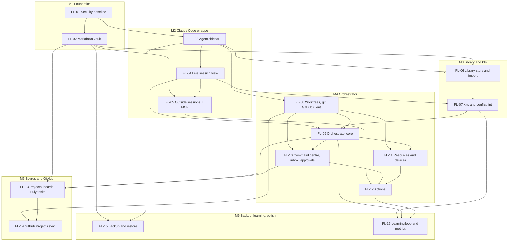

# Floatt command centre: epics

The execution breakdown for [`claude-code-command-centre-plan.md`](./claude-code-command-centre-plan.md). There are 16 epics in 6 milestones.

How to use this file:
- Each epic, from its **Milestone** line down to **Risks**, is ready to paste as a GitHub issue body.
- Each sub-task is sized for one agent in one worktree, ending in one PR.
- Sizes assume one developer working with agents: S is under a week, M is 1-2 weeks, L is 2-3 weeks, XL is 3-4 weeks.

## Milestones

| Milestone | Epics | What you have at the end | Rough weeks |
|---|---|---|---|
| M1 Foundation | FL-01, FL-02 | The same app, with data as markdown in `~/.floatt/` and a safe base | 4-5 |
| M2 Claude Code wrapper you can use daily | FL-03, FL-04, FL-05 | Run, watch and steer Claude sessions from Floatt, and see the ones you started elsewhere | 5-8 |
| M3 Library and kits | FL-06, FL-07 | One library, a kit per project, conflict lint and context cost | 4-6 |
| M4 Orchestrator | FL-08 to FL-12 | The open-source workspace as an app: queue issues, worktrees, verified reports, one inbox, approvals, device-switch buttons | 11-16 |
| M5 Boards, Huly features, GitHub Projects | FL-13, FL-14 | Boards with Huly fields, synced both ways with GitHub Projects | 4-6 |
| M6 Backup, learning loop, polish | FL-15, FL-16 | Drive backup with tested restore, proposals from repeated asks, metrics | 2-4 |

The serial total is about 30-45 weeks. Parallel tracks shorten it, because milestones mark an order of finishing, not a strict queue:
- FL-02 and FL-03 both start right after FL-01.
- FL-06 (library store) needs only the vault and the sidecar, so it starts during M2.
- FL-08 (worktrees and the GitHub client) starts as soon as FL-03 lands.
- FL-15 (backup) can move up to right after FL-02 if migration safety matters more than features.

Two changes from the first draft of the order, both from the research:
- The library store starts early, because the library is the lead pillar and it only needs the vault and the sidecar.
- The GitHub client moves into M4, because the approval sheet needs it to open PRs. Projects v2 sync stays in M5.

## Dependency graph

There are two critical paths. The longer runs FL-01 → FL-03 → FL-04 → FL-07 → FL-09 → FL-10 → FL-12 → FL-16. The other runs FL-01 → FL-02 → FL-06 → FL-07.

---

## M1 Foundation

### FL-01 Security baseline and groundwork

**Milestone:** M1 · **Size:** M, about 1 week · **Depends on:** none

**Problem**

The desktop app runs with `csp: null`. Two components read the Dexie `db` directly, sibling packages can't import `@floatt/app` without a cycle, and there is no CI. The command centre will render markdown written by agents and gain process access, so an XSS there would become code execution.

**Goal**

Make the codebase safe and modular enough for the command-centre work, with no visible change for users.

**In scope**
- A strict CSP in `tauri.conf.json`
- Remove the leftover `greet` command
- Move the two direct `db` reads behind queries and hooks
- Subpath exports `./ui`, `./stores` and `./hooks` on `@floatt/app`
- An `App` `modules` prop, so desktop-only packages add sidebar entries and screens by injection
- CI on pull requests: install, `check-types`, `test`
- CLAUDE.md updated: the Platform section, module injection, and the rule that markdown renders without raw HTML

**Out of scope**
- Any new user feature
- Picking a linter

**Done when**
- The desktop app runs in dev and in a release build with the strict CSP, and Tauri IPC still works
- No file under `components/` or `hooks/` imports `db`
- A test module passed through `modules` renders a sidebar entry and a screen, and `@floatt/app` never imports it
- CI runs on every PR and is green on `main`
- `greet` is gone from Rust and from the capabilities file

**Sub-tasks**
- [ ] FL-01.1 Set a strict CSP and fix what it breaks in dev and release builds
- [ ] FL-01.2 Remove the `greet` command and its capability entry
- [ ] FL-01.3 Route `search-results.component.tsx` and `use-keyboard-shortcuts.ts` through queries and hooks
- [ ] FL-01.4 Add `./ui`, `./stores` and `./hooks` subpath exports
- [ ] FL-01.5 Add the `App` `modules` prop, with a test module
- [ ] FL-01.6 Add a GitHub Actions workflow for install, `check-types` and `test`
- [ ] FL-01.7 Update CLAUDE.md (Platform section, module injection, safe markdown rule)

**Risks**
- The CSP may break dev tooling or IPC. Test both dev and release builds.

### FL-02 Markdown vault at `~/.floatt`

**Milestone:** M1 · **Size:** XL, 3-4 weeks · **Depends on:** FL-01

**Problem**

All tasks live in IndexedDB inside the webview. Agents, git, the sidecar and backup can't read them, and nothing can reach them while the window is closed.

**Goal**

Tasks and projects live as markdown files with YAML frontmatter in `~/.floatt/`. Dexie becomes an index that can be rebuilt, and existing data migrates safely. This is the first shippable step: the same app, with markdown data.

**In scope**
- A `@floatt/vault` package (schemas, serialise, reconcile, in-memory `VaultFs`, migration) that works in the webview and in Node
- Rust vault commands: a path jail, atomic writes with an expected hash, a watcher
- A `floatt-index` Dexie database, reconciled on start and on every change
- Task, subtask, group and subgroup services writing through the vault
- A midpoint reorder, so a move writes one file
- A one-time migration from Dexie v1, with a JSON dump kept in `~/.floatt/.migrations/`
- A web `VaultFs` over IndexedDB
- A vault location setting (default `~/.floatt/`), with `device.json` in the Tauri app-data dir
- A problems list for invalid files and sync-tool conflict copies

**Out of scope**
- New Huly fields and the board (FL-13)
- The library (FL-06)
- Git auto-commit of the vault

**Done when**
- A fresh install creates `~/.floatt/` with `config.json` and the default `projects/tasks/` project
- Every task edit writes exactly one file, and so does a drag reorder
- An edit made in another editor shows in the UI within about a second
- Existing v1 data migrates with nothing lost, and the dump file is kept. The v1 IndexedDB stays untouched for one release
- Deleting the index and restarting rebuilds it from the files
- Path jail tests reject `..`, absolute paths and symlink escapes
- The vault can be moved in Settings, and `device.json` never lives inside it
- The web build works on its IndexedDB `VaultFs`
- The time for a cold index of 10k task files is measured and written down

**Sub-tasks**
- [ ] FL-02.1 `@floatt/vault`: Zod schemas with passthrough for project, task, milestone, note and decision; YAML serialise with a fixed key order
- [ ] FL-02.2 `planReconcile` util and an in-memory `VaultFs`, with vitest
- [ ] FL-02.3 Rust: scan, read, write with expected hash (temp file then rename), remove to `.trash/`, move, and the path jail, with tests
- [ ] FL-02.4 Rust: debounced watcher over a Channel, vault root picked only through a native dialog, `device.json` in app-data
- [ ] FL-02.5 The `floatt-index` database, reconcile on start and on watch events, the problems table
- [ ] FL-02.6 Move the task, subtask, group and subgroup services to field-patch writes
- [ ] FL-02.7 Midpoint reorder in `reorder.service.ts`
- [ ] FL-02.8 Migration from Dexie v1 with a dump, plus the first-launch flow
- [ ] FL-02.9 Web `VaultFs` over a Dexie `files` table
- [ ] FL-02.10 Settings: show, reveal and move the vault location

**Risks**
- Data loss during migration. Keep the v1 data for one release, and test the migration against an in-memory vault
- Slow cold rebuilds on large vaults
- iCloud placeholders and conflict copies if the user moves the vault into a synced folder
- CRLF line endings on Windows and NFC file names on macOS

---

## M2 Claude Code wrapper you can use daily

### FL-03 Agent sidecar and runtime store

**Milestone:** M2 · **Size:** L, 2-3 weeks · **Depends on:** FL-01

**Problem**

The Agent SDK is TypeScript, and runs have to keep going when the window closes. Floatt has no process that can host Claude sessions, own runtime state, or serve hooks and MCP.

**Goal**

Ship `floatt-agentd`, a sidecar that Rust supervises. It owns a SQLite runtime store in app-data and one loopback server for the UI, hooks and MCP.

**In scope**
- A packaging spike: a Bun-compiled sidecar, signed and notarised, with Node as the fallback
- A Rust supervisor that starts agentd, restarts it with backoff and kills its process group on quit. The tray keeps it running with the window closed
- A loopback server on 127.0.0.1 with a per-boot token: WebSocket for the UI, plus `/hook` and `/mcp` stubs
- SQLite schema v1 and a migration runner (events, jobs, runs, sessions, decisions, actions, leases, resources, GitHub cache)
- A `Platform.agent` capability, desktop only
- Secrets handed over from the keychain on request, through stdio
- Detecting the user's `claude` (path, version, capabilities), with a clear setup state when it's missing
- A read cache of the vault fields agentd needs, through `@floatt/vault`

**Out of scope**
- The session UI (FL-04)
- Orchestration (FL-09)

**Done when**
- A signed, notarised build runs agentd on a clean Mac
- Closing the window keeps agentd running, and quitting Floatt stops agentd and every child process
- The UI reconnects by itself after agentd restarts
- Requests without the token are refused
- The SQLite file lives in app-data, never under `~/.floatt/`
- The web build shows no agent UI
- When `claude` is missing, the UI says so and links to Anthropic's install docs

**Sub-tasks**
- [ ] FL-03.1 Spike: a Bun-compiled sidecar in `externalBin`, signed and notarised. Write down the entitlements and size, and fall back to Node if it fails
- [ ] FL-03.2 Rust supervisor with restart backoff and process-group kill, kept alive from the tray
- [ ] FL-03.3 Loopback server with token auth, the WebSocket channel and `/hook` and `/mcp` stubs. Allow its port in the CSP `connect-src`
- [ ] FL-03.4 SQLite store, migration runner and schema v1
- [ ] FL-03.5 `Platform.agent` type and desktop adapter (connect, subscribe, command), undefined on web
- [ ] FL-03.6 Keychain bridge: agentd asks Rust for a named secret over stdio
- [ ] FL-03.7 `claude` discovery, version and capability check, and the setup screen
- [ ] FL-03.8 agentd's vault read cache, using `@floatt/vault` (needs FL-02.1)

**Risks**
- Hardened runtime and JIT entitlements for a Bun binary are **[unverified]**. That's why FL-03.1 runs in week 1
- The sidecar may be about 60-100 MB **[unverified]**
- A second runtime to update and debug

### FL-04 Live session view

**Milestone:** M2 · **Size:** L, 2-3 weeks · **Depends on:** FL-03

**Problem**

Today, checking on an agent means asking master and waiting for relayed prose. Floatt needs to run Claude sessions itself and show what each one is doing, live, with approvals in the UI.

**Goal**

Start, watch, steer and stop Claude sessions in any repo from Floatt. It should be calmer than a terminal and just as capable.

**In scope**
- An SDK driver in agentd: start, resume, send with priority, interrupt, change permission mode and model, close
- An event normaliser from the SDK stream to compact UI events
- `canUseTool` and `AskUserQuestion` shown as approval cards
- A session list and the task focus view: a timeline (steps, tools, subagents), chat with queued messages, and Diff, Checks and Log tabs
- CodeMirror 6 with `@codemirror/merge` for diffs and text
- Cost, context and rate-limit meters
- Recovery after agentd restarts, and file rewind per turn
- "Open in VS Code" and "Open in terminal"
- The `claude -p` stream-json driver as a fallback, behind a setting

**Out of scope**
- Kits from the library. Sessions use an empty kit until FL-07
- Budgets, reports and worktrees (FL-08, FL-09)
- Sessions Floatt didn't start (FL-05)

**Done when**
- You can pick a repo folder, type a prompt, and see streaming text, tool cards, subagents and steps
- A permission prompt appears in Floatt, and allow or deny reaches Claude
- A message typed mid-turn shows as "queued" and is delivered
- Stop ends the turn within a few seconds
- After agentd is killed, the session shows as interrupted, and Resume continues the same session id
- Cost and context percent show for each session
- "Open in VS Code" opens the folder in a new window

**Sub-tasks**
- [ ] FL-04.1 SDK driver and session table in agentd, with events over the WebSocket
- [ ] FL-04.2 Event normaliser (tools, subagents, todos from both `TodoWrite` and `Task*`, cost, rate limits), with text coalesced to about 30 fps
- [ ] FL-04.3 Approvals: `canUseTool` → decision record → UI card, cancelled on abort
- [ ] FL-04.4 Session list and the focus view shell
- [ ] FL-04.5 Tool cards and the subagent tree, with a virtualised log
- [ ] FL-04.6 Diff tab: per-call edits plus `git diff`, rendered with CodeMirror merge
- [ ] FL-04.7 Recovery on agentd start, resume, and rewind of the last turn
- [ ] FL-04.8 "Open in VS Code" and "Open in terminal" buttons
- [ ] FL-04.9 Fallback stream-json driver that shares the normaliser

**Risks**
- The SDK can change. Feature-detect on the init capabilities, not on version strings
- Which todo tool current Claude Code uses is **[unverified]**, so render both
- Parallel sessions use up Pro or Max limits quickly

### FL-05 Outside sessions and the Floatt MCP server

**Milestone:** M2 · **Size:** M, 1-2 weeks · **Depends on:** FL-02, FL-04

**Problem**

Many sessions start outside Floatt, in a terminal or in VS Code. Floatt can't see them, and agents have no way to read tasks or ask Floatt for anything.

**Goal**

Every Claude session on the machine can show up in Floatt and talk to it, as an opt-in.

**In scope**
- The Floatt MCP server over HTTP: `tasks_*`, `notes_*` and `project_state`, with good server instructions and small results
- An opt-in installer for user-scope `http` hooks and the MCP registration, with a diff preview and a byte-for-byte uninstall
- Hook ingest, shown as "external" rows in the session list
- Answering `PermissionRequest` from Floatt
- Polling `claude agents --json --all` for background sessions
- A statusline script that prints a line and posts cost and rate limits
- `SessionStart` context injection (the current task and recent action runs)

**Out of scope**
- Action tools (FL-12)
- `library_propose` (FL-16)
- GitHub tools (FL-08)

**Done when**
- With the opt-in on, a `claude` started in a terminal appears in Floatt within 2 seconds, with its folder and state
- With Floatt quit, that terminal session runs normally, because hooks fail open with short timeouts
- A permission prompt in an outside session can be answered in Floatt
- An agent can call `tasks_list` and `tasks_create`, and the new task file appears in the vault
- Turning the opt-in off restores `~/.claude/settings.json` byte for byte

**Sub-tasks**
- [ ] FL-05.1 MCP server on the loopback server, with `tasks_*` and `notes_*`
- [ ] FL-05.2 `project_state` tool and the server instructions
- [ ] FL-05.3 Hook ingest endpoint and the external session model
- [ ] FL-05.4 Opt-in installer and uninstaller, with preview and restore
- [ ] FL-05.5 Answer `PermissionRequest` from the inbox
- [ ] FL-05.6 `claude agents --json` poller
- [ ] FL-05.7 Statusline script for cost and rate limits

**Risks**
- Writing `~/.claude/settings.json` needs explicit consent every time
- Hook payloads can change between Claude Code releases
- Never parse transcript JSONL, because its format is internal

---

## M3 Library and kits

### FL-06 Library store and import

**Milestone:** M3 (can start during M2) · **Size:** L, 2-3 weeks · **Depends on:** FL-02, FL-03

**Problem**

The user's skills are spread out and drifting. kitten-bot is copied into five repos with different content, the expo plugin is installed four times at different versions, and about 190 skills and commands load into every session. There is no canonical copy and no single place to see them all.

**Goal**

One library at `~/.floatt/library/`, filled by import and browsable in Floatt. The library is also a Claude Code plugin marketplace.

**In scope**
- The library repo layout, `marketplace.json`, the pack layout and the `floatt.json` schema
- Import from `~/.claude` (skills, agents, commands), from installed plugins, from linked repos' `.claude/` folders, and from git packs pinned to a sha
- Dedupe by content hash, with a drift view ("1 item, 3 variants, choose canonical")
- `claude plugin validate` after every change
- A library index for search (name, description, tags)
- A library browser: one table across kinds, with facets, search, usage counts, and an item detail view with its files and a CodeMirror editor
- Pack updates with a per-pack diff, with hooks, MCP servers and `bin/` flagged high-risk
- Curation tiers. The Community tier links out to the official and community marketplaces, skills.sh and MCP registries

**Out of scope**
- Kits and enabling packs per project (FL-07)
- Proposals from Claude and the learning loop (FL-16)

**Done when**
- A fresh library is a valid marketplace, and `claude plugin marketplace add ~/.floatt/library` works in plain Claude Code
- Import finds the user's `~/.claude` items and installed plugins, and copies them in without touching the originals
- The five kitten-bot copies show as one item with variants, and choosing a canonical copy works
- Every library change passes `claude plugin validate`
- An update shows a diff first, and a changed hook is marked high-risk
- Search finds an item by words in its description

**Sub-tasks**
- [ ] FL-06.1 Library layout, `marketplace.json`, and the `floatt.json` Zod schema in `packages/library`
- [ ] FL-06.2 Import `~/.claude` skills, agents and commands into a personal pack
- [ ] FL-06.3 Import installed plugins, one pack per plugin
- [ ] FL-06.4 Scan linked repos, dedupe by hash, show drift
- [ ] FL-06.5 Import git packs pinned to a sha; update with a diff and high-risk flags
- [ ] FL-06.6 Run `claude plugin validate` after every change and surface the errors
- [ ] FL-06.7 Library index and search
- [ ] FL-06.8 Library browser screen, and item detail with the editor
- [ ] FL-06.9 Community tier: registry links labelled unvetted

**Risks**
- Imported packs can carry hostile instructions or MCP commands. Nothing from them runs until the user approves it
- Reading `~/.claude` is fine. Writing there is not, without an opt-in
- A large library will need the embeddings tier from the local AI plan for good search

### FL-07 Kits, conflict lint and per-project packs

**Milestone:** M3 · **Size:** L, 2-3 weeks · **Depends on:** FL-04, FL-06

**Problem**

Even with one library, every session still gets every pack. Triggers overlap ("plan this" matches three skills), hooks inject rules into subagents unseen, and nothing tells the user what a pack costs in context.

**Goal**

Each project picks a kit, Floatt checks the kit for conflicts and cost, and every Floatt run loads exactly that kit without writing into the repo.

**In scope**
- The kit schema and `kits/default.json`, plus `kit:` in `project.md`
- A resolver (extends, requires, excludes, conflicts) as a pure, tested function, plus a kit lockfile
- A materialiser that writes a content-addressed plugin folder in app-data, with instructions appended to the system prompt
- Kit to SDK options (plugins, settingSources, model, effort, permission mode, budget). Each run records its lock
- The conflict lint:
  - shadowing
  - trigger overlap
  - hooks on the same event, and hooks that inject into subagents
  - MCP collisions
  - contradicting permissions
  - contradicting instructions, shown side by side
- Context cost per pack, measured at session init
- A per-project toggle grid (On, Scope, Version, Cost, Conflicts)
- Scopes:
  - local scope for repos you don't own
  - user scope as an opt-in per pack
  - project scope only in owned repos
  - `.git/info/exclude` when a file must exist
- The Core starter kits: `oss-contributor`, `expo-app`, `writing`, `design`

**Out of scope**
- Kit routing by task type (FL-09)
- A workflow builder and skills bound to board columns (later)

**Done when**
- A Floatt run in a project loads exactly its kit. `supportedCommands()` matches the kit and includes nothing from the user's `~/.claude` settings
- `git status` in the repo is clean after a run starts
- The lint flags `plan`, `ccr-plan` and `gsd:plan-phase` as overlapping, and offers to keep one and disable the others
- A hook that injects into subagents is flagged
- The toggle grid shows each pack's context cost
- Toggling a pack in a repo the user doesn't own writes only `.claude/settings.local.json`
- The `oss-contributor` kit runs an issue end to end in a test repo

**Sub-tasks**
- [ ] FL-07.1 Kit schema, the default kit, and `kit:` in `project.md`
- [ ] FL-07.2 `resolveKit` pure function and lockfile, with vitest
- [ ] FL-07.3 Materialiser to a content-addressed plugin folder in app-data
- [ ] FL-07.4 Kit to SDK options in the session driver, recording the lock on the run
- [ ] FL-07.5 Conflict lint: static checks (shadowing, hooks, MCP, permissions)
- [ ] FL-07.6 Conflict lint: trigger overlap and contradicting instructions
- [ ] FL-07.7 Context cost measurement per pack
- [ ] FL-07.8 Per-project toggle grid and scope writes
- [ ] FL-07.9 The Core starter kits

**Risks**
- Keyword overlap misses paraphrased triggers. Embeddings come later
- Managed settings and auto memory still load in SDK sessions. Turn memory off per run if it gets in the way
- `--bare` may become the default for `-p`, so always pass explicit options

---

## M4 Orchestrator, multi-project, worktrees, resources, actions

### FL-08 Worktrees, git and the GitHub client

**Milestone:** M4 (can start during M2) · **Size:** L, 2-3 weeks · **Depends on:** FL-03

**Problem**

Today, worktree creation, base clone syncing, cleanup and every GitHub call happen by hand or through agents. That led to a worktree inside a base clone, and to a hook that called the API about 30 times per command and hit the user's rate limit.

**Goal**

agentd owns every worktree and git operation and the only GitHub client, with a shared budget and git-first checks.

**In scope**
- Worktree create, a port of `new-worktree.sh`:
  - absolute paths and a branch name check
  - fork sync under a per-repo mutex, then a fast-forward with hooks off
  - the base guard
  - the install as a job, skipped when the lockfile hash matches
  - files to copy, the setup script and the draft folder
- Worktree cleanup: leases released, actions expired, no force flags, and remote branch deletes through approval
- Git status helpers using porcelain v2, with a per-repo write mutex
- The GitHub client:
  - the token from `gh auth token`
  - REST and GraphQL token buckets
  - an ETag cache in SQLite
  - backoff
  - a budget readout
- Git-first PR and merge detection (`ls-remote` pull refs, `merge-base --is-ancestor`)
- Cached `github_*` MCP read tools and `propose_write` for agents
- Push and PR creation from agentd, used by the approval sheet in FL-10
- Overlap detection between active branches, and a rebase job with `rerere`

**Out of scope**
- Device and dev server resources (FL-11)
- Projects v2 sync (FL-14)

**Done when**
- A worktree requested with a relative path still lands in the absolute worktree root, never inside a base clone (test)
- A dirty base clone freezes worktree creation for that repo and raises a decision. It is never reset
- A second worktree with the same lockfile skips the install
- Cleanup refuses to remove a worktree with uncommitted changes and asks instead
- With 4 agents running, GitHub use stays inside the set budget, and the UI shows what's left
- A squash-merged PR is detected as merged without an API call
- Two branches touching the same file raise a merge-order decision

**Sub-tasks**
- [ ] FL-08.1 Git helpers (porcelain v2, per-repo mutex) and the base guard
- [ ] FL-08.2 Worktree create job: path checks, sync, install job, draft folder
- [ ] FL-08.3 Worktree cleanup job
- [ ] FL-08.4 GitHub client: token, buckets, ETag cache, backoff, budget readout
- [ ] FL-08.5 Git-first PR, merge and branch state
- [ ] FL-08.6 `github_*` MCP reads and `propose_write`
- [ ] FL-08.7 Push and PR create, run only when an approval record exists
- [ ] FL-08.8 Overlap detection and merge-order decisions
- [ ] FL-08.9 Rebase job after a parent merges, with the force push going through approval

**Risks**
- Repo quirks (like pnpm 12 without corepack) need per-repo profiles
- The `gh` token may lack the `project` scope that FL-14 needs
- ETag behaviour on the newer Projects REST endpoints is **[unverified]**

### FL-09 Orchestrator core

**Milestone:** M4 · **Size:** XL, 3-4 weeks · **Depends on:** FL-04, FL-07, FL-08

**Problem**

Today the master agent holds the roster in its context, can't get messages from its agents, trusts their claims and has no budgets. Status arrives late and stale, and one run went 20 minutes over scope.

**Goal**

A deterministic orchestrator in agentd that queues, schedules, budgets, verifies and recovers runs across all projects.

**In scope**
- A job queue in SQLite with typed needs and pools (agent runs, installs, CPU, RAM, spend)
- The run state machine with overlay states, written as events first
- The scheduler: global and per-project caps, priority with aging, interactive jobs first, and a reason for every wait
- Per-project policy profiles
- Kit routing by task type, with a stored advisor triage as the fallback
- The scope contract and budgets, with behaviour at 50, 80 and 100 percent
- Step labels from `tool_use`, and stall detection that checks CPU time
- The structured report schema, a verifier that runs the repo's check manifest, and claim chips
- The commit pipeline: format, validate the message, `git commit --only`, check the tree
- Policy guards in `canUseTool` and `PreToolUse`:
  - paths
  - parsed Bash
  - the git index rule
  - the GitHub API ban
  - the server and device command ban
  - per-repo allowlists
- Durability: intent and result events, with reconcile by checking the world
- `dependsOn` gating, and bulk pause, resume and cancel

**Out of scope**
- The command centre and inbox UI (FL-10)
- Device leases (FL-11)
- The optional master chat persona (decide at the end of M4)

**Done when**
- With 6 tasks queued and a cap of 4, exactly 4 run, and the other 2 show why they wait
- A run at 80% of its budget gets the wrap-up message, and at 100% it stops and raises a decision
- A run that edits outside its worktree, or runs `git add`, `gh api` or `expo start`, is denied with a message pointing to the right tool
- A report that claims a check passed shows grey until agentd's own run of that check passes
- Killing agentd mid-push and restarting it reconciles from `git ls-remote`, without pushing twice
- A pre-commit hook that rewrites files stops the commit and shows the diff

**Sub-tasks**
- [ ] FL-09.1 Job queue, pools and `pickNext`, with tests
- [ ] FL-09.2 Run state machine and event projections
- [ ] FL-09.3 Policy profiles and the scheduler loop, with a reason for every wait
- [ ] FL-09.4 Kit routing by task type, and stored triage
- [ ] FL-09.5 Scope contract, budgets and nudges
- [ ] FL-09.6 Step labels and stall detection
- [ ] FL-09.7 Report schema, check manifest runner, claim verification
- [ ] FL-09.8 Commit pipeline with `--only` and the tree check
- [ ] FL-09.9 Policy guards with a shell-quote parser, plus the per-repo allowlist mode
- [ ] FL-09.10 Intent and result events, and crash reconcile

**Risks**
- Odd shell syntax can slip past Bash parsing. Deny `sh -c` and `bash -c` by default
- The budget defaults will be wrong at first. The metrics page (FL-16) tunes them
- Scope creep. Keep the master persona out until the inbox has proved itself

### FL-10 Command centre, inbox and approvals

**Milestone:** M4 · **Size:** L, 2-3 weeks · **Depends on:** FL-08, FL-09

**Problem**

The user reads long chat messages to learn what nine agents are doing, answers numbered decision lists by hand, and approves commit and PR text in chat.

**Goal**

One home screen for every run across projects, one inbox for every decision, and one sheet that sends approved text with one key.

**In scope**
- Sidebar entries (Inbox, Command centre, Resources, Library), a sync footer and a 24px status bar
- The command centre: one line per run, grouped Needs you, Working, In review and Done today, with peek (Space) and reply
- The inbox:
  - approval, decision (single and grouped), permission and cleanup cards
  - the recommended option first
  - the keys `Y`, `1`-`9`, `E`, `H`, `X`, `Shift+Y`
  - dedupe, supersede and resolve
- The approval sheet: a safety header, editable commit, push and PR text, edits diffed against the draft, Send all with progress, and "Ask agent to revise"
- The `⌘K` palette base:
  - navigation
  - the prefixes `a:`, `s:`, `p:` and `#96`
  - paste a GitHub issue URL to start an agent from a preflight card
- Notification tiers, batching (at most one per 2 minutes) and the away recap
- Status colour tokens for both themes, reduced motion, and screen-reader text

**Out of scope**
- Actions in the palette (FL-12)
- The board view (FL-13)

**Done when**
- Nine test runs across three projects render as nine lines grouped by state, and nothing auto-scrolls
- Fifteen decisions from one run show as one card with "Accept 12 recommended"
- An approval that posts to GitHub can't be batch-accepted until its sheet has been opened once
- Send all commits, pushes and opens the PR with exactly the text shown, and the card gets a PR chip
- A wrong remote turns the safety header red and disables Send
- A newer draft replaces the old approval card instead of adding a second one
- Pasting an issue URL into `⌘K` starts a run after one Enter

**Sub-tasks**
- [ ] FL-10.1 Sidebar entries, sync footer and status bar
- [ ] FL-10.2 Command centre list with state groups, peek and reply
- [ ] FL-10.3 Inbox data model: dedupe keys, supersede, resolve, snooze
- [ ] FL-10.4 Inbox UI and keys, grouped decisions, accept recommended
- [ ] FL-10.5 Approval sheet with the safety header, edits and Send all
- [ ] FL-10.6 `⌘K` palette base with navigation and prefixes
- [ ] FL-10.7 Start an agent on an issue: the preflight card (open-PR check from cached reads, branch, port, kit, budget)
- [ ] FL-10.8 Notification tiers, batching and the away recap
- [ ] FL-10.9 Status tokens, contrast checks and accessibility text

**Risks**
- Too much on screen. Write the "calm by default" rules as tests
- Preflight open-PR checks spend API budget. Use the cache, and show a link when it's stale

### FL-11 Resource broker and devices

**Milestone:** M4 · **Size:** L, 2-3 weeks · **Depends on:** FL-08, FL-09

**Problem**

Agents started and killed Metro servers, the emulator and DevTools. Servers died, or came back after their worktree was gone. An agent tapped into the user's other app, and another claimed a device switch worked when it didn't.

**Goal**

agentd owns every dev server, emulator and device. Agents lease them, and pointing a device at a worktree is a verified recipe.

**In scope**
- The resource model, with each process supervised in its own process group and logs kept per resource
- Leases with an owner, mode, TTL and scope, cascading on worktree removal
- Port pools: sticky per task, test-bound before use, with exclusive ports supported
- Health checks (Metro, Vite, emulator) and restarts with backoff
- The agent tools `resource.acquire` and `release`. Policy denies direct server and device commands
- A device pool with tags:
  - a dedicated agents emulator
  - write leases with allowed app ids
  - a foreground app check before every tap
- `device.point` recipes with inspector and screenshot verification:
  - Expo dev client
  - physical Android device
  - bare React Native with `debug_http_host`
  - iOS simulator
- `device.screenshot` as evidence for reports
- The resources panel: worktrees, servers, devices, and base clones with "Sync workspace" and "Clean up"

**Out of scope**
- User-facing action buttons beyond the built-ins (FL-12)
- Container runtimes

**Done when**
- Removing a worktree stops its servers and frees its ports, and nothing restarts them
- Task #96 gets the same port every time it starts
- Pointing a bare React Native app at port 8085 works on the emulator, verified by the inspector check and a screenshot
- A tap aimed at an app outside the lease is refused
- The user's personal emulator is never leased unless they opt in
- A crashed Metro restarts up to 3 times, then raises a decision

**Sub-tasks**
- [ ] FL-11.1 Resource model and supervised spawn with logs
- [ ] FL-11.2 Leases with a heartbeat TTL, cascading on worktree removal
- [ ] FL-11.3 Port pools and sticky allocation
- [ ] FL-11.4 Health checks and restart policy
- [ ] FL-11.5 `resource.acquire` and `release` tools; policy denies server and device commands
- [ ] FL-11.6 Device pool, agents emulator setup, write leases and the foreground check
- [ ] FL-11.7 `device.point` recipes with verification
- [ ] FL-11.8 Screenshot capture as evidence
- [ ] FL-11.9 Resources panel

**Risks**
- Device recipes differ per app, so keep them per project and verified
- The extra emulator costs about 2 GB of RAM
- Each app's Expo deep link format is **[unverified]** until tested

### FL-12 Actions

**Milestone:** M4 · **Size:** L, 2-3 weeks · **Depends on:** FL-05, FL-10, FL-11

**Problem**

The user asks Claude for the same things again and again ("switch to 8085", "restart Metro"), and each one is an LLM round trip. Claude should register a button once, and the user should click it with no LLM in the loop.

**Goal**

Claude registers actions through MCP, and the user approves the exact command once. Floatt then runs each action deterministically from the card, the status bar or `⌘K`.

**In scope**
- The action schema: builtin, argv or steps; typed params; preconditions; scope; expiry
- The MCP tools `actions_register`, `actions_update`, `actions_remove`, `actions_list` and `actions_runs`, with `requiresUserInteraction` on the writes
- A proposal and approval card that shows the exact argv, cwd and env, with a diff for updates
- Classification: the stricter of the claimed level and a denylist check, never lowered
- HMAC signing, with the key in the keychain. The runner refuses any mismatch
- The runner: argv only, whole-element params, a cleared env, its own process group, a timeout, a 1 MB buffer, and run records
- Built-in ops from resources and git: point a device, restart a server, run checks, open a URL, open in VS Code, clean up a worktree
- Click-time preconditions, expiry with scope, and tombstones
- Surfaces: card chips, the task header, status bar pins (`⌥1`-`⌥5`), the resources panel and `⌘K`
- Results back to Claude through `streamInput`, hook `additionalContext` and `actions_runs`
- Promoting an action into a template in a pack's `floatt.json`

**Out of scope**
- Spotting repeated asks and offering "Make this an action?" (FL-16)
- Rendering actions in other hosts through MCP Apps (later)

**Done when**
- An agent registers "Switch app to #96 (port 8085)". It shows as a proposal with the exact command and isn't clickable until approved
- After approval, one click runs it with no LLM call, and the result toast links to the log
- Editing the stored definition by hand makes the runner refuse it
- An action containing `git push` is classed `approve`, even when Claude claims `read`
- Removing the #96 worktree greys out and expires its actions
- Typing "switch" in `⌘K` lists the live switch actions, and `⌥1` runs the first pinned one

**Sub-tasks**
- [ ] FL-12.1 Action schema, SQLite storage and run records
- [ ] FL-12.2 MCP action tools with proposals
- [ ] FL-12.3 Classification denylist and level rules, with tests
- [ ] FL-12.4 HMAC signing and verification
- [ ] FL-12.5 The deterministic runner
- [ ] FL-12.6 Approval card with argv, cwd, env and the update diff
- [ ] FL-12.7 Built-in ops wired to resources and git
- [ ] FL-12.8 Surfaces: chips, header, status bar pins and `⌘K` entries
- [ ] FL-12.9 Results fed back to sessions, and promotion to a template

**Risks**
- A denylist never catches everything, so unknown argv defaults to `approve`
- Too many buttons. Expiry and pins keep the list short

---

## M5 Boards, Huly features, GitHub Projects sync

### FL-13 Projects, boards and Huly-style tasks

**Milestone:** M5 · **Size:** L, 2-3 weeks · **Depends on:** FL-02, FL-09, FL-10

**Problem**

Floatt has lists and steps, but it has no projects with repos, no board, and none of the tracker features (sub-issues, milestones, labels, estimates) the user wants alongside agents.

**Goal**

Every project gets a board and Huly-style fields, stored in its markdown files, with agent state shown on the cards.

**In scope**
- `project.md` fields: key, kind, repo, owned, statuses, components, estimate unit, theme (moved from localStorage), agents policy, and the run-to-status mapping
- Task fields: status, parent, milestone, labels, component, estimate, assignee, dependsOn, branch, pr
- Milestones, notes and decisions as files
- A board view with dnd-kit columns from `statuses`, and a list view of the same rows
- The agent overlay on cards (state, step, budget, port, PR, CI)
- Drag rules: dropping on In progress offers "Start agent"; dropping on Done during a run asks first
- Sub-issues, and promoting a step to a sub-issue
- Per-device time logs, and estimates against actuals (agent time counted)
- Single-key verbs on the selected task
- Status changes on mapped run events

**Out of scope**
- GitHub sync (FL-14)
- Planner time-blocking, a timeline view, and skills bound to columns (later)

**Done when**
- A project's board shows its custom statuses as columns, and a drop writes one file
- A task with an active agent shows its live step on the card
- Opening a PR moves the card to the mapped status
- Sub-issues show under their parent and roll up progress
- Time logged on two devices never conflicts
- An agent can create a sub-issue through `tasks_create`, and it shows on the board

**Sub-tasks**
- [ ] FL-13.1 `project.md` and task schema additions in `@floatt/vault`
- [ ] FL-13.2 Project settings screen (key, statuses, components, theme, policy)
- [ ] FL-13.3 Board view with columns and drag rules
- [ ] FL-13.4 Agent overlay on cards
- [ ] FL-13.5 Sub-issues, milestones, labels and components
- [ ] FL-13.6 Time logs, and estimates against actuals
- [ ] FL-13.7 Single-key verbs and palette commands
- [ ] FL-13.8 Status changes from mapped run events

**Risks**
- Renaming a status can break the mappings, so map by id
- Big projects can make the board slow, so virtualise the columns

### FL-14 GitHub Projects v2 two-way sync

**Milestone:** M5 · **Size:** L, 2-3 weeks · **Depends on:** FL-08, FL-13

**Problem**

The user's board and the GitHub board drift apart. Moving cards in both places by hand is the kind of repeated work Floatt should remove, and any sync has to respect the rate limit.

**Goal**

A linked project syncs both ways with a GitHub Project (v2), field by field, with clear conflict rules and a small API cost.

**In scope**
- A link flow: pick a ProjectV2, read its fields and options, auto-map Status by name, ask about the rest, and store the option ids in `project.md`
- A publish gate for new local tasks
- Pull: an `updatedAt` probe, paged items, issue ETags and an adaptive interval
- Push: an outbox with aliased mutations, one write per item per minute, and a circuit breaker
- A per-field three-way merge, with `base` hashes stored in the task file
- Conflict cards for text. For other fields GitHub wins with a notice, except during an active run
- Inbound commands: the start column enqueues the task (opt-in), and closing cancels the run after a confirm
- One sync-owner device
- A sync status screen: age, budget, open PRs with links, conflicts

**Out of scope**
- Webhooks
- An org-level GitHub App

**Done when**
- Linking a project imports its items and maps Status by option id
- A status change in Floatt shows on GitHub within a minute, and a change on GitHub shows in Floatt within one poll
- Editing the same title on both sides raises a conflict card, and nothing is overwritten
- A poll with no changes costs about 1 point
- 60 writes in 10 minutes trips the breaker and raises an alert
- A new local task stays off GitHub until it is published
- Renaming a Status option on GitHub raises a re-link item

**Sub-tasks**
- [ ] FL-14.1 Link flow and the field map in `project.md`
- [ ] FL-14.2 Pull loop with the probe, paging and ETags
- [ ] FL-14.3 Outbox, aliased mutations, rate limits and the breaker
- [ ] FL-14.4 Three-way merge with `base` hashes, with tests
- [ ] FL-14.5 Conflict cards and the active-run exception
- [ ] FL-14.6 Publish gate, and DraftIssue items for tasks without a repo
- [ ] FL-14.7 Inbound commands (start column, close)
- [ ] FL-14.8 Sync-owner device setting and the sync status screen

**Risks**
- The `gh` token may lack the `project` scope. The link flow must check for it and explain
- Fine-grained token support for user-owned projects is **[unverified]**
- Collaborators can reshape the Status options

---

## M6 Backup, learning loop, polish

### FL-15 Backup and restore

**Milestone:** M6 (can move up to right after FL-02) · **Size:** M, 1-2 weeks · **Depends on:** FL-02, FL-03

**Problem**

Once `~/.floatt/` holds everything, losing the disk loses everything. The hidden folder also sits outside Drive or iCloud folder sync, so backup can't rely on where the folder lives.

**Goal**

Encrypted, versioned snapshots of the vault go to a folder or to Google Drive on a schedule, and restore is tested.

**In scope**
- A snapshot builder: a zip of `~/.floatt/` plus `local-state.json` and a token-free `device.json`, with a manifest of per-file hashes
- `age` passphrase encryption, with the passphrase in the keychain and a printable recovery key
- A folder target
- A Google Drive target:
  - the `drive.file` scope
  - a visible "Floatt Backups" folder
  - loopback OAuth with PKCE
  - the refresh token in the keychain
  - resumable uploads
- A schedule (every 6 hours if anything changed, on quit, before migrations, and on demand), keeping 14 daily and 8 weekly snapshots
- Restore into a new folder: check the hashes, migrate an older schema or refuse a newer one, re-index, switch the root
- A settings screen and status in the footer

**Out of scope**
- Live sync between devices
- Backing up the SQLite runtime store, worktrees or caches

**Done when**
- "Back up now" writes an encrypted snapshot that the `age` CLI can open with the passphrase
- A snapshot restores into a new folder on a clean machine, and Floatt opens it with all projects and the library
- Retention keeps exactly 14 daily and 8 weekly snapshots
- A restore from a newer schema is refused with "update Floatt"
- Drive backups land in a visible folder, and the app sees only the files it created
- A backup that has been failing for more than 24 hours shows in the footer and in the inbox
- CI runs a backup and then a restore on a fixture vault

**Sub-tasks**
- [ ] FL-15.1 Snapshot builder and manifest
- [ ] FL-15.2 `age` encryption, keychain passphrase, recovery key
- [ ] FL-15.3 Folder target, schedule and retention
- [ ] FL-15.4 Restore into a new folder, with checks and migration
- [ ] FL-15.5 Google Drive OAuth (loopback, PKCE) and token storage
- [ ] FL-15.6 Drive upload, listing, and download for restore
- [ ] FL-15.7 Settings screen, footer status and failure alerts
- [ ] FL-15.8 Backup and restore test in CI

**Risks**
- OAuth apps left in Testing status lose refresh tokens after about 7 days **[unverified]**, so publish the app
- A user might point a sync client at the live app-data folder. Warn about it in Settings
- Large vaults. Switch to chunked uploads only past about 100 MB

### FL-16 Learning loop, library proposals and metrics

**Milestone:** M6 · **Size:** M, 1-2 weeks · **Depends on:** FL-07, FL-09, FL-12

**Problem**

Repeated requests ("switch Metro", "commit and raise PR", "don't touch the index") still cost a chat round trip each time, and nothing turns them into lasting skills, actions or rules. There's also no way to tell which kits and budgets work.

**Goal**

Floatt notices repeated asks and proposes library items. Claude can propose skills and agents for review. A metrics page shows what each kit costs and how often it fails.

**In scope**
- The `library_propose` MCP tool: it writes to a `proposals/<id>` branch, then validation, a review pane, merge and reload
- A request log (user messages to tasks, manual actions)
- A digest job that clusters repeats into action, skill and rule proposals, each with a scope and a recommendation
- A "Make this an action?" offer after the third similar command, shown once per pattern
- "Save as skill" from a transcript excerpt
- A metrics page: dollars per merged PR, verify-fail rate per kit, time per state, budget overruns
- The optional read-only master chat persona with `propose`, only if the user still wants it

**Out of scope**
- Learning anything silently
- Sharing learned items between users

**Done when**
- Asking three times to switch Metro to the same port produces one "Make this an action?" card with the command filled in
- A proposed skill shows as a diff and passes `claude plugin validate`. On approval it appears in the library and reloads in running sessions
- A rule proposal ("never touch the git index") comes with the matching policy guard, where one exists
- Nothing reaches `main` in the library without approval
- The metrics page shows the cost per merged PR for the last 30 days

**Sub-tasks**
- [ ] FL-16.1 `library_propose` and the proposals branch flow
- [ ] FL-16.2 Proposal review pane, with validation and high-risk flags
- [ ] FL-16.3 Request log and the clustering digest job
- [ ] FL-16.4 The "Make this an action?" offer
- [ ] FL-16.5 "Save as skill" from a transcript excerpt
- [ ] FL-16.6 Metrics page
- [ ] FL-16.7 Master persona panel (optional, after the user decides)

**Risks**
- Noisy proposals. Show each pattern once, and rate-limit the digest
- Clustering quality. Start with exact and near-exact matches

---

## First two weeks

Run these in parallel, one agent per worktree, one PR each. Each item lists what it waits on.

**Week 1**
- FL-01.1 Strict CSP (no wait)
- FL-01.2 Remove `greet` (no wait)
- FL-01.3 Move direct `db` reads behind queries and hooks (no wait)
- FL-01.6 CI workflow (no wait)
- FL-03.1 Bun sidecar signing and notarisation spike. This is the biggest unknown, so start it on day one
- FL-02.1 `@floatt/vault` schemas and YAML serialise (no wait)
- Not code: send the licensing question to Anthropic, and answer open questions 2-5 in the plan

**Week 2**
- FL-01.4 Subpath exports, then FL-01.5 the `modules` prop (FL-01.5 waits on FL-01.4)
- FL-01.7 CLAUDE.md update (after FL-01.5)
- FL-02.2 `planReconcile` and the in-memory `VaultFs` (after FL-02.1)
- FL-02.3 Rust vault commands and the path jail (no wait)
- FL-03.2 Rust supervisor (after FL-03.1 passes)
- FL-03.4 SQLite store and schema v1 (after FL-03.1 picks Bun or Node)

**End of week 2 check**
- The strict CSP is on, and CI is green on `main`
- `@floatt/vault` round-trips every entity type in tests
- The spike result is written down, with a go or no-go on Bun

## Later (not epics yet)

- Inline diff comments sent back to the agent
- An embedded preview browser and device mirror
- A terminal pane with input
- A timeline view per project
- Rearrangeable panes
- A menu-bar or phone companion (start with Claude's Remote Control)
- A VS Code companion extension
- Action cards as MCP Apps in other hosts
- A launchd agent so runs survive quitting Floatt
- Container runtimes
- Planner time-blocking
- A workflow builder that binds skills to board columns
- Opt-in auto-commit for the whole vault
