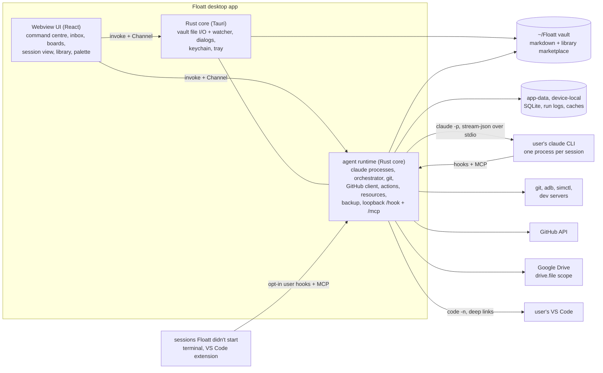

# Floatt as a Claude Code command centre: plan

Floatt grows from a local-first task manager into one place to run, watch and steer Claude Code across all of a developer's projects. This plan merges six research reports (see Sources) into one set of decisions. The build order and paste-ready epics are in [`claude-code-command-centre-epics.md`](./claude-code-command-centre-epics.md).

## Vision

Floatt is a personal command centre on top of Claude Code. It holds a large, curated **library** of skills, agents, tools (MCP servers), hooks and instructions, which you switch on per project as **kits** without polluting any repo. It runs Claude sessions through your own `claude` and shows each one as a calm single line with its live step, budget and heartbeat. Every question and approval from every project lands in **one inbox**. Agents register **actions** such as "Switch Pixel to #96 on :8085", and you click them later with no LLM in the loop. Projects, tasks, notes and the library live as markdown under `~/Floatt/`, where agents, git and backup can read them. Tasks sync both ways with GitHub Projects, and snapshots back up to Google Drive. The model is the user's open-source workspace (a master, one agent per issue, worktrees, exact-text approvals), with its chat rituals turned into code.

## What Floatt is NOT

- **Not another worktree runner.** Claude Code Desktop already runs parallel worktree sessions with a Projects coordinator and phone Dispatch, and Vibe Kanban, Crystal and Roo Code died or were archived competing there. Floatt builds on Claude Code's own sessions, plugins and hooks, and adds what nobody does well: a conflict-checked library, actions, a resource broker, one inbox and board across projects, and readable local state.
- **Not a Claude Code fork, installer or login provider.** Floatt never modifies anything of Claude's: no login flows, no writes to `~/.claude/*` or `~/.claude.json` (settings, plugins, memory), and no installing, updating or uninstalling `claude`. It works out of the box with the `claude` the user's interactive shell resolves, with the same settings and login.
- **Not a cloud service.** No backend, no webhook relay, no team server.
- **Not an editor.** VS Code stays the editor.
- **Not a terminal, browser, mobile companion or issue-tracker client.** Orca and Conductor do those well. Floatt shows Orca's sessions read-only and opens them there, and leaves multi-CLI support, remote hosts, artifact sharing and account switching to them.
- **Not a Huly clone,** and not a harness for every agent CLI. It supports Claude Code only.

## Key decisions

| # | Topic | Decision |
|---|---|---|
| 1 | Runner | Drive the user's installed `claude` CLI over stdio (`-p`, stream-json in and out, `--permission-prompts host`), the way the VS Code extension does, with the same binary, settings and login as the user's terminal. Observe other sessions read-only through `claude agents --json` |
| 2 | Process split | Rust is the trusted shell and owns every process. Floatt's agent runtime ("agentd") is a module in the Rust core, not a sidecar. The webview is UI only and talks to it over Tauri IPC |
| 3 | Source of truth | Vault markdown for content, SQLite in agentd for runtime state, Dexie as the UI's rebuildable index. The Rust core is the only writer of vault files |
| 4 | Store location | One device in v1. The vault is a visible `~/Floatt/` folder and can be moved. Device-local data lives in the Tauri app-data dir |
| 5 | Library format | `~/Floatt/library/` is a Claude Code plugin marketplace with a `floatt.json` beside each `plugin.json`. Kits load with `--plugin-dir` in Floatt runs, and through `.claude/settings.local.json` only inside worktrees Floatt created |
| 6 | Auth and licensing | Personal-only for now, with whatever `claude` login the user's terminal already uses; Floatt never logs in or touches `~/.claude`, and keeps tool approvals in the app. A public build (API key, signing) waits for Anthropic's answer |
| 7 | GitHub | One budgeted client in agentd. The `gh` token in v1, the device flow later. Polling, no webhooks |
| 8 | "VS Code" | Control the user's VS Code and embed CodeMirror 6 |
| 9 | Web app | Freeze the web build on its current Dexie data: no vault and no agents on web. Desktop is where the vault and Claude live |
| 10 | Orchestrator brain | Deterministic code, one instance for all projects. LLMs only as workers, advisors and an optional master persona |
| 11 | Approvals | Anything leaving the machine needs one exact-text approval bound to a content hash |
| 12 | Board vs run state | Task status is content in the file. Run state is a runtime overlay |
| 13 | Workflows | User- or agent-written step lists in YAML in the vault, run by agentd's orchestrator. Claude Code's own workflows run only inside an `agent` step |
| 14 | Agent-written artefacts | One proposal flow for every reusable kind (skills, actions, workflows, kits, checks, recipes and more): the agent proposes, the user edits and approves, and agents search before they write |
| 15 | Questions | Every question an agent asks is a tracked item with its own status. Partial answers go back as structured data, and nothing is re-asked in chat |
| 16 | Claude's files | Floatt never modifies anything of Claude's: no login flows, no writes to `~/.claude/*` or `~/.claude.json`, no installing `claude`. Sessions load what a terminal session would |
| 17 | Other tools | Orca shows in Floatt read-only ("Open in Orca"), and worktrees share the `.worktreeinclude` and `orca.yaml` conventions. Floatt skips what Orca and Conductor already do well |

### 1. Runner: the user's `claude` CLI over stdio

**Key decision:** Floatt doesn't build its own agent loop, and it doesn't embed the Agent SDK either. It drives the user's installed `claude` the way the VS Code extension does.
- **Runs Floatt starts:** the Rust core spawns one `claude` process per session:
  `claude -p --input-format stream-json --output-format stream-json --include-partial-messages --verbose --permission-prompts host --session-id <uuid> --mcp-config <floatt.json> --plugin-dir <kit>`
  - user messages go in on stdin as stream-json, so a message typed mid-turn is queued
  - `--permission-prompts host` sends every permission prompt (and `AskUserQuestion`) to Floatt as a control request on stdout. Floatt answers on stdin, and the answer becomes an inbox card first
  - interrupt, permission-mode and model changes are control requests on stdin, the same messages the SDK sends
  - `--resume <id>` continues a session after a restart, and `--fork-session` branches it
  - a session loads what a terminal session would: the user's settings, plugins, MCP servers, memory and login. Floatt adds only its own MCP server (`--mcp-config`, an HTTP endpoint on the runtime's loopback server) and the project's kit (`--plugin-dir`), and changes no file of Claude's to do it
  - an explicit clean-room kit adds `--strict-mcp-config`, `--setting-sources project,local` and `CLAUDE_CODE_DISABLE_AUTO_MEMORY=1` for that run only
  - Floatt always passes explicit flags, because `--bare` may become the default for `-p` (and `--bare` never reads OAuth, so it can't use the user's login)
- **Other sessions** (terminal, the VS Code extension, `claude --bg`): Floatt lists them read-only from `claude agents --json --all`. Hooks, a statusline and Floatt's MCP server in those sessions would need edits to `~/.claude`, so Floatt only shows a snippet the user can add themselves.
- Why the CLI and not the SDK: the stream-json messages are the same ones the SDK types, and the SDK itself is a wrapper that spawns this binary. Without it there's no JavaScript runtime to ship, sign or notarise, and no second process. Floatt runs the user's own unmodified binary with their own login, as an IDE extension does. The flags above were checked in `claude --help` 2.1.295.
- **Risk:** the host permission protocol (control requests and responses over stdio) is what the SDK implements, but it isn't documented as a standalone API. Floatt pins the `claude` version it was tested with, reads `claude_code_version` and the capabilities from the `system/init` message, warns when the installed version is newer, and re-tests on each update. If the protocol breaks, the fallback is a small Bun script that uses the Agent SDK for the same session.
- **Finding `claude` like the terminal does:** a macOS GUI app doesn't get the shell's `PATH`, so Floatt runs the user's interactive login shell once (`$SHELL -ilc 'command -v claude; claude --version'`), reuses that `PATH` and environment for every spawn, and shows the resolved path and version in Settings. If that fails it tries the known install locations, then a file picker. It never installs, updates or logs in to `claude`; when `claude` is missing or signed out, it says so and links to Anthropic's docs.
- **Spike result (2026-10-09, agent5): go.** Floatt drives `claude` directly over stdio, and its tools come from an HTTP MCP endpoint on the runtime's loopback server.
- Reconciled: B and D put the SDK in a sidecar; C ran each turn as a detached `claude -p`. **Pick the CLI, owned by the Rust core.** The tray keeps the app (and its `claude` children) alive with the window closed, and after a crash a run shows `interrupted` with one-click resume by session id.

### 2. Where orchestration state lives

**Key decision:** each concern has exactly one owner, and the app is two layers, not three processes.

| Layer | Owns | Never does |
|---|---|---|
| Webview (React) | UI, the Dexie index of the vault, ephemeral UI state | Spawn processes, hold tokens, open network connections |
| Rust core (Tauri), including the agent runtime ("agentd") | Windows, tray, notifications, native dialogs, keychain. Vault file I/O (path jail, atomic writes, watcher). The `claude` processes and their stdio, the SQLite store and event log, jobs and the scheduler, worktrees and git, resources, the action runner, the GitHub client, backup jobs, and one loopback server for `/hook` and `/mcp` (used only by `claude` processes) | Render UI |

- Why: without the SDK nothing needs a JavaScript runtime outside the webview. One process owns every child process, the runtime state and the policy, and it keeps running from the tray with the window closed.
- The UI talks to the runtime only through Tauri IPC (`invoke` plus a `Channel` per stream), so the webview never holds a token or reaches a port.
- The orchestrator from M4 on (scheduler, verifier, workflows) is the one part that might be easier in TypeScript. If writing it in Rust proves slow, it can move to a Bun process the Rust core supervises over stdio. Decide that at M4, not before.
- Reconciled: B put the action runner, git and GitHub in Rust; C put the scheduler in a webview hook; D used a Node sidecar for the SDK. **Pick one owner in the Rust core.** The SDK was D's only reason for a sidecar.

### 3. Source of truth

**Key decision:** three stores, each with one rule.

| Store | Holds | Is it the truth? |
|---|---|---|
| Vault (`~/Floatt/`, markdown with YAML frontmatter) | Projects, tasks, milestones, notes, decisions, run summaries, time logs, global rules, the library | **Yes**, for user content |
| SQLite (agentd, in app-data) | Runs, sessions, events, jobs, decisions, actions, leases, resources, GitHub cache | **Yes**, for runtime state |
| Dexie `floatt-index` (webview) | An index of the vault for the UI | No. Rebuilt on any schema change |

- Why: agents, git and backup can read files, and runtime churn (heartbeats, logs, ports) stays out of them. Today's `queries/` and `hooks/` keep working over Dexie, and the frozen web build keeps reading and writing the same tables directly.
- The agent runtime reads only the vault fields it acts on (status, branch, kit, holds) with a small Rust reader, and caches them. The full parser stays in `@floatt/vault` for the UI.
- The Rust core is the only writer of vault files: the UI and the agent runtime both go through it, and agents change tasks through MCP tools. Each write is atomic with an expected content hash; on a mismatch it re-reads and re-applies the field patch once.
- Reconciled: C kept run records as vault files. **Keep live run state in SQLite**, and write one summary file into the vault when a run ends.

### 4. Store location

**Key decision:** v1 runs on one device. The vault defaults to a visible `~/Floatt/` folder, and Settings can point it at any other folder.
- Device-local data lives in the **Tauri app-data dir**, not in the vault: `device.json` (vault path, worktree root, repo paths), the SQLite store, run logs and caches. Secrets go in the keychain.
- Why app-data: the file that says where the vault is can't live inside the vault, and moving the vault into a synced folder must never drag a live SQLite file along.
- Why visible: the user can open the notes in VS Code or Obsidian and put the folder in git later. Several devices (the vault in git, a sync-owner device for GitHub, per-device time logs) are in Later; until then there is no sync-owner device and no per-field merge state in files.

### 5. Library format

**Key decision:** `~/Floatt/library/` is a git repo that is also a Claude Code plugin marketplace.
- One pack is one native plugin, with Floatt-only metadata in a `floatt.json` beside its `plugin.json`. Rule fragments ship as skills, because plugins don't load an `instructions/` folder.
- Kits are `library/kits/<id>.json`.
- Floatt runs load the project's kit with one `--plugin-dir` per pack, straight from the library, and record the library commit as the run's kit lock. Worktrees Floatt created also get the kit as `enabledPlugins` in their `.claude/settings.local.json`, so terminal and VS Code sessions there use it. Floatt writes no other Claude config: not the user's own checkouts, not committed files, not `~/.claude`.
- Why: packs also work in plain Claude Code (the user can run `claude plugin marketplace add ~/Floatt/library`), and versions, dependencies and namespacing come for free.
- Reconciled: C put a `floatt:` block inside each item's frontmatter, which has to be stripped and breaks plain Claude Code use. **Pick A and B's sidecar file.**

### 6. Auth and licensing

**Key decision:** Floatt has no login UI, never reads Claude tokens, and never modifies anything of Claude's.
- **v1 is personal-only:** Floatt runs the user's installed, unmodified `claude`, signed in through Anthropic's own flow. Anthropic's legal page allows an end user to sign in to the unmodified binary with their own subscription.
- **A public release** (in Later): an API key kept in the keychain, app signing and notarisation, and auto-update. The legal page doesn't let third-party developers route requests through Free, Pro or Max credentials on behalf of their users. Conductor's blog reports that Anthropic's 13 May policy on Agent SDK subscription use in third-party tools is "delayed indefinitely".
- **Approvals stay in the app:** Floatt resolves the real `claude` binary, never a shell alias, so an alias's `--dangerously-skip-permissions` doesn't carry over. A per-project "trusted" mode may come later as a deliberate setting.
- **Out of the box:** Floatt uses whatever login the user's terminal `claude` already has. It never runs a login flow, never edits `~/.claude/*` or `~/.claude.json`, and never installs, updates or uninstalls `claude`.
- **Ask Anthropic** before a distributed build advertises subscription use.
- Don't bundle the `claude` binary, and don't name the product "Claude Code".
- Why: the rule for developers is stricter than the end-user rule, and the safe path costs nothing for personal use.

### 7. GitHub access

**Key decision:** one GitHub client inside agentd serves sync, PRs, CI status and agents.
- v1 reads the token from `gh auth token` at start and keeps it in memory. The OAuth device flow comes later.
- Why: zero setup. Every user token shares the same 5,000-per-hour budget anyway, so the fix for today's rate limit is one budgeted client, not another token.
- Git first, cache second, API last. No webhooks, because a desktop app can't receive them.
- Reconciled: B picked the device flow and C picked `gh api` per call. Per-call `gh` makes ETags awkward, and the device flow needs an OAuth app. One client with the `gh` token avoids both.

### 8. What "VS Code" means

**Key decision:** control the user's own VS Code (`code -n <worktree>`, `code -g file:line`, `code --diff`, `vscode://anthropic.claude-code/open?prompt=…`) and embed CodeMirror 6 for notes, PR text and diffs. A companion extension only if that feels limiting. No embedded code-server.
- Why: real editor, real extensions, and sessions started there use the user's own Claude settings, which Floatt leaves alone.

### 9. The web app

**Key decision:** freeze the web build on its current Dexie data. Desktop is where the vault and Claude live.
- Web keeps today's Dexie database and today's task features. It gets no vault, no migration, no agents, no sync and no backup.
- In FL-02 the services write through the vault only when `Platform.vault` exists (desktop) and keep writing Dexie as today when it doesn't (web). Queries and hooks stay shared, because the desktop index keeps today's table shapes.
- New features (projects and boards, the library, agents) ship as desktop modules through the `modules` prop, so the web bundle never loads them.
- Revisit dropping the web build if keeping it costs more than about a day per quarter.

### 10. The orchestrator's brain

**Key decision:** a deterministic orchestrator in agentd, one per machine, covers all projects. LLMs only do judgment work:
- one worker session per task
- short structured advisor calls (triage, brief, report review, PR text)
- an optional read-only "master" persona that can only propose
- Why: today's failures were control-plane failures. Code is free when idle, and it can be replayed and tested.
- One arbiter owns shared resources. Per-project policy profiles make it feel like a master per project.

### 11. Approvals

**Key decision:** anything that leaves the machine needs one approval of the exact bytes, bound to `sha256(payload)`. The default bundle is "commit + push + open PR" in one sheet. Status writes to the user's own GitHub Project need no approval.

### 12. Board status versus run state

**Key decision:** a task's `status` is user content in its file, synced with GitHub. Run state is an overlay chip. The orchestrator changes `status` only on events the project maps (PR opened → `review`, merged → `done`).
- Reconciled: D made columns a projection of the run state machine. **Content wins**, because personal tasks have no runs.

## Architecture overview



```
~/Floatt/                          vault (default location; movable)
├── config.json                     portable settings: schemaVersion, vaultId, groups, default kit, backup policy
├── CLAUDE.md                       global rules given to every run
├── library/                        git repo and Claude Code marketplace
├── projects/<slug>/
│   ├── project.md                  metadata, kit, GitHub map; the body is context for agents
│   ├── tasks/<slug>.md             one task per file; optional <slug>/ folder for PR.md, TODO.md, screenshots
│   ├── milestones/  notes/  decisions/
│   ├── runs/<date>-<slug>.md       summary written when a run ends
│   └── time/<yyyy-mm>.md
├── .migrations/                    one-time dumps (e.g. Dexie v1)
└── .trash/                         soft deletes

<tauri app-data>/                   device-local; never synced, never backed up as-is
└── device.json  floatt.db  runs/<runId>.jsonl  cache/packs/
```

Worktrees live under a device setting, `worktreeRoot`, outside the vault and outside any repo (default `~/Floatt-work/worktrees/<project>/<branch>/`). A project with its own layout, like the open-source workspace's `worktrees/<repo>/<branch>/`, keeps it.

## Library and kits (the lead pillar)

The user's machine shows the problem (A §1.2, C §1.1): one skill is copied into five repos and the copies have drifted, the expo plugin is installed four times at different versions, and about 190 skills and commands load into every session with overlapping triggers ("plan this" matches `plan`, `ccr-plan` and `gsd:plan-phase`).

**Layout:**

```
~/Floatt/library/                      git repo; Floatt owns it
├── .claude-plugin/marketplace.json     name: "floatt"
├── plugins/<pack>/
│   ├── .claude-plugin/plugin.json      native: name, version, dependencies
│   ├── floatt.json                     Floatt-only metadata (below)
│   └── skills/  agents/  commands/  hooks/hooks.json  .mcp.json  output-styles/   (rule fragments are skills)
└── kits/<id>.json                      session presets; each run records the library commit as its lock
```

```ts
type FloattPackMeta = {
  tier?: "core" | "verified" | "community";  // curation tiers are in Later
  categories: string[];                       // Plan, Build, Review, Test, Ship, Debug, Mobile, Orchestration, Safety
  source?: { url: string; sha: string };      // third-party or imported packs, pinned
  actions?: ActionTemplate[];                 // buttons this pack offers
  boardTemplates?: BoardTemplate[];           // statuses, optionally bound to skills
  checks?: Record<string, CheckManifest>;     // per-repo format, typecheck, lint, test
  recipes?: DeviceRecipe[];                   // e.g. "expo dev client on Android emulator"
  conflictsWith?: string[]; replaces?: string[];
  cost?: { contextTokens: number; claudeVersion: string };
};

type Kit = {
  id: string; title: string; extends?: string;
  plugins: string[];                          // "oss-contributor@floatt"
  exclude?: string[];                         // "bmad:party-mode"
  settingSources?: ("user" | "project" | "local")[];  // omitted = what a terminal session loads; ["project","local"] or [] = clean room
  model?: string; effort?: "low" | "medium" | "high" | "xhigh" | "max";
  permissionMode?: "default" | "acceptEdits" | "plan" | "auto" | "dontAsk";
  budget?: { usd: number; wallMin: number; turns: number };
};
```

A project picks its kit in `project.md`, and `kits/default.json` applies unless it opts out.

**How a pack reaches a session** (B §1.2):

| Mechanism | Writes | Use for |
|---|---|---|
| Per-session kit (`--plugin-dir`) | Nothing | **Default** for Floatt runs |
| Local scope | `.claude/settings.local.json` (git-ignored by Claude Code) | **Only inside worktrees Floatt created**, so terminal and VS Code sessions there get the kit |
| User scope | `~/.claude/settings.json` | **Never written by Floatt.** The user can add a pack there themselves |
| Project scope | Committed `.claude/settings.json` | **Never written by Floatt** |

Floatt writes no Claude config outside the worktrees it created, and never a committed file.

**Import** copies into the library and records the source; it never modifies the original. It reads from:
- `~/.claude` skills, agents and commands
- installed plugins
- linked repos' `.claude/`, deduped by content hash, so five copies of one skill show as "1 item, 3 variants, choose canonical", with a drift view
- git packs pinned to a `sha`
- Every change runs `claude plugin validate`.

**Curation tiers** (Later): Core (maintained by Floatt, evaluated and pinned), Verified (third-party, pinned, passes the lint and a smoke eval) and Community (links to the official and community marketplaces, skills.sh and MCP registries, labelled unvetted). v1 has one library the user curates by importing and approving.

**Conflict lint** runs before a pack is enabled, because Claude Code doesn't do this:
- same-name shadowing
- overlapping triggers by keywords (embeddings later via the local AI plan)
- two hooks on one event, with a flag on any hook that injects into subagents
- MCP name collisions
- contradicting permission rules
- The fix it offers is targeted ("keep A, disable B's skill X").
- **Cost meter:** the context tokens each pack adds to every session.

**Updates:** show a per-pack diff before accepting, because instruction changes are behaviour changes. Hooks, MCP servers and `bin/` are flagged high-risk. Each run records its kit lock, so a session can be replayed with the same kit.

**Claude writes to the library only by proposal.**
- `library_propose` (MCP, `requiresUserInteraction`) writes to a `proposals/<id>` branch, never to `main`.
- Floatt validates the proposal and shows a review pane.
- Approving it merges, and the next session loads the change.
- v1 kinds are skills, kits, action templates, workflows, holds and facts. Agents, commands, output styles, checks, recipes and board templates follow, and hooks and MCP server configs come last, since they run code with no model in the loop.

**Starter kits** (Core tier, from A and F):

| Kit | Contents |
|---|---|
| `oss-contributor` | commit, github-contributor, changeset, code-review, security-review, simplify, one planning skill |
| `expo-app` | The expo plugin, device recipes, the check manifest |
| `writing`, `design` | Output styles, doc skills, frontend-design |

Behaviour-injecting packs like ponytail are opt-in per project, never global.

**Routing:** a task's type picks its default workflow (FL-17), and the workflow names the kit and default budget (bug fix 45 min and $4, feature 90 min and $8, research 25 min and $2). The type comes from deterministic signals: column, labels, title prefix. Advisor triage is in Later.

## Claude Code wrapper and live session view

**Engine** (B §1.5, §3):
- The runtime hosts many sessions, and each session is one `claude` process it spawned.
- The default cap is 4 concurrent sessions (roughly 150-400 MB each **[unverified]**), and the rest queue.
- Workers are separate `claude` processes with `cwd` set to the worktree, so each has its own approval queue and cost line.
- Floatt always passes explicit flags, because `--bare` may become the default for `-p`.

**What the view shows**, all from the stream-json output:

| UI | Source |
|---|---|
| Live text | `stream_event` partials, coalesced to about 30 fps |
| Tool cards, subagent tree | `tool_use`/`tool_result` by id, `parent_tool_use_id`, `task_*` events |
| Steps | `TodoWrite` and `Task*` inputs (render both; which one is current is **[unverified]**) |
| Diffs | Per-call edits, then `git diff` as ground truth |
| Approvals, questions | Permission control requests (`--permission-prompts host`) and `AskUserQuestion`, turned into inbox cards |
| Cost, context, limits | `total_cost_usd`, `usage` deduped by message id, the rate-limit events, and context usage (a control request in the SDK; check it in the spike) |

**Controls:** interrupt, set the permission mode, set the model and stop a background task (control requests on stdin), a mid-turn message (a stdin user message, shown as "queued"), resume (`--resume`), fork (`--fork-session`), undo a turn (file rewind; whether the CLI exposes it outside the SDK is unverified) and "Open in VS Code". Claude runs inside Floatt, so there's no "Open in terminal" button.

**Sessions Floatt didn't start:**
- **Read-only by default:** Floatt lists them from `claude agents --json --all` (state and `waitingFor`) and never edits `~/.claude/settings.json` or `~/.claude.json`.
- **Snippet, added by the user:** Settings shows the `http` hooks (SessionStart, PermissionRequest, Notification, Stop, SessionEnd) and the MCP server entry. If the user adds them to their own settings, those sessions send live events, can have permissions answered in Floatt, and get Floatt's tools.
- **Fail open:** the snippet's hooks time out within 2 seconds, so a closed Floatt never slows a terminal session.
- **Visible:** these sessions appear as rows you can open elsewhere.
- **No transcript parsing:** the JSONL format is internal, so use `claude agents --json` and hook payloads instead.

**Floatt MCP tools:**
- `tasks_*`, `notes_*`, `project_state` (with the project's environment facts), `facts_add`
- `questions_ask`, `questions_answers` (the question ledger)
- `library_search`, `library_get`, `library_propose`
- `actions_*`, `workflows_list`, `workflows_get`, `workflows_run`
- `holds_add`, `evidence_attach`
- `github_*` (cached reads)
- `orchestrator.*` (report, lease)

## Orchestrator and multi-project control

See D for depth.

**Roles:** worker (edits only its worktree), researcher and reviewer (read-only), writer (text that always goes to approval), advisor (stateless, small model) and the master persona.

**Run lifecycle:** intake → triaged → queued → preparing → working → verifying → awaiting_approval → committing → pushing → pr_open → merged or closed → cleanup → done. `blocked`, `needs_decision`, `failed` and `cancelled` are overlays that remember the state to resume. State lives in plain rows; every transition also goes into an append-only event table that feeds the timeline.

**Jobs:** agent runs, installs, checks, worktree jobs, rebases, GitHub pushes and backups are jobs in one SQLite queue, sized for one person running up to four agents.

| Limit | Default |
|---|---|
| Agent runs | 4 globally, 2 per project |
| Installs | 1 per package-manager store |
| Spend | A daily cap per project and globally; at the cap, runs pause and raise one decision |
| Ports, GitHub | Port pools and token buckets |

- **Order:** FIFO, with interactive jobs first. CPU and RAM pools and priority with aging are in Later, for when four agents stop being enough.
- **No silent waits:** the overview says why a task is queued ("queued: port 1420 in use (#94)").

**Budgets:** each run has a scope contract (goal, done, out of scope) and caps on wall clock, dollars and turns.
- At 50%: a yellow marker.
- At 80%: agentd tells the run to wrap up.
- At 100%: `interrupt()` and a decision (extend, re-scope or stop).

**Status without pings:**
- The step label comes from the last `tool_use` ("running jest") plus its elapsed time.
- A run counts as stalled after 10 minutes with no stream message while no tool call is open, so a long test run (an open Bash call) doesn't count.

**Verification:**
- A run ends with one structured report of claims and evidence.
- agentd runs the repo's check manifest itself and compares `files_changed` with `git diff`.
- Behaviour claims count only with evidence agentd captured itself.
- Unverified claims stay grey, and only verified ones reach the overview.

**Commit pipeline:**
1. Format the changed files before staging.
2. Validate the message against the repo's commitlint config.
3. `git commit --only -- <approved paths>`, with hooks on.
4. Check that only those paths changed. If a hook rewrote anything, stop and show its diff. Never auto-amend.
5. When a hook fails or rewrites files, "Send to agent" hands its output, the message and the paths to the run's session. A failing CI check gets the same button.

**Policy uses Claude Code's own rules first:**
- the kit's permission deny rules, which Claude Code enforces: the git index commands (`add`, `reset`, `restore --staged`, `commit`, `stash`), the GitHub API (`gh api`, `gh search`, `gh pr|issue view|list`), dev server and device commands, and `sh -c`/`bash -c`
- the host permission handler for everything that prompts
- one `PreToolUse` check for what deny rules can't express: the path guard and the git index rule
- repos that need an allowlist (react-native-firebase's command policy) get it as deny rules in `default` mode; `dontAsk` would also deny Floatt's own MCP proposals

**Multi-project control:** per-project policy profiles, `dependsOn` gating, bulk pause and cancel, and **overlap detection** (branches touching the same files raise a merge-order decision, which would have flagged #94 and #95 on day one). Typing into a task always resumes the same session.

**Durability:** each job writes an intent event, does the side effect, then writes a result event. After a crash, agentd checks the world (`git ls-remote`, `git worktree list`, pid plus health URL) instead of re-running the job.

**Checkpoints:** after every turn agentd records the worktree as a ref (`git stash create` plus `git update-ref`, without touching the index or the files). "Undo turn" restores the files from the previous ref, and a run that stops on a usage limit or a crash keeps its last ref and shows when it can resume (one click; auto-resume is opt-in per project).

## Worktree and resource manager

**Worktrees** (D §5). agentd is the only owner of `git worktree`; agents are denied `worktree`, `checkout`, `switch` and `branch -D`.
- **Create:**
  1. Resolve absolute paths and assert the path is outside any base clone.
  2. Validate the branch name `<package>-<issue#>-<slug>`.
  3. Sync the fork and fast-forward the base clone under a per-repo mutex, with hooks disabled.
  4. Run the base guard: if the clone is dirty or off its default branch, freeze creation for that repo and raise a decision. Never reset it automatically.
  5. `git worktree add`.
  6. Run the install as a job, skipped when the lockfile hash matches.
  7. Copy the files listed in `.worktreeinclude`, run the `orca.yaml` setup script, and create the draft folder. These are the files Orca, Conductor and Claude Code Desktop already read, so one repo's setup works in all of them.
- **Cleanup:**
  1. Release leases and stop servers.
  2. Expire the task's actions.
  3. Run the `orca.yaml` archive script, and save any uncommitted changes as a commit on `refs/floatt/archive/<branch>`, which "Restore" brings back into a new worktree.
  4. `git worktree remove` and `git branch -d`, with no force flags.
  5. Deleting the remote branch leaves the machine, so it goes into the batched approval.
- **Dependent branches:**
  - Own repos stack PRs, with stack-aware merge. Fork PRs stay sequential.
  - When the parent merges, a rebase job runs `git rebase --onto` with `rerere`.
  - The `--force-with-lease` push needs approval.

**Resources** (D §6): dev servers and port mappings. agentd spawns and supervises every one it starts, and shows the ones the user started by hand against their worktree. Agents hold **leases**; they never start or kill a resource. The device lab (a device pool, a dedicated agents emulator, per-app write leases, foreground checks) is in Later.

| Concern | Rule |
|---|---|
| Leases | Tied to a run and a worktree, released when either ends |
| Ports | Pools (Metro 8081-8099, Vite and Next 3000-3049), sticky per task so #96 keeps 8085. Each worktree also gets `FLOATT_PORT`, the first of 10 ports reserved for it. Hard-coded ports (Floatt's 1420) are exclusive |
| Health | Metro `/status`, Vite `GET /`. Up to 3 restarts with backoff, then a decision |
| Cleanup | Removing a worktree revokes its leases, stops its servers and expires its actions |
| Your lock | "I'm testing here" on a worktree denies agents' writes there until it's released. Floatt suggests it when you start a dev server in that worktree |

**Pointing a device at a worktree** is a confirm-level action built from a recipe in the project profile, never improvised:

| Target | Recipe |
|---|---|
| Expo dev client, emulator | A deep link to `10.0.2.2:<port>` |
| Physical Android device | `adb reverse`, then the deep link |
| Bare React Native | `adb reverse` **plus clearing `debug_http_host`**, then a relaunch |
| iOS simulator | `simctl openurl` |

Every recipe ends with a check: within 30 seconds the inspector's `/json/list` must show the app, and a screenshot is captured. Nobody can claim a switch worked without it.

## Actions

Claude registers "Switch app to #96 (port 8085)" once, and the user clicks it whenever they like, with no LLM round trip. See A §4, B §5 and D §7.

```ts
type Action = {
  id: string; title: string;
  scope: { kind: "project" | "task" | "worktree" | "resource"; id: string };
  run:
    | { builtin: "device.point" | "devserver.restart" | "checks.run" | "open_url" | "open_in_vscode" | string; params: Record<string, string | number> }
    | { argv: string[]; cwd: string; env?: Record<string, string> }           // never a shell string
    | { steps: Array<{ builtin: string; params: object } | { argv: string[] }> };
  params?: Record<string, { type: "string" | "integer" | "boolean"; enum?: string[]; default?: unknown }>;
  claimed: "read" | "local" | "destructive" | "external";   // from Claude, untrusted
  level: "safe" | "confirm" | "approve";                     // effective, set by Floatt
  preconditions: ("worktree_exists" | "branch_matches" | "resource_healthy" | "lease_available")[];
  approvedHash?: string;                                      // sha256 of the approved canonical definition
  registeredBy: { runId?: string; user?: true; system?: true };
  expiresAt?: string;
};
```

**Rules:**
- **Registering is a proposal.** `actions_register` carries `requiresUserInteraction`, and nothing is clickable until the user approves the exact argv, cwd and env. An update shows a diff, and the old revision stays live until the new one is approved.
- **Floatt classifies; Claude only claims.**
  - The effective level is the stricter of the claim and a denylist check (`rm`, `git push|reset --hard|clean`, `gh` writes, `curl -X POST`, `kill`, `sudo`, `sh -c`, a cwd outside the scope).
  - It can go up, never down. `external` is always `confirm` or stricter.

| Level | Behaviour | Typical ops |
|---|---|---|
| `safe` | Runs on click | Open URL, screenshot, open logs, start a server |
| `confirm` | One click with a one-line effect | Stop, restart, point a device, relaunch |
| `approve` | Exact argv, approved by hash; any edit invalidates it | First run of a free-argv action, deletes, anything leaving the machine |

- **Bound to its hash:** Floatt stores the sha256 of each approved definition, and the runner refuses anything that doesn't match. Agents can't write to the database anyway (the path guard keeps them in their worktree), so no signing key is needed.
- **Deterministic runner:**
  - argv only, with parameters filling whole argv elements
  - a cleared env plus an allowlist
  - its own process group, a timeout and a 1 MB output buffer
- **Click-time checks:** preconditions are re-checked when clicked. A failed check refuses with a reason ("worktree removed 2 h ago").
- **Lifecycle:** actions expire with their scope or a TTL, and expired ones stay in history but can't run. Anything long-lived an action starts becomes a leased resource.
- **Where they show:** up to 3 chips on the card, the task header, pinned slots in the status bar (`⌥1`-`⌥5`), the resources panel, and `⌘K`.
- **Results go back to Claude:** `streamInput` for Floatt's sessions, hook `additionalContext` for other sessions, and `actions_runs(since)` on demand.
- **Storage:** live actions in SQLite. Templates worth keeping are promoted into a pack's `floatt.json`.
- MCP elicitation may ask for parameters, but never for approval, because a hook can auto-answer it.

## Workflows

The user's day is a few fixed sequences (F "Typical day as flows"). A **workflow** turns one into a file anyone can read and an agent can write. It's an outer, deterministic loop: Claude Code's own workflows (JavaScript that fans out subagents, shown in `/workflows`) take no input mid-run and can't run git or shell steps, so they fit inside one step, not around the whole sequence. See FL-17.

```yaml
# library/plugins/oss-contributor/floatt/workflows/oss-issue.yaml
name: oss-issue
inputs: { issue: { type: string } }
steps:
  - id: worktree
    git: worktree.create
  - id: fix
    agent: { kit: oss-contributor, prompt: "Fix {{inputs.issue}}", budget: { usd: 4, wallMin: 45 } }
  - id: checks
    checks: full
    on_failure: ask
  - id: approve
    approval: commit+push+pr
  - id: ship
    git: [commit, push, pr.open]
```

- **Steps** are a closed set: `agent`, `action`, `checks`, `git`, `approval`, `question`, `wait`. Each reuses a part of the plan (FL-04, FL-12, FL-09, FL-08, FL-10, FL-05).
- **Control** is `if` on an earlier step's outcome or answer, and `on_failure`. No loops or parallel branches in v1.
- **Triggers:** a button, `⌘K`, the `workflows_run` MCP tool, and a board column. Schedules with a precheck (as in Orca) are in Later.
- **Default per task type:** a bug fix, a feature and a research task each start their own default workflow, which names the kit and budget. This replaces kit routing by task type.
- **Runs** are jobs in the orchestrator's queue, so budgets, holds and crash resume apply. Each run is one command-centre row with its current step, plus a run view with every step's status, time, cost and evidence.
- **Editing:** a form-based step list next to the YAML, both writing the same file. A node graph (React Flow) waits until a step list is too limiting.

## Agent-written artefacts

The AI writes things the user and later agents reuse. Every reusable kind goes through one flow (FL-06):
- **Kinds:** skills, agents, commands, output styles, hooks, MCP server configs, instruction fragments (shipped as skills), kits, action templates, workflows, check manifests, device recipes and board templates.
- **Where:** the library repo under `~/Floatt/library/`. A proposal lands on a `proposals/<id>` branch, never on `main`. Live actions and holds start as proposals too, and become clickable or binding only after approval.
- **Review:** a diff against the current item, validation, high-risk flags, and an editor so the user can change the proposal before approving. Approval merges and reloads plugins in running sessions.
- **Reuse:** agents call `library_search` and `actions_list` before writing anything, and a proposal that copies an existing item is refused with a link to it. Each item records who wrote it and when it was last used, so stale ones are easy to spot.

## Questions and other structured state

Chat with agents wastes the user's attention in a few repeating ways. Each one becomes a tracked entity with a UI, and agents use it through the Floatt MCP server.

| Chat today | Floatt | Epic |
|---|---|---|
| Master re-lists the same open decisions every turn; a partial answer ("1, 2, 3") is matched by hand | **Question ledger.** Each question is a row: asker, context, options, recommendation, links to project, task and session, and a status (`open`, `answered`, `delivered`, `deferred`). A partial answer updates only those rows, and the agent gets structured answers back (`streamInput`, hook `additionalContext` or `questions_answers`). Views: Needs you, Answered (ready to act), Waiting on AI, Deferred | FL-05, FL-10 |
| An issue comment took four chat rounds | **Drafts** with versions, a diff per revision, revise-by-instruction, a named target and Copy as markdown | FL-10 |
| A branch tracked `origin/main`, so a push went to the fork's `main` | **Push preflight:** `--no-track` branches, and the upstream, remote and branch are checked before any push | FL-08 |
| "Don't sync this repo while #3066 is open" lived in a TODO note | **Holds** in `project.md`, enforced by the scheduler and sync, cleared on a PR state or date | FL-09 |
| An agent died on a usage limit and its work had to be rebuilt | **Checkpoints** to `refs/floatt/wip/<runId>` without touching the index, and a pause with the reset time | FL-09 |
| An agent changed files while the user tested; two dev servers wanted :1420 | **User lock** on a worktree, and dev servers Floatt didn't start matched to their worktree and port | FL-11 |
| Reports needed hand checks; `\| tail` hid exit codes | **Real exit codes** on every Bash result, and claims from masked pipes stay grey | FL-09 |
| The bun version, a second bun on `PATH` and token scopes were rediscovered each session | **Environment facts** probed per project, plus facts agents propose, in every run's context | FL-05 |
| Screenshots and repro scripts sat in scratchpads that vanish | **An evidence folder** per task, filled by agentd and by `evidence_attach` | FL-09 |

Open questions live in agentd's SQLite with the rest of the runtime state. When a run ends, its answered questions are appended to the task file's `## Decisions` section, so the vault keeps what was decided. Holds, facts and drafts are content and live in the vault.

## Projects, boards and Huly-style tasks

**Today's model carries over** (C §3, §4):

| Today | Becomes |
|---|---|
| Group | A sidebar group in `config.json` |
| Subgroup (list) | `projects/<slug>/project.md`, `kind: personal` or `code` |
| Task | `tasks/<slug>.md` |
| Subtask (step) | A `## Steps` checklist in the task body |
| Smart lists | Still virtual. Command centre, Inbox and Board are virtual views too |

**Files:**
- **`project.md`** holds `key` (`FLT`), `repo`, `defaultBranch`, `owned`, `statuses`, `components`, `theme`, the agents policy, `kit`, `github` and the run-to-status mapping. Its body is context for agents.
- **Task frontmatter** adds `status`, `parent`, `milestone`, `labels`, `component`, `estimate`, `assignee` (human, agent or `@login`), `dependsOn`, `branch`, `pr` and `github`.

**Borrowed from Huly:** sub-issues, milestones, labels and components, estimates against actuals (agent wall time counts automatically), time logs, an inbox, `FLT#12` identifiers, and keyboard-first single-key verbs (`s` status, `l` label, `a` assign to agent, `r` run). Planner time-blocking comes later. **Skipped:** chat, video, HR, the team planner.

**Board:**
- Columns are the project's `statuses`. The default for code projects is Backlog, Todo, In progress, In review, Done.
- The agent shows as an overlay: state, step, budget, port, PR and CI.
- Dragging a card to In progress offers "Start agent". Dragging to Done during a run asks to stop it first.
- A column can start a workflow (FL-17): moving a card into Review runs a `review` workflow whose first step runs `code-review`.
- The board and Huly fields need only the vault, so they can ship right after M1; the agent overlay waits for the orchestrator.

**Import:** the open-source workspace comes in as projects (`repos/`), tasks (`_notes/tasks.md`), linked worktrees, and each task's `PR.md` and `TODO.md` (FL-13.9).

**Write rules:**
- One entity per file.
- Field patches carry an expected hash.
- A reorder sets the midpoint between neighbours, so a move writes one file.
- Unknown keys pass through.
- Derived values (PR state, CI) are never written to files.

## GitHub Projects sync

See C §5, D §11 and B §8.

| Floatt | GitHub |
|---|---|
| Project `github.projectId`, `repo` | A ProjectV2 and its repo |
| Task | An Issue plus a ProjectV2 item. No repo means a DraftIssue |
| `status` | The `Status` single-select, mapped by **option id**, not by name |
| `labels`, `component`, `milestone`, `parent`, `assignee`, `estimate` | Labels, milestone, sub-issues, assignees, fields |
| Time logs, runs, notes, kit | Local only |

**v1 is one-way, Floatt to GitHub:**
- **Link:** pick a ProjectV2, map Status by option id, and import its items once.
- **Publish gate:** in a linked project, new tasks stay local until you click "Publish".
- **Push:** status on mapped run events and on the user's own moves, through an outbox with aliased mutations, at most one write per item per minute, and a circuit breaker after 50 writes in 10 minutes.

**Later (two-way):** pulling changes with a 1-point `updatedAt` probe, a per-field three-way merge against `base` hashes, conflict cards (local text wins, GitHub wins for fields, the run wins during an active run), inbound commands (a "start" column enqueues the task; closing cancels the run after a confirm), and a sync-owner device once there are several devices.

## Backup

**Backup, not sync** (A §7, B §9, C §8).

**Included:** all of `~/Floatt/` (library too), `local-state.json` (inbox read state, timer, layout), `device.json` without tokens, and run transcripts only as an opt-in. **Never included:** indexes, the SQLite runtime store, worktrees, caches, keychain items. Live run state and action instances rebuild or expire.

**Format:** `floatt-<vaultId>-<yyyymmdd-hhmm>.zip.age`, a zip with a manifest of per-file hashes. It's encrypted with `age` in passphrase mode, so the `age` CLI can open it without Floatt. The user gets a printable recovery key.

**Targets:**
- v1 is a folder the user picks (Drive for Desktop, iCloud or Dropbox carry it).
- The Drive API (`drive.file` scope, a visible "Floatt Backups" folder, loopback plus PKCE) is in Later. It needs a published OAuth app, because "Testing" apps reportedly lose refresh tokens after 7 days **[unverified]**.
- Snapshots never go inside `~/Floatt/`.

**Schedule:** every 6 hours if anything changed, on quit, before every migration, and on "Back up now". Keep 14 daily and 8 weekly snapshots.

**Restore:**
1. Decrypt and verify the hashes.
2. Restore into a **new folder**, never over the current vault.
3. Migrate an older schema, or refuse a newer one.
4. Re-index and switch the vault root.
5. CI runs a restore test.

## UX

See E for wireframes. Keep today's three-pane shell and add content, not a new layout system.

**Sidebar:**
- Search, which opens `⌘K`
- **Inbox** (count, amber above 0)
- **Command centre**
- **Resources**
- **Library**
- Projects in the existing group/list tree, with running and needs-you badges
- Personal smart lists
- A sync footer

A 24px **status bar** reads `● 6 working  ◆ 3 need you  ⇄ :8081 :8085  ▢ Pixel 8 → #96  ⟳ GitHub 2m`, and every segment is clickable.

**One line per agent:**

```
◆ agent4  expo#51086 digest      approve commit + PR text          2m  [Y]
● agent1  rn-svg#2533 mask       running jest · 7m02s (usual 1m30s) ⚠  ↻4s  $1.2
```

| Screen | Job |
|---|---|
| Command centre (home) | Every run across projects, grouped Needs you, Working, In review, Done today. A rail for ports, devices and PRs |
| Inbox | Approval, decision, permission and cleanup cards, each with a recommended option (★) and a one-line why |
| Task focus view | Timeline (steps, tools, subagents), chat with queued messages, Diff, Checks, Evidence and Log tabs, the task's actions |
| Approval sheet | A safety header (remote, fork or upstream, checks), then editable commit and PR text. Send all runs commit → push → PR |
| Resources | Worktrees, servers, devices ("Switch to ▾" by task and port), base clones ("Sync workspace") |
| Library | One table across kinds, facets, per-project switches, usage, a conflicts filter |
| GitHub sync | Sync age, open PRs with links, the API budget, conflicts |

**Keys:**
- `⌘K` opens the palette; `G I`/`G H`/`G R`/`G L` go to Inbox, Home, Resources and Library.
- `J`/`K` move, Space peeks, Enter opens the focus view.
- In the inbox: `Y` accepts the recommendation, `1`-`9` picks an option, `E` edits, `H` snoozes, `Shift+Y` accepts every selected recommendation.
- One key jumps to the next thing that needs you, and any card or run can be marked unread to come back to it.
- Approvals that post to GitHub stay out of batches until their sheet has been opened once.

**Notifications:**

| Tier | Delivery | When |
|---|---|---|
| Interrupt | OS notification, at most one per 2 minutes | A run is blocked, budget hit, stalled 10 minutes, CI failed, a device crashed mid-test |
| Badge | Inbox count | Decisions with defaults, review comments, sync conflicts |
| Feed | Row update | Progress, merges, backups |

Cards dedupe on `(kind, subject, state)`, and a newer state supersedes the old card. After 15 minutes away, a one-line recap appears. Every status carries its verb ("Clean up", "Switch", "Nudge").

**MVP UI (E §7):**
1. The sidebar changes and the status bar
2. Command centre with peek and reply
3. Inbox with its keys
4. Approval sheet with Send all
5. Task focus view
6. Resources panel
7. `⌘K` with actions and "Start agent on issue"
8. Board with agent cards
9. Library browser with per-project toggles
10. GitHub sync status
11. The notification tiers with the away recap

## Security

- **Webview:** a strict CSP (today's is `csp: null`), with no `connect-src` beyond Tauri IPC. Agent-written markdown renders with no raw HTML. Without both, an XSS plus process access is remote code execution.
- **Rust:** narrow custom commands, not generic fs or shell plugins exposed to JS. A path jail that rejects `..`, absolute paths and symlink escapes. Roots are picked only through native dialogs.
- **The runtime's loopback server** (for `claude`'s hooks and MCP only) binds to 127.0.0.1 and checks a per-boot token on every request. It spawns only from an allowlist (`claude`, `git`, `gh`, `code`, `adb`, `xcrun`, approved actions), with `cwd` validated.
- **Claude's files are read-only to Floatt:** no writes to `~/.claude/*` or `~/.claude.json`, no login flows, and no installing, updating or uninstalling `claude`.
- **Secrets** live in the keychain, never in the webview. Workers get the user's shell environment minus `GH_TOKEN` and cloud keys, so `claude` sees the same login it has in the terminal.
- **Agents get no GitHub API.** Policy denies `gh api`, `gh pr|issue view|list`, `gh search` and `curl` to the API. Agents read through cached `github_*` tools and `propose_write`.
- **The git index rule:** the index belongs to the user. Agents can't `add`, `reset`, `restore --staged`, `commit` or `stash`. Only the approved commit step touches it, through `git commit --only`.
- **Library:** imported hooks, MCP servers and executables need approval. Notes and packs are untrusted input to agents.
- **Repos:** no committed writes in repos the user doesn't own. Base clones are guarded.
- **Before a git push of the vault,** scan it for token patterns (`ghp_`, `sk-ant-`, `AKIA`).

## Cost and observability

- **Per run:** tokens and USD from the stream's result message, with live estimates deduped by message id. These roll up per task, project, day and role.
- **Plan limits:** shown prominently, because Pro and Max limits assume ordinary individual use: usage per window (five-hour, weekly) with its reset time and a warning at 80%, read from the state Claude Code keeps on disk. For outside sessions Floatt reads the usage state Claude Code keeps on disk, read-only.
- **Cheap by construction:** the control plane uses zero tokens, advisors use a small model, a stable system prompt keeps cache hits high, and runs resume instead of re-explaining.
- **Event log:** an append-only SQLite table plus raw JSONL per run. The board, overview and inbox are projections of it, so replay rebuilds them.
- **Metrics page (Later):** dollars per merged PR, verify-fail rate per kit, and budget overrun rate.

## Lessons from the open-source workspace

From F (9 issues in parallel on 2026-10-08) and D.

| Lesson | Floatt mechanism that prevents it |
|---|---|
| Subagents couldn't message master; status came only at the end | agentd is the parent of every session and reads its live stream. `questions_ask` creates a ledger item. (Claude Code has since added cross-session messaging, but Floatt still needs the stream to track state) |
| A 20-minute over-scoped run: "is it testing forever?" | Scope contract and budgets, nudge at 80%, interrupt at 100%. The row shows step time against the usual time |
| Agents owned Metro, the emulator and DevTools; watchers restarted servers after their worktree was gone | The resource broker owns long-lived processes, agents lease, and removing a worktree cascades |
| The app ignored `adb reverse` until `debug_http_host` was set; an agent claimed the switch worked | `device.point` recipes verified by the inspector and a screenshot. Claims need agentd's own evidence |
| A hook called the GitHub API about 30 times per Bash command | One budgeted client, git first, ETags, scheduled polling. Agents can't reach the API |
| A relative path created a worktree inside a base clone | One worktree creator: absolute paths, an outside-base assertion, a base guard |
| Agents unstaged or restaged the user's review snapshot | The git index rule in `PreToolUse`. `git commit --only` after approval |
| Pre-commit `prettier --write` left the tree dirty; commitlint capped headers | Format before staging, validate the message, commit, check the tree |
| #94 and #95 touched the same files; #96 conflicted in docs | Overlap detection, merge-order decisions, a rebase job after the parent merges |
| An agent tapped into the user's other app | Pointing a device is a confirm-level action, and policy denies taps. The device lab (an agents emulator, app ids on write leases, a foreground check) is in Later |
| Duplicate and stale notices | One report per run, dedupe keys, cards superseded by state, stale status greyed |
| Scope added mid-flight many times | Briefs edited live, delivered to the same session through `streamInput` |
| Repeated asks ("switch Metro", "commit and raise PR") | Actions, workflows, and a learning loop that proposes actions, skills and rules |
| Open decisions re-listed every turn, and partial answers matched by hand | The question ledger, with structured answers going back to the agent |
| A push went to the fork's `main` because the branch tracked it | Push preflight and `--no-track` branches |

**Kept, because the user liked it:** one line per agent, decisions with a recommendation each (answered with `Y`), verified reports, small separate PRs, and cleanup right after a merge.

## Build order

The full breakdown, with acceptance criteria and sub-tasks, is in [`claude-code-command-centre-epics.md`](./claude-code-command-centre-epics.md).

| Milestone | Epics |
|---|---|
| M0 Claude inside Floatt (v0) | FL-01 Security baseline and groundwork, then the Rust runtime driving the user's `claude` CLI over stdio, an in-app session panel with approvals and resume, and Floatt task tools over MCP (parts of FL-03, FL-04 and FL-05). About 2-3 weeks, before the vault |
| M1 Foundation | FL-02 Markdown vault at `~/Floatt` |
| M2 Claude Code wrapper | FL-03 Agent runtime and runtime store, FL-04 Live session view, FL-05 Outside sessions and the Floatt MCP server, and the inbox model (FL-10.3) |
| M3 Library and kits | FL-06 Library store and import, FL-07 Kits, conflict lint and per-project packs |
| M4 Orchestrator | FL-08 Worktrees, git and the GitHub client, FL-09 Orchestrator core, FL-10 Command centre, inbox and approvals, FL-11 Resource broker and dev servers, FL-12 Actions |
| M5 Boards, workflows and GitHub | FL-13 Projects, boards and Huly-style tasks, FL-14 GitHub Projects v2 sync (one-way first), FL-17 Workflows |
| M6 Backup and learning | FL-15 Backup and restore, FL-16 Learning loop |

The review decisions of 2026-10-09 bring the serial estimate from about 36-52 weeks to about 30-40. The epics file lists them and keeps everything cut in its Later section.

## Open questions for the user

1. **Licensing.** *Decided (2026-10-09): personal-only for now; public builds are in Later.* May a distributed Floatt that drives the user's `claude` use their own subscription login? *Recommend:* use your own login for personal builds, email Anthropic now, and default public builds to an API key until they answer.
2. **Writing to `~/.claude`.** *Answered by the user (2026-10-09): never.* Kept for the record: The observer hooks, MCP registration and user-scope packs all write `~/.claude/settings.json`. *Recommend:* one opt-in toggle, with a diff preview and a byte-for-byte restore.
3. **Backup v1 target.** *Decided (2026-10-09): an encrypted folder snapshot; the Drive API is in Later.* Is Google Drive for Desktop installed? *Recommend:* if yes, folder backup first and the Drive API second, in the same epic. If not, the Drive API first.
4. **A dedicated agents emulator** (about 2 GB RAM). *Decided (2026-10-09): part of the device lab, in Later.* *Recommend:* yes. It's the clean way to keep agents out of your own apps.
5. **Concurrency and spend defaults.** *Recommend:* 4 agents globally, 2 per project, and a daily dollar cap per project. Raise them after a week of data.
6. **GitHub Project status writes without approval** (your own boards only; comments and PR text still need approval). *Recommend:* yes, with the circuit breaker.
7. **A "master" chat panel in v1?** *Recommend:* no. Build the command centre, inbox and palette first. Decide at the end of M4; if you still miss it, the read-only master is an optional sub-task in FL-16.
8. **Git for the vault.** *Recommend:* `library/` is always a git repo. Auto-commit for the rest of `~/Floatt/` is opt-in later.
9. **The web build.** *Decided (2026-10-09): frozen on its current Dexie data; no vault and no agents on web.*

## Sources

Claims about Claude Code were checked on 2026-10-09 against code.claude.com and `claude --help` 2.1.295, and the claims about Conductor and Orca against their docs, Orca's CLI and its source.

Research files for this plan, in [`research/`](research/):

- [`A-prior-art.md`](research/A-prior-art.md): the landscape, the library gap, actions prior art, Huly, GitHub sync, Drive
- [`B-claude-code-vscode-tech.md`](research/B-claude-code-vscode-tech.md): Agent SDK, plugins, hooks, MCP, the Tauri sidecar, actions, VS Code, git, GitHub, Drive
- [`C-architecture-data-model.md`](research/C-architecture-data-model.md): codebase fit, the vault data model, the module plan, the web app
- [`D-orchestrator-design.md`](research/D-orchestrator-design.md): the orchestrator, jobs, worktrees, resources, verification, safety
- [`E-ux-design.md`](research/E-ux-design.md): principles, IA, wireframes, flows, notifications, the MVP
- [`F-workspace-reference.md`](research/F-workspace-reference.md): the open-source workspace and its lessons

Related: [`local-ai-plan.md`](./local-ai-plan.md), whose semantic search also powers trigger-overlap checks in a large library.
