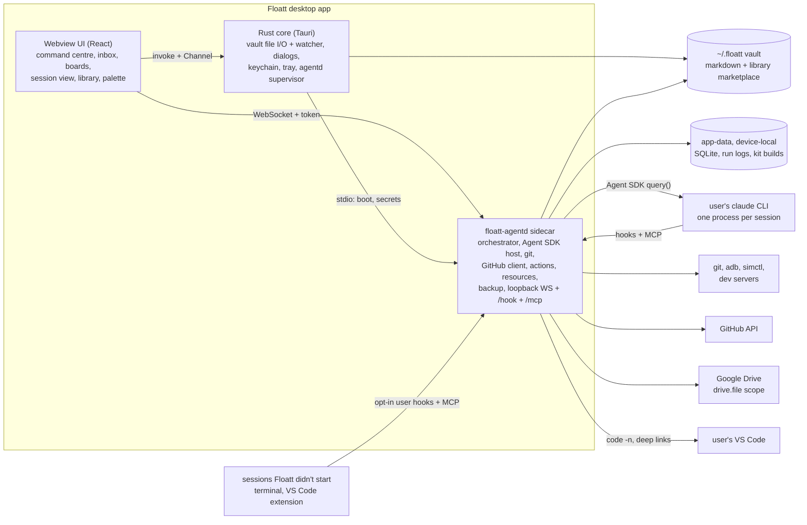

# Floatt as a Claude Code command centre: plan

Floatt grows from a local-first task manager into one place to run, watch and steer Claude Code across all of a developer's projects. This plan merges six research reports (see Sources) into one set of decisions. The build order and paste-ready epics are in [`claude-code-command-centre-epics.md`](./claude-code-command-centre-epics.md).

## Vision

Floatt is a personal command centre on top of Claude Code. It holds a large, curated **library** of skills, agents, tools (MCP servers), hooks and instructions, which you switch on per project as **kits** without polluting any repo. It runs Claude sessions through your own `claude` and shows each one as a calm single line with its live step, budget and heartbeat. Every question and approval from every project lands in **one inbox**. Agents register **actions** such as "Switch Pixel to #96 on :8085", and you click them later with no LLM in the loop. Projects, tasks, notes and the library live as markdown under `~/.floatt/`, where agents, git and backup can read them. Tasks sync both ways with GitHub Projects, and snapshots back up to Google Drive. The model is the user's open-source workspace (a master, one agent per issue, worktrees, exact-text approvals), with its chat rituals turned into code.

## What Floatt is NOT

- **Not another worktree runner.** Claude Code Desktop already runs parallel worktree sessions with a Projects coordinator and phone Dispatch, and Vibe Kanban, Crystal and Roo Code died or were archived competing there. Floatt builds on Claude Code's own sessions, plugins and hooks, and adds what nobody does well: a conflict-checked library, actions, a resource broker, one inbox and board across projects, and readable local state.
- **Not a Claude Code fork or login provider.** It drives the user's unmodified `claude`.
- **Not a cloud service.** No backend, no webhook relay, no team server.
- **Not an editor.** VS Code stays the editor.
- **Not a Huly clone,** and not a harness for every agent CLI. It supports Claude Code only.

## Key decisions

| # | Topic | Decision |
|---|---|---|
| 1 | Runner | Hybrid: drive the user's `claude` through the Agent SDK for Floatt's own runs, and observe other sessions through hooks, MCP and `claude agents --json` |
| 2 | Process split | Rust is the trusted shell. One sidecar, `floatt-agentd`, is the only orchestrator. The webview is UI only |
| 3 | Source of truth | Vault markdown for content, SQLite in agentd for runtime state, Dexie as the UI's rebuildable index |
| 4 | Store location | The vault lives at `~/.floatt/` and can be moved. Device-local data lives in the Tauri app-data dir |
| 5 | Library format | `~/.floatt/library/` is a Claude Code plugin marketplace with a `floatt.json` beside each `plugin.json`. Kits are loaded per session |
| 6 | Auth and licensing | The user's own `claude` login for personal use, an API key for any public build, and Anthropic asked first |
| 7 | GitHub | One budgeted client in agentd. The `gh` token in v1, the device flow later. Polling, no webhooks |
| 8 | "VS Code" | Control the user's VS Code and embed CodeMirror 6 |
| 9 | Web app | Keep a limited "Floatt Tasks" build with no agents |
| 10 | Orchestrator brain | Deterministic code, one instance for all projects. LLMs only as workers, advisors and an optional master persona |
| 11 | Approvals | Anything leaving the machine needs one exact-text approval bound to a content hash |
| 12 | Board vs run state | Task status is content in the file. Run state is a runtime overlay |

### 1. Runner: layer on Claude Code (hybrid)

**Key decision:** Floatt doesn't build its own agent loop.
- **Runs Floatt starts:** `floatt-agentd` drives the user's installed `claude` through the TypeScript Agent SDK (`pathToClaudeCodeExecutable`), one `query()` per task.
- **Other sessions** (terminal, the VS Code extension, `claude --bg`): Floatt observes them through opt-in user-scope hooks, its MCP server, `claude agents --json --all` and a statusline script.
- Why: the SDK gives a typed stream, `canUseTool` approvals, budgets, resume and fork. Observing covers the rest without reimplementing Claude Code.
- Fallback: the same driver can speak `claude -p` stream-json.
- Reconciled: C ran each turn as a detached `claude -p` process so runs outlive the app. **Pick B and D's sidecar.** The tray keeps it alive with the window closed, and after a crash a run shows `interrupted` with one-click resume by session id.

### 2. Where orchestration state lives

**Key decision:** each concern lives in exactly one process.

| Process | Owns | Never does |
|---|---|---|
| Webview (React) | UI, the Dexie index of the vault, ephemeral UI state | Spawn processes, hold tokens |
| Rust core (Tauri) | Windows, tray, notifications. Vault file I/O (path jail, atomic writes, watcher). Native dialogs. Keychain. Starting and killing agentd | Scheduling, git, GitHub, Claude sessions |
| `floatt-agentd` (Bun or Node sidecar) | SQLite store and event log, SDK sessions, jobs and scheduler, worktrees and git, resources, action runner, GitHub client, backup jobs, one loopback server (WebSocket for the UI, `/hook`, `/mcp`) | Render UI, read the keychain directly |

- Why: the SDK is TypeScript, so the orchestrator is TypeScript. One process for all runtime state means one writer, one event log and one place to enforce policy, and it keeps running with the window closed.
- The UI talks to agentd over a loopback WebSocket with a per-boot token. Rust hands agentd secrets over stdio on request.
- Reconciled: B put the action runner, git and GitHub in Rust, and C put the scheduler in a webview hook. That means two writers, or a scheduler that dies with the window. **Pick D's split**, with Rust as the trusted shell.

### 3. Source of truth

**Key decision:** three stores, each with one rule.

| Store | Holds | Is it the truth? |
|---|---|---|
| Vault (`~/.floatt/`, markdown with YAML frontmatter) | Projects, tasks, milestones, notes, decisions, run summaries, time logs, global rules, the library | **Yes**, for user content |
| SQLite (agentd, in app-data) | Runs, sessions, events, jobs, decisions, actions, leases, resources, GitHub cache | **Yes**, for runtime state |
| Dexie `floatt-index` (webview) | An index of the vault for the UI | No. Rebuilt on any schema change |

- Why: agents, git and backup can read files, and runtime churn (heartbeats, logs, ports) stays out of them. Today's `queries/` and `hooks/` keep working over Dexie, and the web build shares the code.
- agentd reads the vault through the same `@floatt/vault` package and caches only the fields it acts on.
- Every writer (the UI through Rust, agentd, an agent) writes atomically with an expected content hash. On a mismatch it re-reads and re-applies the field patch once.
- Reconciled: C kept run records as vault files. **Keep live run state in SQLite**, and write one summary file into the vault when a run ends.

### 4. Store location

**Key decision:** the vault defaults to `~/.floatt/`, and Settings can point it at any other folder.
- Device-local data lives in the **Tauri app-data dir**, not in `~/.floatt/local/`: `device.json` (vault path, worktree root, repo paths), the SQLite store, run logs, kit builds and caches. Secrets go in the keychain.
- Why app-data: the file that says where the vault is can't live inside the vault, and moving the vault into a synced folder must never drag a live SQLite file along.
- The trade-off: a hidden folder is less visible to the user, to Drive or iCloud folder sync and to Obsidian. Backup relies on Floatt's backup feature, not on where the folder sits.

### 5. Library format

**Key decision:** `~/.floatt/library/` is a git repo that is also a Claude Code plugin marketplace.
- One pack is one native plugin, with Floatt-only metadata in a `floatt.json` beside its `plugin.json`.
- Kits are `library/kits/<id>.json`.
- At run start, Floatt builds the project's kit into a content-addressed plugin folder in app-data and loads it with the SDK's `plugins` option. Nothing is written into the repo.
- Why: packs also work in plain Claude Code (`claude plugin marketplace add ~/.floatt/library`), and versions, dependencies and namespacing come for free.
- Reconciled: C put a `floatt:` block inside each item's frontmatter, which has to be stripped and breaks plain Claude Code use. **Pick A and B's sidecar file.**

### 6. Auth and licensing

**Key decision:** Floatt has no login UI and never reads Claude tokens.
- **Personal use:** the SDK runs the user's installed, unmodified `claude`, signed in through Anthropic's own flow. Anthropic's legal page allows that for an end user.
- **Any public release:** an API key, kept in the keychain. The SDK docs ask third-party products to use API keys unless approved.
- **Ask Anthropic** before a distributed build advertises subscription use.
- Don't bundle the `claude` binary, and don't name the product "Claude Code".
- Why: the SDK rule is stricter than the end-user rule, and the safe path costs nothing for personal use.

### 7. GitHub access

**Key decision:** one GitHub client inside agentd serves sync, PRs, CI status and agents.
- v1 reads the token from `gh auth token` at start and keeps it in memory. The OAuth device flow comes later.
- Why: zero setup. Every user token shares the same 5,000-per-hour budget anyway, so the fix for today's rate limit is one budgeted client, not another token.
- Git first, cache second, API last. No webhooks, because a desktop app can't receive them.
- Reconciled: B picked the device flow and C picked `gh api` per call. Per-call `gh` makes ETags awkward, and the device flow needs an OAuth app. One client with the `gh` token avoids both.

### 8. What "VS Code" means

**Key decision:** control the user's own VS Code (`code -n <worktree>`, `code -g file:line`, `code --diff`, `vscode://anthropic.claude-code/open?prompt=…`) and embed CodeMirror 6 for notes, PR text and diffs. A companion extension only if that feels limiting. No embedded code-server.
- Why: real editor, real extensions, and sessions started there share `~/.claude/settings.json`, so Floatt's hooks see them.

### 9. The web app

**Key decision:** keep a limited "Floatt Tasks" build.
- It runs the same vault code over an IndexedDB `VaultFs`.
- It has no agents, sync or backup, because `Platform.agent` is absent there.
- Revisit dropping it if it costs more than about a day per quarter.

### 10. The orchestrator's brain

**Key decision:** a deterministic orchestrator in agentd, one per machine, covers all projects. LLMs only do judgment work:
- one worker session per task
- short structured advisor calls (triage, brief, report review, PR text)
- an optional read-only "master" persona that can only propose
- Why: today's failures were control-plane failures. Code is free when idle, and it can be replayed and tested.
- One arbiter owns shared resources. Per-project policy profiles make it feel like a master per project.

### 11. Approvals

**Key decision:** anything that leaves the machine needs one approval of the exact bytes, bound to `sha256(payload)`. The default bundle is "commit + push + open PR" in one sheet. Status writes to the user's own GitHub Project need no approval.

### 12. Board status versus run state

**Key decision:** a task's `status` is user content in its file, synced with GitHub. Run state is an overlay chip. The orchestrator changes `status` only on events the project maps (PR opened → `review`, merged → `done`).
- Reconciled: D made columns a projection of the run state machine. **Content wins**, because personal tasks have no runs.

## Architecture overview



```
~/.floatt/                          vault (default location; movable)
├── config.json                     portable settings: schemaVersion, vaultId, groups, default kit, backup policy
├── CLAUDE.md                       global rules given to every run
├── library/                        git repo and Claude Code marketplace
├── projects/<slug>/
│   ├── project.md                  metadata, kit, GitHub map; the body is context for agents
│   ├── tasks/<slug>.md             one task per file; optional <slug>/ folder for PR.md, TODO.md, screenshots
│   ├── milestones/  notes/  decisions/
│   ├── runs/<date>-<slug>.md       summary written when a run ends
│   └── time/<deviceId>/<yyyy-mm>.md
├── .migrations/                    one-time dumps (e.g. Dexie v1)
└── .trash/                         soft deletes

<tauri app-data>/                   device-local; never synced, never backed up as-is
└── device.json  floatt.db  runs/<runId>.jsonl  kits/<hash>/  cache/packs/
```

Worktrees live under a device setting, `worktreeRoot`, outside the vault and outside any repo (default `~/Floatt-work/worktrees/<project>/<branch>/`). A project with its own layout, like the open-source workspace's `worktrees/<repo>/<branch>/`, keeps it.

## Library and kits (the lead pillar)

The user's machine shows the problem (A §1.2, C §1.1): `kitten-bot` is copied into five repos and the copies have drifted, the expo plugin is installed four times at different versions, and about 190 skills and commands load into every session with overlapping triggers ("plan this" matches `plan`, `ccr-plan` and `gsd:plan-phase`).

**Layout:**

```
~/.floatt/library/                      git repo; Floatt owns it
├── .claude-plugin/marketplace.json     name: "floatt"
├── plugins/<pack>/
│   ├── .claude-plugin/plugin.json      native: name, version, dependencies
│   ├── floatt.json                     Floatt-only metadata (below)
│   ├── skills/  agents/  commands/  hooks/hooks.json  .mcp.json  output-styles/
│   └── instructions/*.md               rule fragments that kits append to the system prompt
└── kits/<id>.json                      session presets; resolved to kits/<id>.lock.json
```

```ts
type FloattPackMeta = {
  tier: "core" | "verified" | "community";
  categories: string[];                       // Plan, Build, Review, Test, Ship, Debug, Mobile, Orchestration, Safety
  source?: { url: string; sha: string };      // third-party or imported packs, pinned
  actions?: ActionTemplate[];                 // buttons this pack offers
  boardTemplates?: BoardTemplate[];           // statuses, optionally bound to skills
  checks?: Record<string, CheckManifest>;     // per-repo format, typecheck, lint, test
  recipes?: DeviceRecipe[];                   // e.g. "expo dev client on Android emulator"
  conflictsWith?: string[]; replaces?: string[];
  cost?: { contextTokens: number; claudeVersion: string };
};

type Kit = {
  id: string; title: string; extends?: string;
  plugins: string[];                          // "oss-contributor@floatt"
  exclude?: string[];                         // "bmad:party-mode"
  settingSources?: ("project" | "local")[];   // never "user" for Floatt runs; [] = clean room
  model?: string; effort?: "low" | "medium" | "high" | "xhigh" | "max";
  permissionMode?: "default" | "acceptEdits" | "plan" | "auto" | "dontAsk";
  budget?: { usd: number; wallMin: number; turns: number };
};
```

A project picks its kit in `project.md`, and `kits/default.json` applies unless it opts out.

**How a pack reaches a session** (B §1.2):

| Mechanism | Writes | Use for |
|---|---|---|
| Per-session kit (SDK `plugins`) | Nothing | **Default** for Floatt runs |
| Local scope | `.claude/settings.local.json` (git-ignored by Claude Code) | Repos you don't own, in sessions Floatt doesn't start |
| User scope | `~/.claude/settings.json` | Packs wanted everywhere. **Opt-in per pack** |
| Project scope | Committed `.claude/settings.json` | **Only repos the user owns** |

Floatt never writes committed files in a repo it doesn't own. If a file must exist there, it goes in `.git/info/exclude`.

**Import** copies into the library and records the source; it never modifies the original. It reads from:
- `~/.claude` skills, agents and commands
- installed plugins
- linked repos' `.claude/`, deduped by content hash, so five kitten-bot copies show as "1 item, 3 variants, choose canonical", with a drift view
- git packs pinned to a `sha`
- Every change runs `claude plugin validate`.

**Curation tiers:**
1. **Core:** maintained by Floatt, evaluated and pinned.
2. **Verified:** third-party, pinned, passes the lint and a smoke eval.
3. **Community:** links to the official and community marketplaces, skills.sh and MCP registries, labelled unvetted.

**Conflict lint** runs before a pack is enabled, because Claude Code doesn't do this:
- same-name shadowing
- overlapping triggers (keyword overlap first, embeddings later via the local AI plan)
- two hooks on one event, with a flag on any hook that injects into subagents
- MCP name collisions
- contradicting permission rules
- contradicting instructions (one LLM pass at enable time)
- The fix it offers is targeted ("keep A, disable B's skill X").
- **Cost meter:** the context tokens each pack adds to every session.

**Updates:** show a per-pack diff before accepting, because instruction changes are behaviour changes. Hooks, MCP servers and `bin/` are flagged high-risk. Each run records its kit lock, so a session can be replayed with the same kit.

**Claude writes to the library only by proposal.**
- `library_propose` (MCP, `requiresUserInteraction`) writes to a `proposals/<id>` branch, never to `main`.
- Floatt validates the proposal and shows a review pane.
- Approving it merges and reloads plugins.

**Starter kits** (Core tier, from A and F):

| Kit | Contents |
|---|---|
| `oss-contributor` | commit, github-contributor, changeset, code-review, security-review, simplify, one planning skill |
| `expo-app` | The expo plugin, device recipes, the check manifest |
| `writing`, `design` | Output styles, doc skills, frontend-design |

Behaviour-injecting packs like ponytail are opt-in per project, never global.

**Routing:** a task's type picks its kit and default budget (bug fix 45 min and $4, feature 90 min and $8, research 25 min and $2). Deterministic signals (column, labels, title prefix) come first, then a stored advisor triage (D §2).

## Claude Code wrapper and live session view

**Engine** (B §1.5, §3):
- One agentd hosts many sessions, and each session is one `claude` process.
- The default cap is 4 concurrent sessions (roughly 150-400 MB each **[unverified]**), and the rest queue.
- Workers are separate SDK sessions with `cwd` set to the worktree, so each has its own approval queue and cost line.
- Floatt always passes explicit options, because `--bare` may become the default for `-p`.

**What the view shows**, all from the SDK stream:

| UI | Source |
|---|---|
| Live text | `stream_event` partials, coalesced to about 30 fps |
| Tool cards, subagent tree | `tool_use`/`tool_result` by id, `parent_tool_use_id`, `task_*` events |
| Steps | `TodoWrite` and `Task*` inputs (render both; which one is current is **[unverified]**) |
| Diffs | Per-call edits, then `git diff` as ground truth |
| Approvals, questions | `canUseTool` and `AskUserQuestion`, turned into inbox cards |
| Cost, context, limits | `total_cost_usd`, `usage` deduped by message id, `getContextUsage()`, `SDKRateLimitEvent` |

**Controls:** `interrupt()`, `setPermissionMode()`, `setModel()`, `streamInput()` (a mid-turn message shows "queued"), `stopTask(id)`, `resume`, `forkSession`, `rewindFiles` (undo a turn), "Open in terminal" (`claude attach <id>`) and "Open in VS Code".

**Sessions Floatt didn't start:**
- **Installer:** a one-click opt-in adds user-scope `http` hooks (SessionStart, PermissionRequest, Notification, Stop, SessionEnd, PostToolUse as async) and registers the MCP server. It shows a diff of `~/.claude/settings.json` first and restores it byte for byte on uninstall.
- **Fail open:** hooks time out within 2 seconds, so a closed Floatt never slows a terminal session.
- **Visible:** these sessions appear as rows where you can answer permissions or open them elsewhere.
- **No transcript parsing:** the JSONL format is internal, so use `listSessions()` instead.

**Floatt MCP tools:**
- `tasks_*`, `notes_*`, `project_state`
- `library_propose`
- `actions_*`
- `github_*` (cached reads)
- `orchestrator.*` (report, ask, lease)

## Orchestrator and multi-project control

See D for depth.

**Roles:** worker (edits only its worktree), researcher and reviewer (read-only), writer (text that always goes to approval), advisor (stateless, small model) and the master persona.

**Run lifecycle:** intake → triaged → queued → preparing → working → verifying → awaiting_approval → committing → pushing → pr_open → merged or closed → cleanup → done. `blocked`, `needs_decision`, `failed` and `cancelled` are overlays that remember the state to resume. Every transition is an event first, and the run row is a projection of the events.

**Jobs and pools:** agent runs, installs, checks, worktree jobs, rebases, GitHub sync, backups and digests are all jobs in one SQLite queue, and each declares what it needs.

| Pool | Default |
|---|---|
| Agent runs | 4 globally, 2 per project |
| Installs | 1 per package-manager store |
| CPU and RAM | New jobs wait above 80% of cores or 75% of RAM |
| Spend | A daily cap per project and globally; at the cap, runs pause and raise one decision |
| Ports, devices, GitHub | Pools, exclusive write leases, token buckets |

- **Priority:** `project.weight × task.priority`, with aging so nothing starves.
- **No silent waits:** the overview says why a task is queued ("queued: emulator busy (#94)").

**Budgets:** each run has a scope contract (goal, done, out of scope) and caps on wall clock, dollars and turns.
- At 50%: a yellow marker.
- At 80%: agentd tells the run to wrap up.
- At 100%: `interrupt()` and a decision (extend, re-scope or stop).

**Status without pings:**
- The step label comes from the last `tool_use` ("running jest") plus its elapsed time.
- A run counts as stalled after 5 minutes with no SDK message **and** no child CPU time, so long test runs don't count.

**Verification:**
- A run ends with one structured report of claims and evidence.
- agentd runs the repo's check manifest itself and compares `files_changed` with `git diff`.
- Behaviour claims count only with evidence agentd captured itself.
- Unverified claims stay grey, and only verified ones reach the overview.

**Commit pipeline:**
1. Format the changed files before staging.
2. Validate the message against the repo's commitlint config.
3. `git commit --only -- <approved paths>`, with hooks on.
4. Check that only those paths changed. If a hook rewrote anything, stop and show its diff. Never auto-amend.

**Policy is code.** `canUseTool` plus a `PreToolUse` hook on every run enforce:
- path guards
- parsed Bash sub-commands
- the git index rule
- the GitHub API ban
- the server and device command ban
- per-repo allowlists (react-native-firebase's command policy)

**Multi-project control:** per-project policy profiles, `dependsOn` gating, bulk pause and cancel, and **overlap detection** (branches touching the same files raise a merge-order decision, which would have flagged #94 and #95 on day one). Typing into a task always resumes the same session.

**Durability:** each job writes an intent event, does the side effect, then writes a result event. After a crash, agentd checks the world (`git ls-remote`, `git worktree list`, pid plus health URL) instead of re-running the job.

## Worktree and resource manager

**Worktrees** (D §5). agentd is the only owner of `git worktree`; agents are denied `worktree`, `checkout`, `switch` and `branch -D`.
- **Create:**
  1. Resolve absolute paths and assert the path is outside any base clone.
  2. Validate the branch name `<package>-<issue#>-<slug>`.
  3. Sync the fork and fast-forward the base clone under a per-repo mutex, with hooks disabled.
  4. Run the base guard: if the clone is dirty or off its default branch, freeze creation for that repo and raise a decision. Never reset it automatically.
  5. `git worktree add`.
  6. Run the install as a job, skipped when the lockfile hash matches.
  7. Copy the project's "files to copy" (`.env`), run its setup script, and create the draft folder.
- **Cleanup:**
  1. Release leases and stop servers.
  2. Expire the task's actions.
  3. Raise a decision if there are uncommitted changes.
  4. `git worktree remove` and `git branch -d`, with no force flags.
  5. Deleting the remote branch leaves the machine, so it goes into the batched approval.
- **Dependent branches:**
  - Own repos stack PRs. Fork PRs stay sequential.
  - When the parent merges, a rebase job runs `git rebase --onto` with `rerere`.
  - The `--force-with-lease` push needs approval.

**Resources** (D §6): dev servers, emulators, simulators, devices, DevTools windows and port mappings. agentd spawns and supervises every one. Agents hold **leases**; they never start or kill a resource.

| Concern | Rule |
|---|---|
| Leases | An owner, read or write mode, a TTL renewed by heartbeat, a task or worktree scope. Many readers per server, one writer per device |
| Ports | Pools (Metro 8081-8099, Vite and Next 3000-3049), sticky per task so #96 keeps 8085. Hard-coded ports (Floatt's 1420) are exclusive |
| Health | Metro `/status`, Vite `GET /`, emulator `sys.boot_completed`. Up to 3 restarts with backoff, then a decision |
| Cleanup | Removing a worktree revokes its leases, stops its servers and expires its actions |
| Devices | A separate agents emulator. The user's personal emulator is never leased. Every tap first checks that the foreground app matches the lease |

**Pointing a device at a worktree** is a recipe from the project profile, never improvised:

| Target | Recipe |
|---|---|
| Expo dev client, emulator | A deep link to `10.0.2.2:<port>` |
| Physical Android device | `adb reverse`, then the deep link |
| Bare React Native | `adb reverse` **plus clearing `debug_http_host`**, then a relaunch |
| iOS simulator | `simctl openurl` |

Every recipe ends with a check: within 30 seconds the inspector's `/json/list` must show the app, and a screenshot is captured. Nobody can claim a switch worked without it.

## Actions

Claude registers "Switch app to #96 (port 8085)" once, and the user clicks it whenever they like, with no LLM round trip. See A §4, B §5 and D §7.

```ts
type Action = {
  id: string; title: string;
  scope: { kind: "project" | "task" | "worktree" | "resource"; id: string };
  run:
    | { builtin: "device.point" | "devserver.restart" | "checks.run" | "open_url" | "open_in_vscode" | string; params: Record<string, string | number> }
    | { argv: string[]; cwd: string; env?: Record<string, string> }           // never a shell string
    | { steps: Array<{ builtin: string; params: object } | { argv: string[] }> };
  params?: Record<string, { type: "string" | "integer" | "boolean"; enum?: string[]; default?: unknown }>;
  claimed: "read" | "local" | "destructive" | "external";   // from Claude, untrusted
  level: "safe" | "confirm" | "approve";                     // effective, set by Floatt
  preconditions: ("worktree_exists" | "branch_matches" | "resource_healthy" | "lease_available")[];
  approvedHash?: string;                                      // HMAC of the canonical definition
  registeredBy: { runId?: string; user?: true; system?: true };
  expiresAt?: string;
};
```

**Rules:**
- **Registering is a proposal.** `actions_register` carries `requiresUserInteraction`, and nothing is clickable until the user approves the exact argv, cwd and env. An update shows a diff, and the old revision stays live until the new one is approved.
- **Floatt classifies; Claude only claims.**
  - The effective level is the stricter of the claim and a denylist check (`rm`, `git push|reset --hard|clean`, `gh` writes, `curl -X POST`, `kill`, `sudo`, `sh -c`, a cwd outside the scope).
  - It can go up, never down. `external` is always `confirm` or stricter.

| Level | Behaviour | Typical ops |
|---|---|---|
| `safe` | Runs on click | Open URL, screenshot, open logs, start a server |
| `confirm` | One click with a one-line effect | Stop, restart, point a device, relaunch |
| `approve` | Exact argv, approved by hash; any edit invalidates it | First run of a free-argv action, deletes, anything leaving the machine |

- **Signed:** Floatt stores an HMAC of each approved definition, with the key in the keychain. The runner refuses anything that doesn't match, so an agent editing files or the database can't change an approved action.
- **Deterministic runner:**
  - argv only, with parameters filling whole argv elements
  - a cleared env plus an allowlist
  - its own process group, a timeout and a 1 MB output buffer
- **Click-time checks:** preconditions are re-checked when clicked. A failed check refuses with a reason ("worktree removed 2 h ago").
- **Lifecycle:** actions expire with their scope or a TTL, and expired ones stay in history but can't run. Anything long-lived an action starts becomes a leased resource.
- **Where they show:** up to 3 chips on the card, the task header, pinned slots in the status bar (`⌥1`-`⌥5`), the resources panel, and `⌘K`.
- **Results go back to Claude:** `streamInput` for Floatt's sessions, hook `additionalContext` for other sessions, and `actions_runs(since)` on demand.
- **Storage:** live actions in SQLite. Templates worth keeping are promoted into a pack's `floatt.json`.
- MCP elicitation may ask for parameters, but never for approval, because a hook can auto-answer it.

## Projects, boards and Huly-style tasks

**Today's model carries over** (C §3, §4):

| Today | Becomes |
|---|---|
| Group | A sidebar group in `config.json` |
| Subgroup (list) | `projects/<slug>/project.md`, `kind: personal` or `code` |
| Task | `tasks/<slug>.md` |
| Subtask (step) | A `## Steps` checklist in the task body |
| Smart lists | Still virtual. Command centre, Inbox and Board are virtual views too |

**Files:**
- **`project.md`** holds `key` (`FLT`), `repo`, `defaultBranch`, `owned`, `statuses`, `components`, `theme`, the agents policy, `kit`, `github` and the run-to-status mapping. Its body is context for agents.
- **Task frontmatter** adds `status`, `parent`, `milestone`, `labels`, `component`, `estimate`, `assignee` (human, agent or `@login`), `dependsOn`, `branch`, `pr` and `github`.

**Borrowed from Huly:** sub-issues, milestones, labels and components, estimates against actuals (agent wall time counts automatically), per-device time logs that never conflict, an inbox, `FLT#12` identifiers, and keyboard-first single-key verbs (`s` status, `l` label, `a` assign to agent, `r` run). Planner time-blocking comes later. **Skipped:** chat, video, HR, the team planner.

**Board:**
- Columns are the project's `statuses`. The default for code projects is Backlog, Todo, In progress, In review, Done.
- The agent shows as an overlay: state, step, budget, port, PR and CI.
- Dragging a card to In progress offers "Start agent". Dragging to Done during a run asks to stop it first.
- Later, a column can run a skill (moving a card into Review runs `code-review`).

**Write rules:**
- One entity per file.
- Field patches carry an expected hash.
- A reorder sets the midpoint between neighbours, so a move writes one file.
- Unknown keys pass through.
- Derived values (PR state, CI) are never written to files.

## GitHub Projects sync

See C §5, D §11 and B §8.

| Floatt | GitHub |
|---|---|
| Project `github.projectId`, `repo` | A ProjectV2 and its repo |
| Task | An Issue plus a ProjectV2 item. No repo means a DraftIssue |
| `status` | The `Status` single-select, mapped by **option id**, not by name |
| `labels`, `component`, `milestone`, `parent`, `assignee`, `estimate` | Labels, milestone, sub-issues, assignees, fields |
| Time logs, runs, notes, kit | Local only |

**Rules:**
- **Publish gate:** in a linked project, new tasks stay local until you click "Publish".
- **One sync-owner device** runs the loop. Other devices get the results through the vault.
- **Pull:** a 1-point probe of the project's `updatedAt`, and only if it moved, page items 100 at a time. Every 1-5 minutes while a board is open, 10-15 when idle, never while rate-limited. Issues use REST with ETags.
- **Push:** an outbox with aliased mutations, at most one write per item per minute, and a circuit breaker after 50 writes in 10 minutes.
- **Three-way merge per field**, against a per-field `base` hash stored in the task file:
  - Title and body: keep the local copy and raise a conflict card.
  - Status, labels, milestone, estimate, assignee: GitHub wins, with a notice. The exception is a task with an active run, where the run's status wins and the GitHub edit becomes a conflict card.
- **Inbound commands:**
  - Moving an item into the project's "start" column on GitHub enqueues the task (opt-in).
  - Closing it on GitHub cancels the run, after an inbox confirm.

## Backup

**Backup, not sync** (A §7, B §9, C §8).

**Included:** all of `~/.floatt/` (library too), `local-state.json` (inbox read state, timer, layout), `device.json` without tokens, and run transcripts only as an opt-in. **Never included:** indexes, the SQLite runtime store, worktrees, kit builds, keychain items. Live run state and action instances rebuild or expire.

**Format:** `floatt-<vaultId>-<yyyymmdd-hhmm>.zip.age`, a zip with a manifest of per-file hashes. It's encrypted with `age` in passphrase mode, so the `age` CLI can open it without Floatt. The user gets a printable recovery key.

**Targets:**
- v1 is a folder the user picks (Drive for Desktop, iCloud or Dropbox carry it).
- v2 is the Drive API with the `drive.file` scope: a visible "Floatt Backups" folder, loopback plus PKCE, the refresh token in the keychain.
- Publish the OAuth app, because "Testing" apps reportedly lose refresh tokens after 7 days **[unverified]**.
- Snapshots never go inside `~/.floatt/`.

**Schedule:** every 6 hours if anything changed, on quit, before every migration, and on "Back up now". Keep 14 daily and 8 weekly snapshots.

**Restore:**
1. Decrypt and verify the hashes.
2. Restore into a **new folder**, never over the current vault.
3. Migrate an older schema, or refuse a newer one.
4. Re-index and switch the vault root.
5. CI runs a restore test.

## UX

See E for wireframes. Keep today's three-pane shell and add content, not a new layout system.

**Sidebar:**
- Search, which opens `⌘K`
- **Inbox** (count, amber above 0)
- **Command centre**
- **Resources**
- **Library**
- Projects in the existing group/list tree, with running and needs-you badges
- Personal smart lists
- A sync footer

A 24px **status bar** reads `● 6 working  ◆ 3 need you  ⇄ :8081 :8085  ▢ Pixel 8 → #96  ⟳ GitHub 2m`, and every segment is clickable.

**One line per agent:**

```
◆ agent4  expo#51086 digest      approve commit + PR text          2m  [Y]
● agent1  rn-svg#2533 mask       running jest · 7m02s (usual 1m30s) ⚠  ↻4s  $1.2
```

| Screen | Job |
|---|---|
| Command centre (home) | Every run across projects, grouped Needs you, Working, In review, Done today. A rail for ports, devices and PRs |
| Inbox | Approval, decision, permission and cleanup cards, each with a recommended option (★) and a one-line why |
| Task focus view | Timeline (steps, tools, subagents), chat with queued messages, Diff, Checks, Evidence and Log tabs, the task's actions |
| Approval sheet | A safety header (remote, fork or upstream, checks), then editable commit and PR text. Send all runs commit → push → PR |
| Resources | Worktrees, servers, devices ("Switch to ▾" by task and port), base clones ("Sync workspace") |
| Library | One table across kinds, facets, per-project switches, usage, a conflicts filter |
| GitHub sync | Sync age, open PRs with links, the API budget, conflicts |

**Keys:**
- `⌘K` opens the palette; `G I`/`G H`/`G R`/`G L` go to Inbox, Home, Resources and Library.
- `J`/`K` move, Space peeks, Enter opens the focus view.
- In the inbox: `Y` accepts the recommendation, `1`-`9` picks an option, `E` edits, `H` snoozes, `Shift+Y` accepts every selected recommendation.
- Approvals that post to GitHub stay out of batches until their sheet has been opened once.

**Notifications:**

| Tier | Delivery | When |
|---|---|---|
| Interrupt | OS notification, at most one per 2 minutes | A run is blocked, budget hit, stalled 10 minutes, CI failed, a device crashed mid-test |
| Badge | Inbox count | Decisions with defaults, review comments, sync conflicts |
| Feed | Row update | Progress, merges, backups |

Cards dedupe on `(kind, subject, state)`, and a newer state supersedes the old card. After 15 minutes away, a one-line recap appears. Every status carries its verb ("Clean up", "Switch", "Nudge").

**MVP UI (E §7):**
1. The sidebar changes and the status bar
2. Command centre with peek and reply
3. Inbox with its keys
4. Approval sheet with Send all
5. Task focus view
6. Resources panel
7. `⌘K` with actions and "Start agent on issue"
8. Board with agent cards
9. Library browser with per-project toggles
10. GitHub sync status
11. The notification tiers with the away recap

## Security

- **Webview:** a strict CSP (today's is `csp: null`), with `connect-src` limited to the agentd port. Agent-written markdown renders with no raw HTML. Without both, an XSS plus process access is remote code execution.
- **Rust:** narrow custom commands, not generic fs or shell plugins exposed to JS. A path jail that rejects `..`, absolute paths and symlink escapes. Roots are picked only through native dialogs.
- **agentd:** binds to 127.0.0.1 only and checks the per-boot token on every request. It spawns only from an allowlist (`claude`, `git`, `gh`, `code`, `adb`, `xcrun`, approved actions), with `cwd` validated.
- **Secrets** live in the keychain, never in the webview. Workers get a scrubbed env with no `GH_TOKEN` or cloud keys.
- **Agents get no GitHub API.** Policy denies `gh api`, `gh pr|issue view|list`, `gh search` and `curl` to the API. Agents read through cached `github_*` tools and `propose_write`.
- **The git index rule:** the index belongs to the user. Agents can't `add`, `reset`, `restore --staged`, `commit` or `stash`. Only the approved commit step touches it, through `git commit --only`.
- **Library:** imported hooks, MCP servers and executables need approval. Notes and packs are untrusted input to agents.
- **Repos:** no committed writes in repos the user doesn't own. Base clones are guarded.
- **Before a git push of the vault,** scan it for token patterns (`ghp_`, `sk-ant-`, `AKIA`).

## Cost and observability

- **Per run:** tokens and USD from the SDK result, with live estimates deduped by message id. These roll up per task, project, day and role.
- **Plan limits:** shown prominently, because Pro and Max limits assume ordinary individual use. The statusline script brings in the same data for outside sessions.
- **Cheap by construction:** the control plane uses zero tokens, advisors use a small model, a stable system prompt keeps cache hits high, and runs resume instead of re-explaining.
- **Event log:** an append-only SQLite table plus raw JSONL per run. The board, overview and inbox are projections of it, so replay rebuilds them.
- **Metrics page (later):** dollars per merged PR, verify-fail rate per kit, and budget overrun rate.

## Lessons from the open-source workspace

From F (9 issues in parallel on 2026-10-08) and D.

| Lesson | Floatt mechanism that prevents it |
|---|---|
| Subagents couldn't message master; status came only at the end | agentd is the parent of every session and reads its live stream. `ask` creates an inbox card |
| A 20-minute over-scoped run: "is it testing forever?" | Scope contract and budgets, nudge at 80%, interrupt at 100%. The row shows step time against the usual time |
| Agents owned Metro, the emulator and DevTools; watchers restarted servers after their worktree was gone | The resource broker owns long-lived processes, agents lease, and removing a worktree cascades |
| The app ignored `adb reverse` until `debug_http_host` was set; an agent claimed the switch worked | `device.point` recipes verified by the inspector and a screenshot. Claims need agentd's own evidence |
| A hook called the GitHub API about 30 times per Bash command | One budgeted client, git first, ETags, scheduled polling. Agents can't reach the API |
| A relative path created a worktree inside a base clone | One worktree creator: absolute paths, an outside-base assertion, a base guard |
| Agents unstaged or restaged the user's review snapshot | The git index rule in `PreToolUse`. `git commit --only` after approval |
| Pre-commit `prettier --write` left the tree dirty; commitlint capped headers | Format before staging, validate the message, commit, check the tree |
| #94 and #95 touched the same files; #96 conflicted in docs | Overlap detection, merge-order decisions, a rebase job after the parent merges |
| An agent tapped into the user's other app | A dedicated agents emulator, app ids on write leases, a foreground check |
| Duplicate and stale notices | One report per run, dedupe keys, cards superseded by state, stale status greyed |
| Scope added mid-flight many times | Briefs edited live, delivered to the same session through `streamInput` |
| Repeated asks ("switch Metro", "commit and raise PR") | Actions, and a learning loop that proposes actions, skills and rules |

**Kept, because the user liked it:** one line per agent, decisions with a recommendation each (answered with `Y`), verified reports, small separate PRs, and cleanup right after a merge.

## Build order

The full breakdown, with acceptance criteria and sub-tasks, is in [`claude-code-command-centre-epics.md`](./claude-code-command-centre-epics.md).

| Milestone | Epics |
|---|---|
| M1 Foundation | FL-01 Security baseline and groundwork, FL-02 Markdown vault at `~/.floatt` |
| M2 Claude Code wrapper | FL-03 Agent sidecar and runtime store, FL-04 Live session view, FL-05 Outside sessions and the Floatt MCP server |
| M3 Library and kits | FL-06 Library store and import, FL-07 Kits, conflict lint and per-project packs |
| M4 Orchestrator | FL-08 Worktrees, git and the GitHub client, FL-09 Orchestrator core, FL-10 Command centre, inbox and approvals, FL-11 Resource broker and devices, FL-12 Actions |
| M5 Boards and GitHub | FL-13 Projects, boards and Huly-style tasks, FL-14 GitHub Projects v2 sync |
| M6 Backup and learning | FL-15 Backup and restore, FL-16 Learning loop, library proposals and metrics |

## Open questions for the user

1. **Licensing.** May a distributed, SDK-driven Floatt use the user's own subscription login? *Recommend:* use your own login for personal builds, email Anthropic now, and default public builds to an API key until they answer.
2. **Writing to `~/.claude`.** The observer hooks, MCP registration and user-scope packs all write `~/.claude/settings.json`. *Recommend:* one opt-in toggle, with a diff preview and a byte-for-byte restore.
3. **Backup v1 target.** Is Google Drive for Desktop installed? *Recommend:* if yes, folder backup first and the Drive API second, in the same epic. If not, the Drive API first.
4. **A dedicated agents emulator** (about 2 GB RAM). *Recommend:* yes. It's the clean way to keep agents out of your own apps.
5. **Concurrency and spend defaults.** *Recommend:* 4 agents globally, 2 per project, and a daily dollar cap per project. Raise them after a week of data.
6. **GitHub Project status writes without approval** (your own boards only; comments and PR text still need approval). *Recommend:* yes, with the circuit breaker.
7. **A "master" chat panel in v1?** *Recommend:* no. Build the command centre, inbox and palette first. Decide at the end of M4; if you still miss it, the read-only master is an optional sub-task in FL-16.
8. **Git for the vault.** *Recommend:* `library/` is always a git repo. Auto-commit for the rest of `~/.floatt/` is opt-in later.

## Sources

Research files for this plan, in [`research/`](research/):

- [`A-prior-art.md`](research/A-prior-art.md): the landscape, the library gap, actions prior art, Huly, GitHub sync, Drive
- [`B-claude-code-vscode-tech.md`](research/B-claude-code-vscode-tech.md): Agent SDK, plugins, hooks, MCP, the Tauri sidecar, actions, VS Code, git, GitHub, Drive
- [`C-architecture-data-model.md`](research/C-architecture-data-model.md): codebase fit, the vault data model, the module plan, the web app
- [`D-orchestrator-design.md`](research/D-orchestrator-design.md): the orchestrator, jobs, worktrees, resources, verification, safety
- [`E-ux-design.md`](research/E-ux-design.md): principles, IA, wireframes, flows, notifications, the MVP
- [`F-workspace-reference.md`](research/F-workspace-reference.md): the open-source workspace and its lessons

Related: [`local-ai-plan.md`](./local-ai-plan.md), whose semantic search also powers trigger-overlap checks in a large library.
