# D. Floatt orchestrator design

researcherD, 2026-10-08. Scope: the layer that turns Floatt's projects, tasks and boards into Claude Code work running in git worktrees, modelled on the `abappi19/open-source` workspace (`CLAUDE.md`, `master-agent` and `new-worktree` skills, `update-tasks.sh`, `_notes/tasks.md`, `draft/`) and on what went wrong in it today.

## 0. Key decisions

1. **No long-lived master LLM in the control plane.** A deterministic orchestrator daemon owns state, scheduling, worktrees, resources, GitHub and approvals. LLMs do the judgment work: workers run one task each, and cheap one-shot "advisor" calls handle triage, briefs, report review and PR text. A "master" chat survives as a UI persona with read-only tools that proposes operations; it never holds the roster in its context.
2. **The orchestrator is the parent process of every agent** (Claude Agent SDK `query()`), so it sees every message and tool call as it happens. This removes the "subagent can't message master" problem rather than working around it.
3. **Status comes from the orchestrator's state machine, never from agent prose.** Agents submit one structured report (claims plus evidence), and the orchestrator verifies it.
4. **Long-lived processes belong to the orchestrator.** Agents lease dev servers, ports and devices and can't start or kill them. Everything scoped to a worktree is garbage-collected with that worktree.
5. **Anything that leaves the machine goes through a single approval of exact text**, bound to a content hash. Decisions are batched into one inbox, each with a recommendation.
6. **One rate-limited GitHub client** serves sync, agents and the UI. Git comes first, then the cache, and the API last.
7. **One global orchestrator across all projects** with one job system: agent runs, installs, checks, GitHub sync and Drive backup are all jobs with typed limits.
8. **The library (skills, agents, tools, rules, actions) is the product's core.** Routing picks a kit per task type, and a learning loop proposes new library items from repeated requests.

---

## 1. Roles and topology

```
                 ┌──────────────── Floatt UI (Tauri webview, React) ────────────────┐
                 │ boards · task cards · inbox · overview · palette · "master" chat │
                 └───────────────▲──────────────────────────────┬──────────────────┘
                     events (WS) │                              │ commands (HTTP)
                 ┌───────────────┴──────────────────────────────▼──────────────────┐
                 │ Orchestrator daemon (Node sidecar, SQLite, single process)       │
                 │  scheduler · state machine · worktree mgr · resource mgr ·       │
                 │  action runner · verifier · inbox · GitHub client · sync · backup│
                 └──┬─────────────┬──────────────┬───────────────┬─────────────────┘
          SDK query()│  SDK query() │  one-shot      │ child procs    │ git / gh / adb
             worker A│     worker B │  advisor calls │ (metro, vite,  │ simctl
          (wt A cwd) │  (wt B cwd)  │  (haiku-class) │  emulator)     │
```

- **Daemon.** It's a Node sidecar because the Agent SDK is TS or Python, not Rust. It runs as long as Floatt's tray icon does, and a launchd agent comes later so runs survive the app closing. Its state lives in SQLite (`node:sqlite`, with no extra dependency) in Floatt's app-data folder. The UI connects over localhost with a per-boot token. In the shared React package it is reached through a new `Platform.orchestrator` capability, following Floatt's existing platform seam: the web build gets `undefined`, so the feature is hidden there.
- **Workers.** One SDK session per task. `cwd` is the task's worktree, and `additionalDirectories` covers only its draft folder. A follow-up on a task always goes to the same session: `streamInput` while it runs, `resume: sessionId` once it is idle. That is today's rule "a follow-up goes to the agent that owns it", now enforced by a lookup table instead of an LLM's memory.
- **Advisors** are stateless `query()` calls with `outputFormat: json_schema`, a small model, `maxTurns` of 1-3 and read-only tools. They triage an issue (in scope? already has a PR?), write the brief, review a report against the diff, and draft commit and PR text with the `github-contributor` and `commit` skills.
- **The "master" persona** is a chat panel. It gets MCP tools such as `orchestrator.list_tasks`, `get_events` and `propose(op)`, and proposals reach the user as inbox items. The user still talks to "master", but routing, roster and state live in code.

**Why not an LLM master?** Today's failures were control-plane failures: lost messages, a roster held in context, status that went stale, claims that weren't verified, ports switched by hand. A deterministic core is cheap (it costs $0 when idle), replayable and testable. LLMs stay where judgment is needed.

**Routing is deterministic.** `taskId → ownerRunId`. New tasks enter queues, the scheduler assigns slots, and the kit router (§2) picks the agent definition. Today's rules stay: one task per run, no splitting off helpers, and a new task never waits silently. If it queues, the overview says why ("queued: emulator busy (#94)").

**Multi-project.** There is one global orchestrator, not one master per project. Shared resources (one emulator, one GitHub budget, CPU and RAM) need one arbiter, and per-project masters would have to negotiate with each other, which is exactly today's problem. Each project gets a **policy profile** (its own concurrency cap, priority weight, budget, repo rules and kit defaults), so it feels like a per-project master without being one.

## 2. The library: routing, role templates, kits, learning loop

**Library items** are versioned files in a library repo, which itself can be a Floatt project:

| Kind | Format | Example |
|---|---|---|
| agent | Claude Code agent `.md` (`AgentDefinition`) | `worker-bugfix`, `researcher`, `reviewer`, `writer` |
| skill | `SKILL.md` folder | `new-worktree`, `commit`, `github-contributor`, `changeset` |
| tool | MCP server, or an in-process SDK tool | `orchestrator` (report, lease, decide), `device` |
| rule | instruction fragment | "never touch the git index", "no GitHub API reads" |
| action | `Action` template (§7) | "Switch device to task's server" |
| checks | per-repo check manifest | `expo: tsc, oxlint, jest <pkg>` |
| recipe | device and server recipe | "expo dev-client on Android emulator" |

**Role templates**, one per role used today:

- `master`: the chat persona. Read-only tools plus `propose`.
- `worker`: edits only inside its worktree, gets a scope contract, and ends with the structured report.
- `researcher`: read-only, gets WebSearch and WebFetch, writes only to the draft folder, and produces a document.
- `reviewer`: read-only, gets the diff and the evidence, and returns findings as structured claims.
- `writer`: produces PR, issue and commit text in the house style. Its output always becomes an approval item.

**Routing to a kit.** Task type comes first from deterministic signals: board column, issue labels (`bug`, `feature`), task template, title prefix (`release:`). An advisor triage call is the fallback, and its answer is stored so it isn't asked again. Type maps to a `KitRecipe`:

| Type | Agent | Skills | Tools | Checks | Default budget |
|---|---|---|---|---|---|
| bug fix | worker-bugfix | repo guide, new-worktree, commit, changeset | orchestrator, resource lease | repo full | 45 min, $4 |
| feature | worker-feature | as above + plan | + device (if UI) | full + screenshots | 90 min, $8 |
| research | researcher | none | WebSearch, WebFetch | none | 25 min, $2 |
| release | worker-release | changeset, github-contributor | orchestrator | full + build | 30 min, $3 |
| device testing | worker-device | device recipes | device, resource lease | screenshot + logs | 30 min, $3 |

**Kits are materialised per run outside the worktree,** at `app-data/kits/<runId>/`, as a generated local plugin loaded with the SDK's `plugins: [{type:"local", path}]`. The repo's own `CLAUDE.md` and `.claude/` load through `settingSources: ["project"]`, and user settings don't load at all, so runs are reproducible and nothing comes from `~`. Writing kits into the worktree would put stray files in `git status` and risk getting them staged. A `kit.lock.json` records the exact library versions, so a replay uses the same kit.

**Learning loop.** Every user message to a task, plus every manual action, is logged as a `request` event. A nightly advisor job, or one at a threshold, clusters them:

- The same imperative 3 or more times ("switch Metro to #96", "commit and raise PR") becomes an **action** or **skill** proposal.
- The same constraint repeated ("don't use the GitHub API", "don't touch the index") becomes a **rule** proposal, with a matching **policy guard** where it can be enforced in code (§13).
- An agent correction followed by the same fix becomes a checks or recipe update.

Each proposal goes to the inbox with a diff to the library, its scope (global, project or repo) and a recommendation. The user approves it, and the library commits it in its own repo, so it is reviewable and revertible. Nothing is learned silently.

## 3. Task lifecycle and state machine

```mermaid
stateDiagram-v2
  [*] --> intake
  intake --> triaged: dedupe + open-PR check
  intake --> skipped: open PR exists / out of scope
  triaged --> queued: accepted
  queued --> preparing: slot + leases granted
  preparing --> working: worktree + install ok
  working --> verifying: report submitted
  verifying --> working: checks/claims fail (auto, max 2)
  verifying --> awaiting_approval: green; texts drafted
  awaiting_approval --> working: user requests changes
  awaiting_approval --> committing: exact text approved
  committing --> pushing
  pushing --> pr_open
  pr_open --> working: review changes requested / rebase needed
  pr_open --> merged
  pr_open --> closed
  merged --> cleanup
  closed --> cleanup
  cleanup --> done
  done --> [*]
  state "any active" as A
  A --> blocked: lease/dependency/rate-limit wait
  blocked --> A: unblocked (returns to prior state)
  A --> needs_decision: budget hit, conflict, ambiguity
  needs_decision --> A: answered
  A --> failed: unrecoverable / retries exhausted
  failed --> queued: retry
  A --> cancelled: user
```



`blocked`, `needs_decision` and `failed` are overlay states: the task remembers `resumeState`. Transitions are written as events first, and the task row is a projection of them.

**Board columns.** Keep it to six. "Blocked" is a badge, not a column.

| Column | States |
|---|---|
| Backlog | intake, triaged, skipped (filtered out by default) |
| Ready | queued |
| In progress | preparing, working, verifying |
| Needs you | awaiting_approval, needs_decision, failed |
| In review | committing, pushing, pr_open |
| Done | merged, closed, cleanup, done, cancelled |

**Dragging a card is a command.** Backlog to Ready means accept. Needs you to Ready means retry. A drag that isn't valid snaps back and says why. The same mapping drives GitHub Projects sync (§11).

## 4. Job system and global scheduler

Every unit of work is a `Job` in one SQLite-backed queue, in the style of BullMQ: `agent_run`, `install`, `checks`, `worktree_create`, `worktree_cleanup`, `rebase`, `gh_sync`, `project_sync`, `drive_backup`, `resource_health`, `learning_digest`.

**Limits are typed, and a job declares what it needs:**

```ts
type Need = { cpu?: number; ramGb?: number; tokensPerHr?: number;
              ports?: number; device?: DeviceSelector; gh?: number /* est. API cost */ };
```

| Pool | Default | Notes |
|---|---|---|
| global agent runs | 4 | user-tunable; at most 8 on this Mac |
| per-project agent runs | 2 | per policy profile |
| installs | 1 per package manager store | pnpm and bun installs thrash disk |
| CPU / RAM | 80% of cores, 75% of RAM | sampled every 10 s; new jobs wait if over |
| tokens | daily $ cap per project and globally | runs pause at the cap and raise one decision |
| ports | pools (§6) | |
| devices | exclusive write lease | §6 |
| GitHub | token buckets (§11) | |

**Scheduling.** Priority is `project.weight × task.priority`, plus aging so nothing starves. FIFO applies within a priority. Interactive jobs (a user clicking an action, or "run checks now") skip the queue but still respect resource leases. Background jobs (sync, backup, digest) run only when the agent slots are under 75%, never during an install, and back off when the battery is low.

**Durability.** Jobs follow an outbox pattern: an `intent` event, the side effect, then a `result` event. After a crash the daemon reconciles each in-flight intent by **checking the world**, not by re-running it. For a push it compares `git ls-remote origin <branch>` with the local SHA. For a worktree it runs `git worktree list`. For a server it checks the pid and the health URL.

**Focus switching.** Every task keeps its SDK session id, its event stream, its last report and an auto-generated two-line "where it stands", refreshed on each state change. Opening a card shows those. Typing into it resumes the same session, so context is never lost. Pausing a task means `interrupt()` plus parking in `blocked(paused)`, and resuming continues the same session.

**Bulk operations:** pause or resume everything in a project, cancel a selection, approve the selected inbox items, re-run checks on a selection, and clean up all done tasks.

**Drive backup** is the `drive_backup` job, every 6 hours plus on quit:

1. `VACUUM INTO` a snapshot of the SQLite state, plus Floatt's Dexie export from the webview, the library repo bundle (`git bundle`) and the draft folders.
2. Encrypt it with a user passphrase-derived key.
3. Do a resumable upload under OAuth with the `drive.file` scope (only files the app created), keeping 14 versions.

The UI shows the last success, its size and the next run. A failure sends a notification and becomes an inbox item after two misses.

## 5. Worktree manager

The worktree manager is the only owner of `git worktree`. Agents are denied `git worktree`, `checkout`, `switch` and `branch -D` (§13).

**Create** (the `worktree_create` job) ports `new-worktree.sh` to code:

1. Resolve absolute paths: `root/worktrees/<repo>/<branch>`. Assert that `realpath(wt)` is not under `repos/` and does not exist yet. This fixes the relative-path worktree that ended up inside a base clone.
2. Branch name `<package>-<issue#>-<short-name>`, validated by regex and against existing branches.
3. Base sync under a per-repo mutex. `gh repo sync` runs only if the last sync for that repo is more than 10 minutes old (it's a write call, rate-limited). After it, `git -c core.hooksPath=/dev/null -C <base> merge --ff-only origin/<default>`, so the post-merge hook can never run an install in a base clone.
4. **Base guard:** before and after, the base clone must have `git status --porcelain` empty and its branch equal to the default branch. On drift, freeze worktree creation for that repo and raise a decision. The repo is never reset automatically.
5. `git worktree add <abs> -b <branch> origin/<default>`.
6. Install as its own job. Detect the package manager from `packageManager`, `devEngines` or the lockfile. Apply known quirks from the repo profile, for example running pnpm 12 directly because corepack can't start it. Skip the install if the stored lockfile hash already matches.
7. Raise `git.repositoryScanMaxDepth` in `.vscode/settings.json` if needed, from the master-agent skill. The change stays unstaged and shows up as an FYI.
8. Add the task row and the draft folder (`draft/<repo>-<n>-<slug>/TODO.md`, `PR.md`).

**Cleanup** (on merged, or on closed plus the user's OK):

1. Release the task's leases and stop its servers.
2. Expire its actions (§7).
3. If the worktree has uncommitted changes, raise a decision.
4. `git worktree remove` without `--force`, then `git branch -d` without `-D`.
5. Deleting the remote branch leaves the machine, so it goes into the batched approval.
6. Archive the draft folder.

**Dependent branches:**

- **Overlap detection.** On every verify, compare `git diff --name-only origin/<default>...<branch>` across the project's active branches. Overlapping files create a `dependsOn` edge and a merge-order decision, with a recommendation: merge the smaller or older one first. This would have flagged #94 and #95 on day one.
- **Stacking.** For own repos (axonpack, floatt), stack: the PR base is the parent branch. For forks this isn't possible, because an upstream PR can't target a fork branch, so the PRs stay sequential and the dependent's description mentions the dependency.
- **Rebase job.** When a parent merges, run `git rebase --onto origin/<default> <oldParentTip> <branch>` in the child worktree, with `rerere` enabled, and only while no run holds the worktree lease. If the conflicts are only in docs, changelogs or lockfiles, the owner run gets a "resolve conflicts" turn. Otherwise it becomes `needs_decision`. The force-push afterwards (`--force-with-lease`) needs approval, which is batched.

## 6. Resource manager

A **resource** is a long-lived thing the orchestrator spawns and supervises: a dev server (Metro, Vite, Next.js, Tauri dev), an emulator or simulator, a physical device, a browser or DevTools window, an adb reverse mapping. Agents never own one; they hold **leases**.

**Ownership.** The daemon spawns every process in its own process group, records its pid, port, command and log path, and is the only thing that kills it. Agent tool policy (§13) denies the commands that start or kill servers and devices: `expo start`, `react-native start`, `metro`, `vite`, `next dev`, `tauri dev`, `emulator`, `adb reverse`, `adb shell input`, `kill`/`pkill`, `lsof -ti | xargs kill`, and so on. The deny message points the agent at `resource.acquire`.

**Leases:**

```
resource.acquire({ kind: "devserver", worktree, profile: "metro" }) → { leaseId, port, url, logPath }
resource.acquire({ kind: "device", selector: { platform: "android", tag: "agents" }, mode: "write", app: "com.axonpack.example" })
```

- A lease has an owner (a run or the user), a mode (`read` or `write`), a TTL renewed by the owner's heartbeat, and a scope (task and worktree).
- Several readers can share a dev server, for example the user looking at it while an agent tests against it. A device takes at most one writer.
- When a lease expires or its owner run ends, the resource is released. A dev server whose last lease is gone stops after a grace period (10 minutes by default; the user can pin it).
- **Removing a worktree cascades.** Its leases are revoked, its servers stopped and its actions expired. No orphaned watcher can restart anything, because only the daemon starts processes and it checks that the worktree exists first.

**Ports** come from pools: Metro 8081-8099, Vite and Next.js 3000-3049, others configurable. Allocation records the task, then binds a test socket to confirm the port is free. Ports are sticky per task (#96 always gets 8085 while it lives), so the user learns them. A project whose port is hard-coded (Floatt desktop's `devUrl` 1420) is marked `exclusive`, and its lease queues.

**Health checks:**

- Metro: `GET /status` returns `packager-status:running`.
- Vite: `GET /` returns 200.
- Emulator: `adb -s <serial> shell getprop sys.boot_completed` returns `1`.

A failure triggers a restart with exponential backoff (at most 3 times), then a `resource.unhealthy` event and a decision. Logs are rotated per resource and linked from the card.

**Devices:**

- The pool is tagged. **The agents' emulator (AVD `floatt-agents`) is separate from the user's personal emulator, which is never leased unless the user opts in.** That alone stops agents tapping into the user's other app.
- A write lease names the allowed app ids. Every `device.tap`, `type` or `swipe` first checks the foreground package (`dumpsys activity activities` → `mResumedActivity`) and refuses if it doesn't match.

**Pointing a device at a worktree's server** (`device.point`) is a recipe from the project profile, never improvised:

1. Hold the device write lease.
2. Ensure the target dev server lease is healthy.
3. Apply the transport for the platform and app type:
   - Android emulator with an Expo dev client: `am start -a android.intent.action.VIEW -d "<scheme>://expo-development-client/?url=http%3A%2F%2F10.0.2.2%3A<port>"`. This uses 10.0.2.2, so no adb reverse is needed.
   - Physical Android device: `adb -s S reverse tcp:<port> tcp:<port>`, then the same deep link with `localhost`.
   - Bare React Native: `adb reverse tcp:8081 tcp:<port>`, **plus clearing the app's `debug_http_host` pref** (through `run-as`), plus force-stop and relaunch. This is the step whose absence made the app ignore adb reverse today.
   - iOS simulator: `xcrun simctl openurl <udid> <url>`.
4. **Verify:** within 30 seconds, `GET http://127.0.0.1:<port>/json/list` must list a target whose device name or app id matches, and a screenshot is captured. Only then is `device.pointed` emitted. Otherwise `device.point_failed` is emitted with the evidence. Nobody, agent or orchestrator, can claim a switch worked without this check.

## 7. Actions: deterministic buttons that Claude registers

An **action** is a named, parameter-bound, deterministic operation that the user triggers later with no LLM involved. For example, instead of asking master each time, an agent registers "Switch Pixel to #96 (port 8085)" and the user clicks it whenever they like.

**Who registers what:**

| Registrar | May register | Initial level |
|---|---|---|
| orchestrator (built-ins) | resource ops, checks, open URL, open in VS Code | per op (below) |
| worker run | actions scoped to **its own** task or worktree only, built from built-in ops or argv commands that pass the same policy as its Bash | built-in op: as defined; free argv: `approve` |
| master persona / advisor | proposals only, which go to the inbox | n/a |
| user | anything, in any scope | user's choice |
| learning loop | proposals to promote to a project or global template | after approval |

**Built-in ops exposed by resources:** `devserver.start | stop | restart | open_logs`, `device.point(task)`, `device.screenshot`, `device.relaunch_app`, `open_url(url)`, `open_in_vscode(worktree)` (`code -n <abs>`), `checks.run(task, set)`, `worktree.open_terminal`, `task.pause | resume`.

**Spec:**

- **Execution is deterministic.** Ops run through the same runner as jobs: argv arrays only, never shell strings, with a fixed cwd and env. Parameters are typed and come from a closed set (task id, port from the lease, or a value the user picks), never free text spliced into a command.
- **Preconditions are re-checked at click time:** the worktree exists, the branch matches, the resource is healthy or can be started, and the user holds or can take the lease. If one fails, the action refuses and says why ("worktree removed 2 h ago"), and it can't half-run.
- **Lifecycle.** An action's scope is project, task, worktree or resource. It expires with its scope (task done, worktree removed, resource deleted) or with an optional TTL. Expired actions are tombstoned: kept in history, hidden and not runnable. Actions are one-shot. Anything long-lived they start becomes a resource with a lease, never a background watcher.
- **Logging.** Each run emits `action.started` and `action.finished` with the exit code, duration, an output tail and the postcondition result (for `device.point`, the inspector check). Runs show on the task timeline and can be replayed.
- **Confirmation levels:**
  - `safe`: runs on click. For read-only or easily reversible ops on leased resources: open URL, screenshot, open logs, start a server.
  - `confirm`: one click to confirm, showing a one-line effect ("Pixel will relaunch com.x pointed at :8085"). For stop, restart, point or relaunch.
  - `approve`: shows the **exact argv, cwd and env diff**, approved by content hash, so any edit invalidates the approval. Required for any free argv action's first run, and always for actions that leave the machine (push, comment) or delete things. After the first approval the user may lower it to `confirm`.
- **Surfacing:**
  - On the task card: up to three action chips, pinned first, then the most recently used.
  - In the task drawer: all of the task's actions.
  - On the board: a column toolbar for bulk built-ins (run checks on all In progress).
  - In a resource panel: one row per device or server, with "point at →" chips for every live task.
  - In the **command palette**, which extends Floatt's existing `command.store` and `useKeyboardShortcuts`: every live action, indexed with fuse.js (already a dependency), for example `switch pixel #96`.

## 8. Communication: event log, heartbeats, budgets, reports

**The event log** is an append-only SQLite table, with live fan-out to the UI over a WebSocket. Every SDK message is mirrored as a compact event (with `tool_use` summarised), and the raw stream is written to `runs/<runId>.jsonl`. Board, overview, cost and inbox are all projections of it, so replay simply rebuilds them.

**Status without pings.** Because the daemon consumes the SDK stream, "what is the agent doing?" is answered from the last `tool_use`, mapped to a step label (for example `Bash: pnpm jest` becomes "running jest", `Edit src/x.ts` becomes "editing x.ts"), plus the elapsed time on that step. Agents never need to send status pings, and none get queued.

**Agent-to-orchestrator tools** (in-process MCP, `orchestrator.*`):

- `progress({ step, pct?, eta? })`: optional, for milestones.
- `ask({ question, options, recommendation })`: creates an inbox item. The run continues with other work or blocks, at its choice.
- `resource.acquire` and `release`, `action.register`.
- `report(Report)`: the final structured report, sent once per run. Duplicates are ignored, which removes duplicate completion notices.

**Liveness.** A run is `stalled` if there has been no SDK message for 5 minutes **and** its child processes show no CPU time. Long test runs are therefore not stalls. On a stall the daemon calls `interrupt()`, keeps the partial output and raises `needs_decision`.

**Budgets.** These fix the 20-minute over-scoped profiling task. Each run carries a **scope contract**: goal, definition of done, out-of-scope, and wall-clock, dollar and turn caps (`maxBudgetUsd` and `maxTurns` passed to the SDK, plus a daemon timer).

- At 50%, the overview shows a yellow budget marker.
- At 80%, the daemon `streamInput`s "80% of budget used: wrap up, report what you have and what's left".
- At 100%, `interrupt()` and `needs_decision`, offering: extend by X (recommended if the report shows progress), re-scope or stop.

**Cancellation** is a cancel command: `abortController.abort()`. Leases are released by cascade, the worktree is kept and the state becomes `cancelled`.

**The report schema** is enforced with `outputFormat` JSON schema on the run's final turn, or by the `report` tool:

```ts
type Claim =
  | { kind: "files_changed"; paths: string[] }
  | { kind: "check_passed" | "check_failed"; check: string; cmd: string }
  | { kind: "behavior_verified"; description: string; evidence: EvidenceRef[] }
  | { kind: "root_cause"; description: string; refs: string[] }   // file:line refs
  | { kind: "not_done"; description: string };
type Report = {
  runId: string; summary: string;                 // ≤ 2 lines, shown on the card
  claims: Claim[];
  decisions: { question: string; options: string[]; recommendation: string; why: string }[];
  drafts?: { commitMessage?: string; prTitle?: string; prBodyPath?: string };
  nextSteps?: string[];
};
```

## 9. Verification

**Check manifest per repo.** It is derived once from the repo's own guides and scripts (`package.json` scripts, the CLAUDE.md, AGENTS.md and CONTRIBUTING commands), then confirmed by the user and stored in the library:

```yaml
expo:   { format: "node_modules/.bin/oxfmt --write {changed}", typecheck: "../../node_modules/.bin/tsc -p tsconfig.json --noEmit",
          lint: "../../node_modules/.bin/oxlint --config oxlint.config.mjs {changed}", test: "./node_modules/.bin/jest {related}", cwd: "packages/{pkg}" }
floatt: { typecheck: "pnpm check-types", test: "pnpm test" }                       # lint is a no-op upstream
react-native-firebase: { allowlist: "okf-bundle/testing/agent-command-policy.md" }  # agent Bash restricted to it
```

**The verifier runs the checks itself**, as a `checks` job in the worktree, and doesn't trust an agent's `check_passed`. Checks are scoped to the changed packages (turbo `--filter=...[origin/<default>]` or `{changed}`).

**Claim checking:**

| Claim | Verified by |
|---|---|
| `files_changed` | equal to `git diff --name-only origin/<default>...HEAD` plus untracked files; a mismatch flags the report |
| `check_*` | the orchestrator's own run of the same check |
| `behavior_verified` | evidence must be orchestrator-captured (a screenshot via `device.screenshot`, server logs, an inspector check), carrying an event id; agent-written files don't count |
| `root_cause` | an optional reviewer advisor reads the diff and the refs, and returns agree, disagree or unsure |

Unverified claims show as grey "claimed" chips and verified ones as green; only verified claims appear in the overview.

**The pre-commit pipeline**, which fixes today's hook failures, runs in this order:

1. Run the formatter on the changed files (before staging).
2. Validate the message against the repo's commitlint config (for example `header-max-length` 100), or a 72-character default.
3. Commit with `git commit --only -- <approved paths>`, with hooks enabled. `--only` commits exactly those paths and leaves anything else the user staged alone.
4. Assert that `git status --porcelain` is unchanged except for the committed paths. If a hook rewrote files, stop with `needs_decision` and show the hook's diff. Never auto-amend.

## 10. Human in the loop: inbox, overview, notifications

**Inbox item types:**

- `approve_text`: a commit message plus a diff hash, a PR title and body, an issue comment, or a force-push.
- `choose`: options with a recommendation.
- `budget`: extend, re-scope or stop.
- `merge_order`.
- `permission`: an agent asks for a denied capability.
- `library_proposal`.
- `conflict` (sync, §11).
- `drift`: a base clone isn't clean.

**Exact text and one bundle.** An approval binds `sha256(payload)`, and execution uses exactly that payload. The default bundle per task is **"commit + push + open PR"**: one item showing the diff stat, the message and the PR body, with per-step checkboxes. That is one round trip instead of three.

**Batching.** Items get an urgency:

- Blocking a run with nothing else to do: notify now.
- Otherwise: a **digest**, sent when the user returns to the window, when 3 or more items are pending, or after 30 minutes.

Each item shows its recommendation first, and the inbox has an **"Accept all recommendations"** button for the selection. Items that expire (a task cancelled meanwhile) disappear by themselves.

**The cross-project overview** is the default home screen. It mirrors the format the user liked today:

```
axonpack   agent2 #96 tanstack tab   verifying · jest 2m · $0.84 · 18m
axonpack   agent3 #95 storage keys   needs you · rebase on #94 (docs conflict)
expo       agent4 #51158 focus fx    working · editing useFocusEffect.ts · 61% budget
floatt     -      backup             ok 14:00 · next 20:00

Your decisions (3)
1. Merge #94 before #95. Recommend: yes (smaller, older)
2. Approve commit + PR for axonpack#96. Recommend: approve
3. Learn rule "never touch the git index" as a global rule. Recommend: yes
```

There is one line per run with project, label, task, current step, cost and elapsed time, and status that's older than 60 seconds is greyed rather than shown as current. `agentN` labels are kept for the user's mental model; they map to run ids.

**Notifications** use Floatt's existing `Platform.notifications`. Each title names the project and task ("axonpack #96 · approve PR text"), clicking one deep-links to the item, and they are coalesced per digest.

## 11. External API hygiene and GitHub Projects sync

**One GitHub client** in the daemon is the only path to `api.github.com`:

- **Separate token buckets for REST and GraphQL**, sized to leave headroom for the user. The orchestrator uses at most 1,500 REST requests and 1,500 GraphQL points per hour by default, and reads `x-ratelimit-remaining` and `retry-after`.
- Below 20% remaining, only interactive and approved writes run. At 5%, everything stops and waits for `x-ratelimit-reset`.
- **Serial queue.** Writes are spaced at least 1 second apart, following GitHub's secondary-limit guidance.
- **Conditional requests.** Every REST GET stores its ETag and sends `If-None-Match`. GitHub doesn't count an authorised 304 against the primary limit. Responses are cached in SQLite with a TTL per kind: issue labels 30 minutes, PR state 10 minutes, repo metadata 1 day.

**Git first:**

- Default branch: `git remote set-head --auto`.
- PR existence: `git ls-remote <remote> 'refs/pull/*/head'` matched against the branch SHA.
- Merged: `git merge-base --is-ancestor`, or `git log origin/<default> --grep '(#<n>)'` for squash merges.

The task-state hook from today becomes these git checks. API calls happen only when the user opens a card and the cache is stale.

**Agents never call the API.** Policy denies `gh api`, `gh pr view|list|checks`, `gh issue view|list`, `gh search` and `curl …api.github.com`, and workers' environment has no `GH_TOKEN`. Agents get `github.read({ kind, ref })` (cached and budgeted, at most 20 per run by default) and `github.propose_write(...)`, which becomes an approval item. Rows always carry plain github.com URLs for the user to open.

**GitHub Projects (v2) sync** is the `project_sync` job. The Projects API is GraphQL-only. Project item webhooks need a public endpoint and are org-level, so a local app polls:

- **Incremental poll.** Page items 100 at a time with their field values and `updatedAt`, store the end cursor, and diff locally by `(itemId, updatedAt)`. The schedule adapts: every 60 seconds while the board is open and recently edited, every 10 minutes when idle, never while rate-limited. If a project-level change probe (one cheap query) shows nothing new, the page walk is skipped.
- **Mapping.** A per-project config maps the Floatt column (§3) to the GitHub `Status` single-select option, plus custom fields:

  | Floatt | GitHub Projects |
  |---|---|
  | column | `Status` (Backlog, Ready, In progress, Needs you, In review, Done) |
  | priority | `Priority` field |
  | PR | linked PR on the item |
  | budget/cost | optional number field `Agent $` |
  | agent label | text field `Agent` |

- **Outbound.** A state change such as `pr_open` updates the item's Status to "In review" and links the PR. Updates are debounced (5 seconds) and coalesced per item, and since these are writes to the user's own board, they don't need approval. **Inbound.** Moving a card to "Ready" on GitHub enqueues the task, which is the same command as dragging it in Floatt, so an agent picks it up when a slot frees. Moving it to "Done" or closing it on GitHub cancels the active run, via an inbox confirm if a run is active.
- **Conflicts.** Each field keeps `lastSyncedValue`. If both sides changed since then, nothing is overwritten. A `conflict` inbox item shows Floatt's value, GitHub's value and a recommendation: the orchestrator's state wins for agent-driven columns, and the human edit wins for priority and title.
- **Spam guards.** Writes are per item, coalesced, and at most one per item per minute. A circuit breaker opens if more than 50 writes happen in 10 minutes, and sync pauses with an inbox alert.

**Backoff everywhere** is exponential with jitter: 1 second to 15 minutes, resetting on success. Sync status (last success, items, cost in points, next run) is shown in the project header.

## 12. Cost and observability

- **Per run:** input, output, cache-read and cache-write tokens and USD. These come from the SDK result (`total_cost_usd`, `modelUsage`), with live estimates from per-message `usage` deduplicated by message id. Output tokens come only from the result, because per-step output is a placeholder. On a crash, totals are recovered from the last good result. They roll up per task, project, day and role.
- **Cheap by construction:**
  - The control plane uses zero tokens.
  - Advisors use a small model with structured output.
  - Workers use the kit's default model and effort, with a cheaper model for research and writing.
  - The system prompt stays stable and the task brief goes in the user turn, which maximises prompt-cache hits. `ENABLE_PROMPT_CACHING_1H` is set for projects with many short runs.
  - `resume` is used instead of re-explaining context.
- **Transcripts** are the raw JSONL per run plus the SDK session id. A task timeline interleaves events, tool calls, check results, actions and decisions.
- **Replay and resume:**
  - Projections rebuild from the event log.
  - "Resume" means `resume: sessionId`.
  - "Try another approach" means `forkSession: true` into a new branch and worktree.
  - `enableFileCheckpointing` plus `rewindFiles` gives an undo for a run's edits.
- **Metrics page:** dollars per merged PR, verify-fail rate per kit, average wall time per state, and the rate of budget overruns. That last one tells you when a kit's budget defaults are wrong.

## 13. Safety

**Policy enforcement** happens in `canUseTool` plus a `PreToolUse` hook for each run, so it is code, not instructions:

- **Paths.** Edit, Write and NotebookEdit targets must `realpath` under the run's worktree or draft folder. Reads outside are allowed except for secrets (`~/.ssh`, `**/.env*` outside the worktree, keychains, `~/.config/gh`).
- **Bash** is parsed into commands (with a shell-quote parser) and every sub-command is checked:
  - **Denied by default:**
    - Git: `git add`, `restore --staged`, `reset`, `rm --cached`, `commit`, `push`, `rebase`, `checkout/switch <other>`, `worktree`, `branch -D`, `stash` without `-m "<issue>"`, `clean -fdx`.
    - Processes: server and device starts and kills (§6).
    - Destructive file and repo ops: `rm -rf` outside the worktree, any command touching `repos/*`.
    - GitHub: `gh` writes and the GitHub API reads listed in §11.
    - Package and device: `npm publish`, `adb uninstall`, `pm clear` for apps not in the lease.
  - **The git index rule** is absolute for agents: the index belongs to the user. Only the commit step (§9) touches it, right after approval, and only through `--only`.
  - **Allowlist mode** for repos that require it: react-native-firebase's `agent-command-policy.md` is loaded as the run's whole Bash allowlist, and the permission mode is `dontAsk`.
- **Environment.** Workers get a scrubbed env: no `GH_TOKEN`, `NPM_TOKEN` or cloud keys. Tokens live in the OS keychain and are used only by the daemon's GitHub client and push step. Pushing uses the user's SSH agent from the daemon process only.
- **Isolation:**
  - Runs can't see other worktrees (path guard).
  - Devices are restricted to leased app ids.
  - The user's personal emulator isn't in the pool.
  - Base clones are guarded (§5).
  - Anything else a run attempts becomes a `permission` inbox item with the exact request, never a silent retry.
- **No `~` writes.** Kits, transcripts and state live in Floatt's app data (or in the workspace when it's a workspace project), and `settingSources` excludes `user`.

## 14. Type sketches

```ts
type TaskState = "intake"|"triaged"|"skipped"|"queued"|"preparing"|"working"|"verifying"
  |"awaiting_approval"|"committing"|"pushing"|"pr_open"|"merged"|"closed"|"cleanup"|"done"
  |"blocked"|"needs_decision"|"failed"|"cancelled";

interface Task {
  id: string; projectId: string; repo: string; issueUrl?: string; title: string;
  type: "bugfix"|"feature"|"research"|"release"|"device-test";
  state: TaskState; resumeState?: TaskState; blockedReason?: string;
  priority: number; branch?: string; worktreePath?: string /* absolute */;
  draftDir?: string; dependsOn: string[]; prRef?: { repo: string; number: number; url: string };
  ownerRunId?: string; sessionId?: string; kitLock?: string;
  scope: { goal: string; done: string[]; outOfScope: string[] };
  budget: { wallMin: number; usd: number; turns: number };
  spent: { usd: number; tokensIn: number; tokensOut: number; wallMin: number };
  ghItem?: { projectItemId: string; lastSynced: Record<string, string> };
}

interface AgentRun {
  id: string; label: string /* agentN */; taskId: string; role: "worker"|"researcher"|"reviewer"|"writer"|"advisor";
  agentDef: string; model: string; sessionId: string; cwd: string;
  status: "starting"|"running"|"idle"|"stalled"|"interrupted"|"finished"|"failed"|"cancelled";
  currentStep?: { label: string; tool?: string; since: string };
  lastEventAt: string; usage: { usd: number; in: number; out: number; cacheRead: number; cacheWrite: number };
  leaseIds: string[]; transcriptPath: string; reportId?: string;
}

interface Resource {
  id: string; kind: "devserver"|"emulator"|"simulator"|"device"|"browser"|"port-map";
  profile: string; projectId?: string; worktreePath?: string;
  pid?: number; port?: number; serial?: string; url?: string; logPath?: string;
  health: { status: "starting"|"healthy"|"unhealthy"|"stopped"|"lost"; checkedAt: string; failures: number };
  exclusive: boolean; pinned: boolean;
}
interface Lease { id: string; resourceId: string; owner: { runId?: string; user?: true };
  mode: "read"|"write"; apps?: string[]; expiresAt: string; scope: { taskId?: string; worktreePath?: string } }

interface Action {
  id: string; label: string; scope: { kind: "project"|"task"|"worktree"|"resource"; id: string };
  op: { builtin: string; params: Record<string, string|number> } | { argv: string[]; cwd: string; env?: Record<string,string> };
  level: "safe"|"confirm"|"approve"; approvedHash?: string;
  preconditions: ("worktree_exists"|"branch_matches"|"resource_healthy"|"lease_available")[];
  registeredBy: { runId?: string; user?: true; system?: true }; expiresAt?: string; tombstoned?: boolean;
}

interface Decision {
  id: string; taskId?: string; projectId: string;
  kind: "approve_text"|"choose"|"budget"|"merge_order"|"permission"|"library_proposal"|"conflict"|"drift";
  title: string; options: string[]; recommendation: string; why: string;
  payload?: unknown; payloadHash?: string; urgency: "now"|"digest"; status: "open"|"answered"|"expired";
}

interface Job { id: string; type: string; projectId?: string; taskId?: string; priority: number;
  needs: Need; state: "queued"|"running"|"done"|"failed"|"cancelled"; attempts: number;
  runAfter?: string; intentEventId?: string }

interface Event {
  seq: number; ts: string; projectId?: string; taskId?: string; runId?: string; jobId?: string;
  type: string;   // "task.state", "run.tool_use", "run.report", "resource.health", "lease.granted",
                  // "action.finished", "decision.opened", "gh.call", "sync.conflict", "job.intent", ...
  data: unknown;
}
// Report: see §8.
```

## 15. Prior art to borrow from

- **Temporal / durable execution:** workflows as deterministic code with activities, *heartbeats with timeouts* (for liveness), *signals* (user messages to a run) and *queries* (status). We borrow the patterns (outbox, reconcile, activity heartbeat) without running a Temporal server, which would be too heavy for a desktop app.
- **BullMQ:** job priorities, rate-limited queues, stalled-job detection, flows (parent and child jobs) and progress events. Our SQLite queue copies these semantics.
- **LangGraph:** checkpointed state graphs, and `interrupt()` for human-in-the-loop with resume. That maps to `needs_decision` and `awaiting_approval` with a durable `resumeState`.
- **OpenHands:** an event stream of Actions and Observations as the single source of truth, with a sandboxed runtime. That is our event log, and a later phase could add container runtimes.
- **Claude Code itself:**
  - Subagents and agent definitions are our role templates.
  - Agent teams and cross-session messaging show peer messaging, which is what failed us when a subagent tried to reach its parent.
  - Agent view's one-row-per-session status and PR status influenced our overview line.
  - Worktree isolation and hooks give the policy points (`PreToolUse`, `SessionStart`).
  - The Agent SDK provides `canUseTool`, `maxBudgetUsd`, `resume` and `forkSession`, `interrupt`, `streamInput`, `outputFormat`, `plugins` and cost fields.
  - We *use* Claude Code as the worker engine and put the control plane outside it.

## 16. Phasing

**MVP (P0), "replace today's workspace":**

- Daemon, SQLite, the event log and the WebSocket to the UI.
- Board columns as a projection, and the overview line.
- Worktree manager: absolute paths, base guard, hook-less ff-merge, installs as jobs, cleanup.
- Workers through the SDK, one per task, with resume and streamInput. Scope contract and budgets, with nudges at 80% and an interrupt at 100%.
- The structured report, a verifier running the repo's check manifest, and the claim chips.
- Inbox: the exact-text "commit + push + PR" bundle, recommendations and accept-all.
- Policy guards: paths, the index rule, the GitHub API ban, the server-command ban.
- GitHub client: buckets, ETag cache, the git-first status checks.
- Dev servers owned by the daemon: port pools, health checks, GC on worktree removal.
- Actions with built-ins (start/stop server, open URL, run checks, open in VS Code), and the palette.

**P1, "devices and multi-project":**

- Device pool and leases, the `device.point` recipes with inspector verification, screenshots as evidence, the foreground-app guard.
- Per-project policy profiles and the global scheduler with CPU, RAM and $ pools.
- Overlap detection, merge-order decisions and the rebase job.
- Digests and notifications.
- GitHub Projects v2 sync (one-way out first, then inbound).
- Drive backup.

**P2, "library and learning":**

- The library repo, kit router and role templates, kit locks.
- Advisors (triage, review, writer).
- The learning loop, with proposals in the inbox.
- Two-way sync conflict handling.
- Fork and rewind, the metrics page.
- A launchd daemon so runs survive the app closing.
- Optional container runtimes.

## 17. Open decisions (with recommendations)

1. **Daemon language.** A Node sidecar, recommended because the SDK is TS-first and fits Floatt's TS stack, or Rust in Tauri with a Node bridge. **Recommend Node.**
2. **Orchestrator state.** Daemon SQLite as the source of truth, mirrored into Dexie for the UI, or Dexie only. **Recommend SQLite.** Agents run while the window is closed, and the webview's IndexedDB can't be reached from the daemon.
3. **A dedicated agents emulator** (one more AVD, about 2 GB RAM) versus sharing the user's. **Recommend dedicated.**
4. **Default bundle approval** "commit + push + PR" as one item. **Recommend yes**, with per-step checkboxes.
5. **GitHub Projects sync writes without approval** (status and fields only, own boards). **Recommend yes**, with the circuit breaker; comments and PR text still need approval.
6. **Global agent cap** of 4 by default. **Recommend 4**, and raise it after a week of CPU and RAM data.

researcherD
